# Unit 01: Introduction to Software Project Management

> **Hours:** 5 Hrs. | **Source:** `Chapter_1_Introduction to Software Project Management.pdf`

---

## Table of Contents
- [1. Software Engineering and Software Product](#1-software-engineering-and-software-product)
  - [Key Characteristics of Software Engineering](#key-characteristics-of-software-engineering)
- [2. Objectives of SPM](#2-objectives-of-spm)
- [3. Software Project: Definition and Characteristics](#3-software-project-definition-and-characteristics)
  - [3.1 What is a Project?](#31-what-is-a-project)
  - [3.2 Key Properties of a Project](#32-key-properties-of-a-project)
  - [3.3 Formal Definitions](#33-formal-definitions)
  - [3.4 Software Project](#34-software-project)
  - [3.5 Examples of Projects](#35-examples-of-projects)
- [4. SMART Goals](#4-smart-goals)
  - [Common Constraints Influencing a Project](#common-constraints-influencing-a-project)
- [5. Classification of Projects](#5-classification-of-projects)
  - [5.1 Classification by Source of Capital](#51-classification-by-source-of-capital)
  - [5.2 Classification by Content](#52-classification-by-content)
  - [5.3 Classification by Involvement](#53-classification-by-involvement)
  - [5.4 Classification by Objective](#54-classification-by-objective)
- [6. Characteristics of Software Projects](#6-characteristics-of-software-projects)
  - [Additional Characteristics](#additional-characteristics)
- [7. Categories of Software Projects](#7-categories-of-software-projects)
- [8. Project Manager](#8-project-manager)
  - [Skills Required](#skills-required)
- [9. Project Management](#9-project-management)
  - [Objectives of Project Management](#objectives-of-project-management)
  - [Factors Influencing PM Division Setup](#factors-influencing-pm-division-setup)
  - [Benefits of Good Project Management](#benefits-of-good-project-management)
  - [Project Management Life Cycle (Overview)](#project-management-life-cycle-overview)
- [10. Project Management Life Cycle (Visual Overview)](#10-project-management-life-cycle-visual-overview)
- [11. Activities Covered by SPM](#11-activities-covered-by-spm)
  - [11.1 Feasibility Study](#111-feasibility-study)
  - [11.2 Planning](#112-planning)
  - [11.3 Execution](#113-execution)
- [12. Project Management Cycle (Detailed)](#12-project-management-cycle-detailed)
  - [12.1 Initiation Phase](#121-initiation-phase)
  - [12.2 Planning Phase](#122-planning-phase)
  - [12.3 Execution Phase](#123-execution-phase)
  - [12.4 Closure Phase](#124-closure-phase)
- [13. SPM Framework](#13-spm-framework)
  - [13.1 Tools and Templates](#131-tools-and-templates)
  - [13.2 Visual References](#132-visual-references)
- [14. Types of Project Plan](#14-types-of-project-plan)
- [Quick Revision Summary](#quick-revision-summary)
  - [Key Formulas &amp; Acronyms](#key-formulas-acronyms)
  - [Decision Rules](#decision-rules)
  - [Project Management Life Cycle — Quick Reference](#project-management-life-cycle-quick-reference)
  - [Key Takeaways](#key-takeaways)

---

## 1. Software Engineering and Software Product

This course familiarizes with different concepts of software project management mainly focusing on:

- Project Analysis
- Scheduling
- Resource Allocation
- Risk Analysis
- Monitoring and Control
- Software Configuration Management

> **Definition:** **Software Engineering** is the systematic application of scientific principles and methods to develop efficient, reliable, and economical software products.

An initial definition of Software Engineering is:

> *"The establishment and use of sound engineering principles in order to obtain economical software that is reliable and works efficiently on real machines."*

Most problems are large and sometimes tricky to handle, especially if they present something new that has never been solved before. So, we must begin investigating it by analyzing it, i.e., breaking problem into pieces that can understand and deal with. Once we have analyzed the problem, **synthesis** is done to put pieces together to get solution of the entire problem.

Thus, **problem-solving technique** must have two parts:

- **Analyzing**
- **Synthesizing**

Software Engineers use tools, techniques, procedures and paradigms (Patterns) to enhance the quality of their software products. Their aim is to use efficient and productive approaches to generate effective solutions to problems.

### Key Characteristics of Software Engineering

- Aimed at large software
- Systematic and well-defined techniques, methodologies and tools
- Tools to design, code, test and maintain quality software
- Applicable within a resource constrained environment

---

## 2. Objectives of SPM

The main objective of the course is to provide:

- **Knowledge** of different concepts of software project management so that one will be able to understand and handle various projects.
- **Skill** to deal with high risk and innovative projects using different project management skills.

---

## 3. Software Project: Definition and Characteristics

### 3.1 What is a Project?

> **Definition (Dictionary):** A **project** is *"a planned activity."*

Being planned assumes that to a large extent we can determine how we are going to carry out a task before we start.

A project starts from scratch with a definite mission, generates activities involving a variety of human and non-human resources. All project activities are directed towards fulfilment of the mission and stop once the mission is fulfilled.

### 3.2 Key Properties of a Project

> **⚠️ Important:** Every project has three defining properties:

1.  **Project is Temporary** — Projects are not a permanent feature. It doesn't matter how long the project is, it has some **starting date** and some **ending date**. Its finish must be specified; otherwise it is not a project.
2.  **Project is Unique** — Every project is unique. No matter how similar a project is, still it is unique as there must be some difference. *E.g., two similar towers (in shape) are to be constructed adjacent to each other — although similar, the area of construction is different, planned inhabitants are different, and so on.*
3.  **Project must have a Deliverable** — All projects must have a deliverable, meaning it must have a target, objective that has to be achieved. The deliverable can be a specified product (part of a bigger project), a service, or a result. The project is declared closed once the objectives have been accomplished or it is felt that the deliverables are no more needed.

### 3.3 Formal Definitions

> **Definition (PMI):** According to **Project Management Institute (PMI)**, a **project** is *"a temporary endeavor undertaken to create a unique product or service."*

> **Definition (British Standard):** A project is *"a unique set of coordinated activities, with definite starting and finishing points, undertaken by an individual or organization to meet specific objectives within defined schedule, cost and performance parameters."*

> **Definition (Exam-ready):** A set of unique, inter-related activities planned and executed in sequence to create a unique product or service within a specific time, budget, and quality constraints.

### 3.4 Software Project

> **Definition:** A **software project** is the complete process of software development — from requirement gathering to testing and maintenance — carried out within a specified time and budget to deliver an intended software product.

### Project vs Software Project

| Aspect | General Project | Software Project |
|--------|----------------|------------------|
| Product | Physical (bridge, building, road) | Intangible (code, application, system) |
| Progress | Visibly observable (foundation, walls, roof) | Not immediately visible (behind screens/code) |
| Changes | Expensive and difficult after construction | Relatively easy and flexible |
| Complexity | Structural relationships are clear | Component relationships are abstract |
| Team Skills | Often specialized and repetitive work | Highly varied (developers, QA, analysts, designers) |
| Primary Risk | Material, labor, weather | Requirements, technology, people |

> 💡 **Why This Matters:** Understanding that software projects are fundamentally different from construction or manufacturing projects helps project managers choose the right tools, processes, and risk management strategies.

### Key Distinctions of Software Projects

| Aspect | Observation |
|---|---|
| Progress Visibility | Progress of software development is not obviously visible |
| Modifiability | Modifications of software products are easier and more flexible |
| Complexity | Software products are usually more complex than hardware products in terms of development and construction cost |

---

## 4. SMART Goals

Project objectives are defined as the general statement of desired output or end result of the project.

> **Definition:** **SMART** is a framework for setting project goals that are **S**pecific, **M**easurable, **A**chievable, **R**elevant, and **T**ime-bounded.

| Letter | Term | Description |
|---|---|---|
| **S** | **Specific** | Clearly defines the goals in detail, without leaving room for wrong interpretations. Consider the *Five W's*: Who? What? When? Where? Why? |
| **M** | **Measurable** | Refers to the measures and specifications of the performances that will determine if the goal has been achieved. Answers questions like *"How much?"* or *"How many?"* |
| **A** | **Achievable** | The team has a reasonable expectation of completion with success. Every project manager should give achievable goals — extremely difficult work can reduce productivity and negatively affect motivation. |
| **R** | **Relevant** | A goal is relevant when it is in line with group or business goals. If the goal has no relevance to the general vision, it is practically useless. |
| **T** | **Time Bounded** | Having a deadline. A deadline creates needed urgency and helps responsible stakeholders focus on commitments. |

> ⚡ **Quick Formula:** SMART = **S**pecific + **M**easurable + **A**chievable + **R**elevant + **T**ime Bounded

> 💡 **Example — SMART Goal Applied:**
>
> *"Add a login feature to the mobile app by December 30th, using the existing authentication library, within the allocated 40-hour budget."*
>
> | Letter | Criterion | In This Example |
> |--------|-----------|-----------------|
> | **S**pecific | Clear, detailed goal | "Add a login feature to the mobile app" |
> | **M**easurable | Quantifiable | "Using existing auth library, 40-hour budget" |
> | **A**chievable | Realistic | Team has done this before; library is ready |
> | **R**elevant | Aligns with business | Users need secure login to access the app |
> | **T**ime Bounded | Has a deadline | "By December 30th" |

> 🧠 **Memory Aid:** To remember SMART, think **"S.M.A.R.T. Goals"** — each letter is a filter: if a goal fails any one of the five, it needs more work.

### Common Constraints Influencing a Project

| Constraint | Description |
|---|---|
| **Scope** | What work is included |
| **Quality** | Standards to be met |
| **Cost** | Budget available |
| **Time** | Schedule/deadline |
| **Resources** | People, tools, materials |

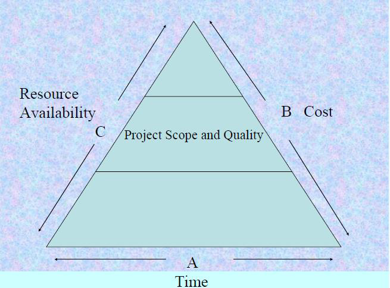

> **⚠️ Important:** The scope and the quality of the project are influenced by a variety of constraints like time, cost, and availability of resources — known as the **Scope Triangle**.

---

## 5. Classification of Projects

Every project is different from one another and can be classified based on several different points. The classification varies according to factors such as objectives, source of capital, content, and so on.

Projects can be classified based on the following factors:

1. According to **Source of Capital**
2. According to **Content**
3. According to **Involvement**
4. According to **Objective**

> 💡 **Why This Matters:** Different project types need different management approaches. A public infrastructure project has rigid compliance requirements, while a private IT project may prioritize speed. Classifying your project tells you *which playbook to use.*

> 🧠 **Memory Aid — 4 Classification Factors:** Think **S-C-I-O** — **S**ource of capital, **C**ontent, **I**nvolvement, **O**bjective.

### 5.1 Classification by Source of Capital

| Type | Description |
|---|---|
| **Public** | Financing comes from Governmental institutions |
| **Private** | Financing comes from businesses or private incentives |
| **Mixed** | Financing comes from a mixed source of both public and private funding |

### 5.2 Classification by Content

| Type | Description |
|---|---|
| **Construction** | Projects related to construction of civil or architectural work. An engineering project where planning of execution is needed for desired outcome. |
| **IT Projects** | Projects related to software development, IT systems, etc. |
| **Business** | Projects involved with development of a business idea, management of a work team, cost management, etc., usually following a commercial strategy. |
| **Service or Project Production** | Projects involving development of an innovative product or service, design of a new product, etc. Often used in R&D department. |

### 5.3 Classification by Involvement

| Type | Description |
|---|---|
| **Departmental** | When a certain department or area of an organization is involved |
| **Internal** | When a whole company itself is involved in the project's development |
| **Matrix** | When there is a combination of departments involved |
| **External** | When a company outsources external project manager or teams to execute the project |

### 5.4 Classification by Objective

| Type | Description |
|---|---|
| **Production** | Oriented at the production of a product or service considering a certain objective to be met by an organization |
| **Social** | Oriented at the improvement of the quality of life of people (e.g., Corporate Social Responsibility - CSR) |
| **Educational** | Oriented at the education of others to make them better |
| **Community** | Oriented at people, however with their involvement |
| **Research** | Oriented at innovation and gaining knowledge to enhance operational efficiency of an organization |

---

## 6. Characteristics of Software Projects

Software projects have certain characteristics which make them different from other engineering projects.

| Characteristic | Description |
|---|---|
| **Invisibility** | When a physical artifact such as a bridge or road is being constructed, the progress can actually be seen. With software, progress is not immediately visible. In software development, there is a level of uncertainty — it isn't easy to accurately define detailed requirements before starting development. |
| **Complexity** | Considering the fact of investment per dollar/pound/euro, software products contain more complexity than other engineered artifacts. For example, in a bridge there is a clear structural relationship between parts, whereas software component relationships are much more complicated. We cannot measure the complexity of a software project until we work on it. |
| **Conformity** | Physical systems are governed by consistent physical law, while software developers have to conform to the requirements of human clients. If client requirements are inconsistent, developing software can be a difficult job. |
| **Flexibility** | Software systems are particularly subject to change. A bridge has to be built in a specific order, whereas we can make software much more flexibly and restructure parts quite freely. |

> 🧠 **Memory Aid — 4 Characteristics:** Think **I-C-C-F** — **I**nvisibility, **C**omplexity, **C**onformity, **F**lexibility.

### Additional Characteristics

- **Intangibility:** Software projects are intangible.
- **People-intensive:** Managing a software project is more about managing interpersonal communication and less about administration.
- **High skill requirement:** It requires a highly skilled team of developers, QA, and other stakeholders to develop a software project (unlike making a bridge where skills can be less varied).

---

## 7. Categories of Software Projects

*Content derived from class notes.*

Some categories of software projects include:

- **Information System** vs. **Embedded Systems**
- **Outsourced Projects**
- **Compulsory** vs. **Voluntary Users**
- **Objective-driven Development**

> **📊 Comparison: Information System vs. Embedded System**

| Aspect | Information System | Embedded System |
|---|---|---|
| Interface | Interfaces with the **organization** | Interfaces with a **machine** |
| Example | Inventory system maintained by an organization | Process control system (e.g., maintaining air conditioning equipment) |

> **Objective-driven Development:** Projects are also defined by producing a product or meeting objectives. Such projects produce the product that must meet all kinds of client requirements. In general, software projects have an objective-driven stage (recommends the new system to meet identified requirements) and a project-driven stage (to actually develop the product).

---

## 8. Project Manager

> **Definition:** A **project manager** is the person responsible for leading a project from start to finish — handling planning, execution, people, resources, and scope with full authority and accountability for project completion.

### Skills Required

| Skill Category | Specific Skills |
|---|---|
| **Technical Skills** | Scheduling, Cost Control, Risk Management, Task Management, Quality Management |
| **Soft Skills** | Leadership, Negotiation, Critical Thinking, Communication, Sense of Humor |
| **Management Skills** | Activity & Resource Planning, Organizing & Motivating the Project Team, Controlling Time Management, Cost Estimation & Developing the Budget, Ensuring Customer Satisfaction, Analyzing and Managing Project Risk, Managing Reports & Necessary Documentation |

---

## 9. Project Management

> **Definition:** **Project Management** is the application of knowledge, skills, tools, and techniques to project activities to meet stakeholder needs and expectations. — **PMI**

### Objectives of Project Management

- Coordinate the various interrelated processes of the project
- Ensure project includes all the work required (and only the work required) to complete successfully
- Ensure the project is completed **on time** and **within budget**
- Ensure the project will satisfy the needs for which it was undertaken
- Ensure the most effective use of the people involved
- Promote effective communication between team members and key stakeholders
- Ensure that project risks are identified, analyzed, and responded to

### Factors Influencing PM Division Setup

The decision on whether or not to set up a separate project management division depends upon:

| Factor | Description |
|---|---|
| Interactions/Interdependencies | Between various departments |
| Sharing of common resources | Resource pooling needs |
| Importance to organization | How critical the project is |
| Size of the project | Scale and magnitude |
| Degree of unfamiliarity | Work novelty and complexity |
| Market changes | Market dynamics |
| Reputation of organization | Organizational standing |

### Benefits of Good Project Management

- **Better efficiency** — Working smarter, not harder
- **Cost flexibility** — Pay only for hours spent on delivering services; fewer hours = lower cost
- **Objectivity** — Far from office politics, a PM gives an idea of what is better for the company
- **Focus** — Once the PM handles the work, you can focus on finding other providers

### Project Management Life Cycle (Overview)

The project management life cycle describes high-level processes for delivering a successful project. It is one of the critical processes of any project as it is the core process that connects all other project activities and processes together.

> 💡 **Why This Matters:** The PM Life Cycle gives you a roadmap — at any point, you should know which phase you're in, what activities to focus on, and what deliverables to produce before moving to the next phase.

The project management life cycle is usually broken down into **four phases**:

1. **Initiation**
2. **Planning**
3. **Execution**
4. **Closure**

> **Note:** Some methodologies also include a fifth phase — *Controlling or Monitoring* — but for our purposes, this phase is covered under the execution and closure phases.

### Project Lifecycle vs Product Lifecycle

| Aspect | Project Lifecycle | Product Lifecycle |
|--------|-------------------|-------------------|
| Scope | Covers the project from start to finish | Covers the product from concept to retirement |
| Phases | Initiation → Planning → Execution → Closure | Concept → Development → Production → Retirement |
| Duration | Temporary (ends when project is closed) | Long-term (spans entire product life) |
| Focus | Delivering the project outputs | Managing the product through its entire life |
| Example | Building the app (6 months) | The app from idea to decommission (5+ years) |

> 💡 **Why This Matters:** A project manager delivers the project (e.g., build the software), but the product may live on for years. Understanding this distinction helps manage expectations about when PM responsibilities end.

---

## 10. Project Management Life Cycle (Visual Overview)

| Phase | Key Activities |
|---|---|
| **Initiation** | Identify business need, brainstorm solutions, gather requirements |
| **Planning** | Create project plan, develop schedule, allocate resources, estimate budget |
| **Execution** | Turn plan into action, track progress, communicate, manage quality and budget |
| **Closure** | Deliver final deliverables, release resources, evaluate success, document lessons learned |

---

## 11. Activities Covered by SPM

A software project is not only concerned with the actual writing of software. Usually there are **three successive processes** that bring a new system into being:

1. **Feasibility Study**
2. **Planning**
3. **Execution**

> 💡 **Why This Matters:** Many beginners think software project management is just about coding. In reality, a large portion of effort goes into *deciding what to build* (feasibility) and *planning how to build it* (planning) before any code is written.

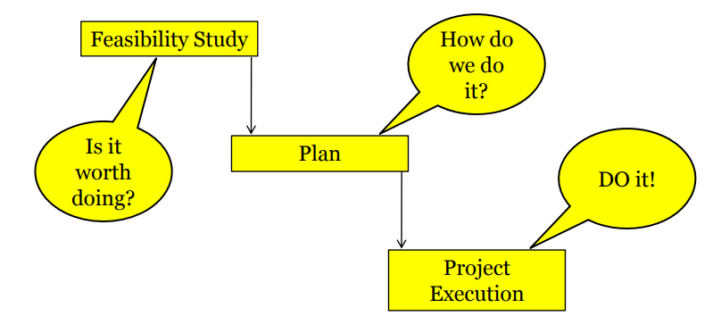

### 11.1 Feasibility Study

> **Definition:** A **feasibility study** investigates whether a proposed project is viable and worth starting — ensuring it has a valid business case before committing resources.

- Information is gathered about the requirements of the proposed application
- Probable developmental and operational costs, along with the value of the benefits, are estimated

#### Types of Feasibility

| Type | Key Question |
|---|---|
| **Technical** | Hardware, Software, Infrastructure? |
| **Economical** | Investment vs. Rate of Return? |
| **Legal** | Legal procedures, IT policy, Cyber law, Ethics? |
| **Operational** | Will the system come into operation as per the requirement? |
| **Time** | Tentative time period of completion |

### 11.2 Planning

> **Definition:** **Planning** is the process of formulating the project roadmap — creating an outline plan for the whole project and a detailed plan for the first stage, once the feasibility study confirms viability.

- Formulate an **outline plan** for the whole project and a **detailed plan** for the first stage
- For large projects, detailed planning is not done right at the beginning; more detailed planning of later stages is done as they are approached

#### Contents List for a Project Plan

1. Introduction and background of project
2. Project Objectives
3. Constraints (could be included with project objectives)
4. Project products (both deliverable products the client will receive and intermediate products)
5. Activities to be carried out
6. Resources to be used
7. Risks to the project

### 11.3 Execution

> **Definition:** **Execution** is the phase where the project plan is put into action — typically including **design** and **implementation** sub-phases to build the actual product.

| Sub-phase | Description |
|---|---|
| **Design** | Thinking and making decisions about the precise form of the products. For software, this relates to the external appearance (user interface) or the internal architecture. |
| **Implementation** | Refers to the real-time execution of the final product of the software project. |

---

## 12. Project Management Cycle (Detailed)

*Content derived from class notes.*

### 12.1 Initiation Phase

Project initiation is the **starting point** of any project.

#### Process Flow

1. **Identify** a business need, problem, or opportunity
2. All activities related to winning the project take place (service provider proves eligibility and ability)
3. **Brainstorm** ways the team can meet this need or solve this problem
4. **Detailed requirements gathering** — all client requirements are gathered and analyzed for implementation
5. **Negotiations** may take place to change or remove certain requirements
6. The initiation process usually **ends with requirements gathering**

#### Steps in the Initiation Phase

| Step | Description |
|---|---|
| **Feasibility Study** | Identify the primary problem and whether the project will deliver a solution |
| **Identifying Scope** | Define the depth and breadth of the project |
| **Identifying Deliverables** | Define the product or service to provide |
| **Identifying Stakeholders** | Figure out whom the project affects and what their needs may be |
| **Developing a Business Case** | Compare potential costs and benefits to determine if the project moves forward |
| **Developing a Statement of Work** | Document the project's objectives, scope, and deliverables as a working agreement |

### 12.2 Planning Phase

Project planning is one of the main project management processes. If the project management team gets this step wrong, there could be heavy negative consequences during the next phases.

> **⚠️ Important:** This is the **most important phase** when it comes to project cost and effort.

#### Process

1. The project plan is derived to address requirements such as scope, budget, and timelines
2. The project schedule is developed
3. Depending on the budget and schedule, **resources are allocated**
4. Break down the larger project into **smaller tasks**, build the team, and prepare a schedule

#### Steps in the Planning Phase

| Step | Description |
|---|---|
| **Creating a Project Plan** | Identify timeline, phases, tasks, and possible constraints |
| **Creating Workflow Diagrams** | Visualize processes using swim lanes so team members understand their roles |
| **Estimating Budget** | Use cost estimates to determine spend for maximum ROI |
| **Gathering Resources** | Build functional team from internal/external talent pools with necessary tools |
| **Anticipating Risks** | Identify issues that may cause stalling; plan to mitigate risks and maintain quality |

### 12.3 Execution Phase

The execution phase **turns your plan into action**.

#### Project Manager's Role

- Keep work on track
- Organize team members
- Manage timelines
- Ensure work is done according to the original plan
- **Track effort and cost** to determine if the project is progressing in the right direction

> **Note:** Senior management requires daily or weekly status updates. The client may also want to track progress.

#### Steps in the Execution Phase

| Step | Description |
|---|---|
| **Creating Tasks & Organizing Workflows** | Assign granular aspects to appropriate team members; avoid overworking |
| **Briefing Team Members** | Explain tasks, provide guidance, organize process-related training |
| **Communicating** | Provide updates to stakeholders at all levels |
| **Monitoring Quality** | Ensure team members meet time and quality goals |
| **Managing Budget** | Monitor spending; keep the project on track |

### 12.4 Closure Phase

Once the team has completed work on a project, we enter the **closure phase**.

#### Activities in Closure

- Provide **final deliverables**
- **Release project resources**
- **Determine the success** of the project
- Evaluate what did and did not work

> **⚠️ Important:** Just because the major project work is over does not mean the project manager's job is done.

#### Steps in the Closure Phase

| Step | Description |
|---|---|
| **Analyzing Project Performance** | Determine if goals were met (tasks completed on time and on budget) using a checklist |
| **Analyzing Team Performance** | Evaluate how team members performed (timeliness and quality of work) |
| **Documenting Project Closure** | Ensure all aspects are completed with no loose ends; provide reports to key stakeholders |
| **Conducting Post-Implementation Reviews** | Final analysis considering lessons learned for similar future projects |
| **Accounting for Used and Unused Budget** | Allocate remaining resources for future projects |

---

## 13. SPM Framework

Software Project Management Framework consists of **three parts**:

1. **Project Lifecycle** (Similar to Project Management Life Cycle)
2. **Project Control Cycle**
3. **Tools and Templates**

### 13.1 Tools and Templates

To manage the project management system adequately and efficiently, we use project management tools:

| Tool | Description |
|---|---|
| **Gantt Chart** | Schedule of the project. One of the most popular and helpful ways of showing activities displayed against time. Each activity is represented by a bar. |
| **PERT Chart** | Program Evaluation Review Technique. A network diagram concerning the number of nodes, which represents events. The direction of the lines indicates the sequence of the task. |
| **Work Breakdown Structure (WBS)** | A management tool and necessary part of project designing. A task-oriented system for subdividing a project into product parts. Describes subtasks, work packages, and represents the connection between work packages. |

#### Templates Used in SPM

| Template Type | Purpose |
|---|---|
| Business Requirements | Document functional and non-functional requirements |
| Risk Management | Identify, assess, and plan for risks |
| Quality Assurance | Define quality standards and testing procedures |

### 13.2 Visual References

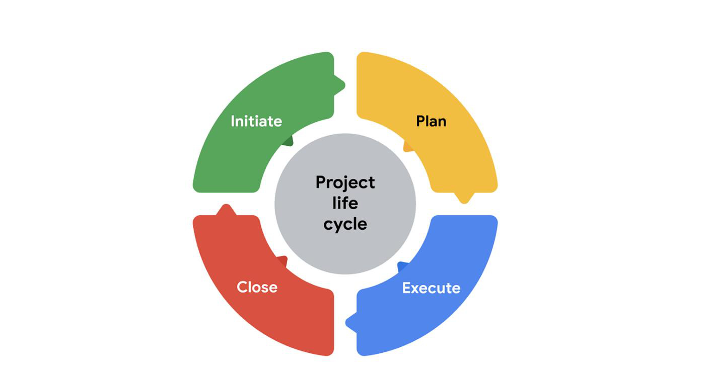
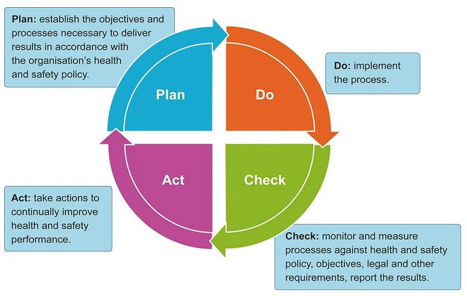
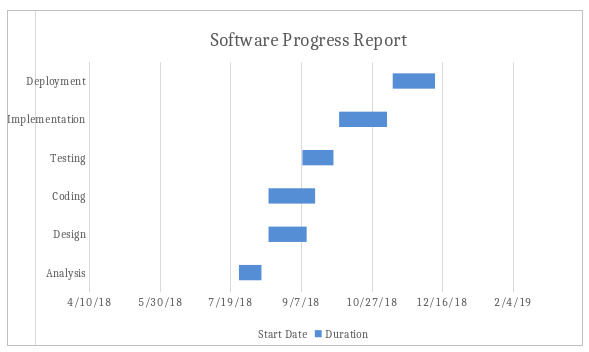
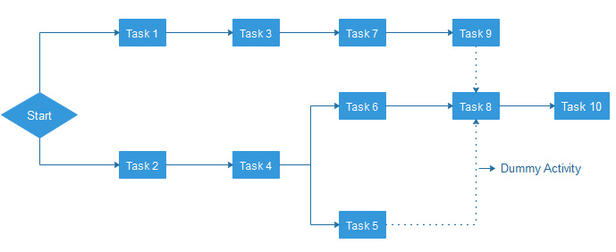
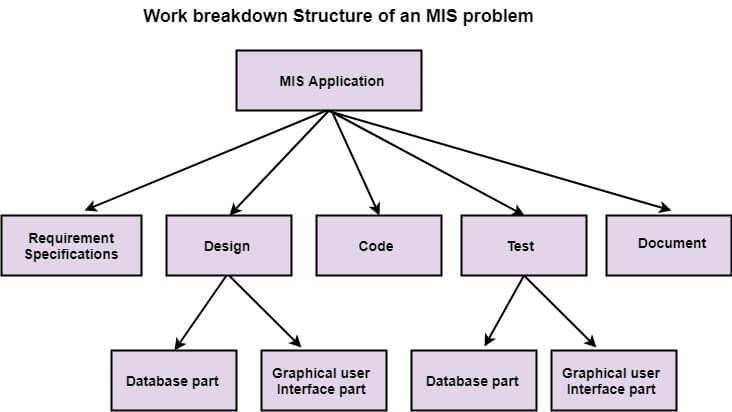
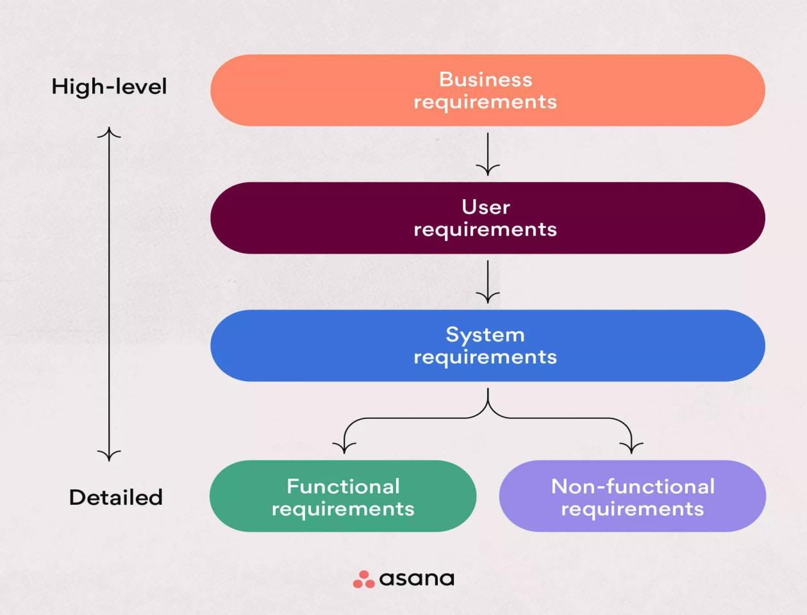

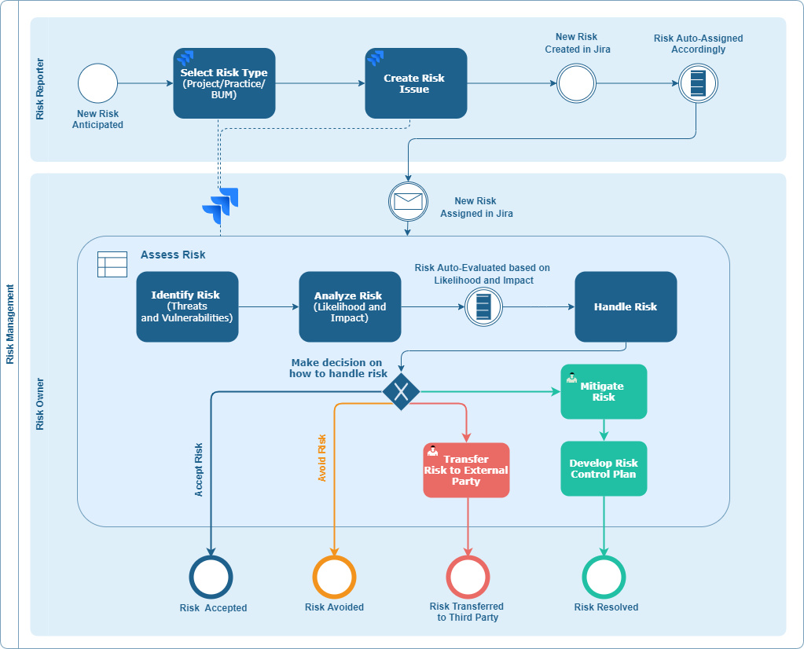
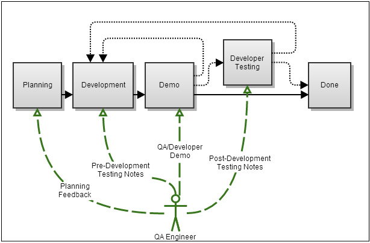

---

## 14. Types of Project Plan

The project planning process is the main tool used to ensure that tasks are completed in a timely manner.

> **Definition:** A **project plan** is a formal document that defines how a project will be executed, monitored, and controlled — specifying deliverables, timeline, resources, and success criteria.

In order to make certain that a project has the best chance of success and risk of failure has been minimized, a plan is devised to determine the most effective strategy for completion.

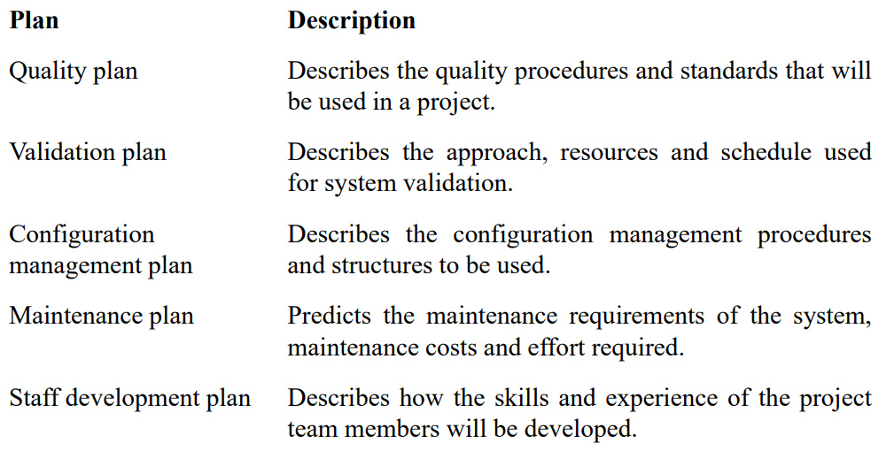
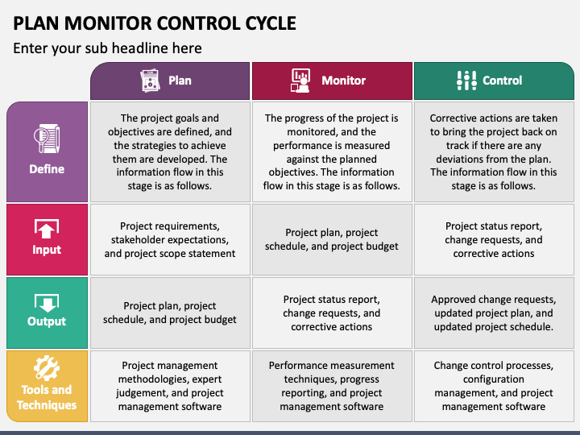

---

## ⭐ Quick Revision Summary

### Key Formulas & Acronyms

| Acronym | Stands For | Meaning |
|---|---|---|
| **SMART** | Specific, Measurable, Achievable, Relevant, Time Bounded | Framework for setting project objectives |
| **PMI** | Project Management Institute | Professional organization defining PM standards |
| **PERT** | Program Evaluation Review Technique | Network diagram for task sequencing |
| **WBS** | Work Breakdown Structure | Task-oriented system for subdividing projects |
| **SPM** | Software Project Management | Management of software development projects |
| **PM** | Project Management | Application of knowledge, skills, tools to meet project goals |

### Decision Rules

1. **Is it a project?** Check: Temporary? Unique? Has a deliverable? If yes to all → it's a project.
2. **Is a goal SMART?** Check: Specific? Measurable? Achievable? Relevant? Time Bounded? If yes to all → it's a SMART goal.
3. **Should a PM division be set up?** Consider: Interdependencies, resource sharing, project importance, size, complexity, market changes, organizational reputation.
4. **Which feasibility to check?** Technical → Economical → Legal → Operational → Time.

### Project Management Life Cycle — Quick Reference

```
┌─────────────────────────────────────────────────────────────────┐
│                    PROJECT MANAGEMENT LIFE CYCLE                │
├─────────────┬─────────────┬─────────────┬───────────────────────┤
│  INITIATION │  PLANNING   │  EXECUTION  │       CLOSURE         │
├─────────────┼─────────────┼─────────────┼───────────────────────┤
│ Feasibility │ Project Plan│ Task Creation│ Performance Analysis  │
│ Scope       │ Workflow    │ Briefing   │ Team Evaluation       │
│ Deliverables│ Budget      │ Monitoring  │ Documentation        │
│ Stakeholders│ Resources   │ Quality     │ Lessons Learned      │
│ Business Case│ Risk Mgmt  │ Budget Mgmt │ Budget Accounting    │
└─────────────┴─────────────┴─────────────┴───────────────────────┘
```

### Key Takeaways

> ⭐ **Software projects differ** from physical projects in **invisibility, complexity, conformity, and flexibility**.
>
> ⭐ **Project success** depends on balancing the **Scope Triangle**: Scope, Quality, Cost, Time, and Resources.
>
> ⭐ **SMART goals** are essential for defining clear, measurable, and achievable project objectives.
>
> ⭐ The **PM Life Cycle** has 4 phases: Initiation → Planning → Execution → Closure.
>
> ⭐ **SPM Framework** comprises **Project Lifecycle + Project Control Cycle + Tools & Templates** (Gantt, PERT, WBS).

## Glossary

| Term | Definition |
|------|-----------|
| **Project** | A temporary endeavor undertaken to create a unique product, service, or result |
| **Software Project** | Complete procedure of software development from requirement gathering to testing and maintenance within a specified period |
| **SPM** | Application of knowledge, skills, tools, and techniques to software project activities |
| **SMART** | Framework for setting goals: Specific, Measurable, Achievable, Relevant, Time Bounded |
| **Feasibility Study** | Investigation of whether a prospective project is worth starting |
| **WBS** | Work Breakdown Structure — hierarchical decomposition of project work |
| **Gantt Chart** | Time-scaled bar chart showing project activities and their durations |
| **PERT** | Program Evaluation and Review Technique — network diagram for uncertain activity times |
| **Scope Triangle** | The balancing constraint among scope, quality, cost, time, and resources |
| **Deliverable** | Any measurable, tangible outcome produced by a project |
| **Stakeholder** | Any individual or organization affected by the project |
| **PMI** | Project Management Institute — professional body defining PM standards |
| **SPM Framework** | Three parts: Project Lifecycle + Project Control Cycle + Tools & Templates |
| **Project Life Cycle** | Sequence of phases: Initiation → Planning → Execution → Closure |
