# Unit 02: Project Analysis

> **Hours:** 8 Hrs. | **Source:** `Chapter_2_Project Analysis.pdf`

---

## Table of Contents

1. [Introduction to Project Analysis](#introduction-to-project-analysis)
2. [Strategic Assessment](#strategic-assessment)
   - [2.1 Programme Management](#21-programme-management)
   - [2.2 Portfolio Management](#22-portfolio-management)
3. [Technical Assessment](#technical-assessment)
4. [Economic Analysis](#economic-analysis)
   - [4.1 Present Worth Method](#41-present-worth-method)
   - [4.2 Future Worth Method](#42-future-worth-method)
   - [4.3 Annual Worth Method](#43-annual-worth-method)
   - [4.4 Internal Rate of Return (IRR)](#44-internal-rate-of-return-irr)
   - [4.5 Benefit-Cost Ratio (BCR)](#45-benefit-cost-ratio-bcr)
   - [4.6 Uniform Gradient Cash Flow](#46-uniform-gradient-cash-flow)
5. [Comparison of Alternatives](#comparison-of-alternatives)
6. [Solved Numerical Problems](#solved-numerical-problems)
   - [6.1 Discounted Payback Period Problems](#61-discounted-payback-period-problems)
   - [6.2 ROI Problems](#62-roi-problems)
7. [Key Formulas Reference](#key-formulas-reference)
8. [Quick Revision Summary](#quick-revision-summary)

---

## Introduction to Project Analysis

> **Definition:** Project analysis is the process of examining the aspects of a project in detail. It helps ensure the project runs as expected and stays within the predefined budget.

**Benefits of Project Analysis:**
- **Determines Feasibility** of a Project
- **Aids in Budgeting**
- **Improves Project Planning and Scheduling**
- **Detects and Mitigates Risks**
- **Expedites the Monitoring and Evaluation** of Projects

---

## Strategic Assessment

> **Definition:** Strategic assessment is the process of evaluating a project against the organization's long-term goals to ensure there is a concrete plan that clearly defines the organization's objectives. It provides the basis for defining a project and its goals.

**Purpose of Strategic Assessment:**
- Analyzing company performance
- Identifying areas of strength and opportunity
- Creating a workable environment
- Judging whether a project fits the long-term goals of the organization

**Who Performs It:** Usually carried out by senior management that needs a strategic plan clearly defining the objectives of the organization.

**Two Main Types:**
1. **Programme Management** — for projects developed for use *within* the organization
2. **Portfolio Management** — for products developed by a software company *for external* organizations

---

### 2.1 Programme Management

> **Definition:** According to D.C. Ferns (Journal of Project Management Institute): *"Programme is a group of projects that are managed in a coordinated way to gain benefits that would not be possible were the projects to be managed independently."*

In programme management, individual projects are components of a larger programme within the organization.

#### Issues in Programme Management

| Category | Key Questions |
|----------|---------------|
| **Objectives** | How does the project contribute to the long-term goal of the organization? Will the product increase the market share? And by how much? |
| **IS Plan (Integrated System Plan)** | Does the product fit into the overall IS plan? How does the product relate to other existing systems? |
| **Organization Structure** | How does the product affect the existing organizational structure? How does the product affect the existing workflow? What is the overall business model? |
| **MIS (Management Information System)** | What information does the product provide? To whom is the information provided? How does the product relate to other existing MISs? |
| **Personnel** | What are the staff implications? (skills and numbers) What are the impacts on the overall policy on staff development? (training, workshops, seminars, conferences, magazine subscriptions, etc.) |
| **Good Will** | How does the product affect the good will of the organization? |

---

### 2.2 Portfolio Management

> **Definition:** Portfolio management involves assessing products developed by a software company for external client organizations. It requires evaluating the product for both the client organization and the software-providing company.

**Key Issues in Portfolio Management:**
- Long-term goal of the software company
- The effects of the project on the portfolio of the company *(synergies and conflicts)*
- Any added-value to the overall portfolio of the company

---

#### Comparison: Strategic Assessment Types

| Aspect | Programme Management | Portfolio Management |
|--------|---------------------|---------------------|
| **Scope** | Projects developed for internal use | Products developed for external clients |
| **Focus** | How the project fits within the organization | How the project fits within the company's product line |
| **Key Concern** | Organizational alignment | Market positioning and portfolio value |

---

## Technical Assessment

> **Definition:** Technical assessment consists of evaluating the required functionality against the available hardware and software. It provides a fact-based understanding of the current level of product knowledge, technical maturity, program status, and technical risk by comparing assessment results against defined criteria.

**Areas Dealt With:**
- Functionality against hardware and software
- The strategic IS plan of the organization
- Any constraints imposed by the IS plan

**Purpose:** Technical assessment is the cross-cutting process used to help monitor the technical progress of a project.

#### Technical Reviews vs. Technical Indicators

| Aspect | Technical Reviews | Technical Indicators |
|--------|-------------------|---------------------|
| **Purpose** | Periodic evaluations of technical progress | Quantitative measures of technical performance |
| **Frequency** | Periodic (milestone-based) | Continuous tracking |
| **Examples** | Design reviews, code reviews, test reviews | Key Performance Parameters (KPPs), Technical Performance Measures (TPMs) |

> **Key Performance Parameters (KPPs):** A subset of performance parameters deemed most critical for the success of the project. They represent the minimum acceptable values for key system attributes.

> **Technical Performance Measures (TPMs):** Quantitative metrics used to track the actual versus planned technical performance of a project throughout its lifecycle.

---

## Economic Analysis

> **Definition:** Economic analysis involves evaluating the project by analyzing its financial feasibility. This includes identifying and estimating costs of resources (labor, materials, equipment), forecasting the project's revenue or savings, and assessing the potential risks and benefits of the project.

**Goal:** To determine whether a project is financially viable and to provide information for making decisions about resource allocation.

#### Methods of Economic Analysis

| Method | Type | Purpose |
|--------|------|---------|
| Present Worth Method | Discounted Cash Flow | Compare value of all cash flows at time zero |
| Future Worth Method | Discounted Cash Flow | Compare value of all cash flows at project end |
| Annual Worth Method | Equivalent Annual | Convert all cash flows to uniform annual amounts |
| Internal Rate of Return (IRR) | Rate-based | Find break-even interest rate |
| Benefit-Cost Ratio (BCR) | Ratio | Compare benefits to costs as a ratio |

---

### 4.1 Present Worth Method

> **Definition:** The Present Worth Method (also called Discounted Cash Flow (DCF), Present Value (PV), or Net Present Value (NPV)) calculates the difference between the present value of cash inflows and the present value of cash outflows. All cash flows of each alternative are reduced to time zero by assuming an interest rate ***i***.

**Key Concept:**
- **NPV > 0:** Investment is expected to be a good investment
- **NPV < 0:** Investment is not expected to be a good investment

**Notations:**
- **P** — Initial investment
- **Rj** — Net revenue at the end of the *j*th year
- **i** — Interest rate, compounded annually
- **S** — Salvage value at the end of the *n*th year

#### Cash Flow Diagram Types

**Revenue/Profit-Dominated Cash Flow (RDCF):**
- Profit, revenue, salvage value (inflows) → assigned **positive** sign
- Costs (outflows) → assigned **negative** sign
- **Decision Rule:** Select alternative with the **maximum** present worth

**Cost-Dominated Cash Flow (CDCF):**
- Costs (outflows) → assigned **positive** sign
- Profit, revenue, salvage value (inflows) → assigned **negative** sign
- **Decision Rule:** Select alternative with the **minimum** present worth

#### Formulas

**Revenue-Dominated Cash Flow (RDCF):**

$$ \text{PW}(i) = -P + R_1\frac{1}{(1+i)^1} + R_2\frac{1}{(1+i)^2} + \dots + R_j\frac{1}{(1+i)^j} + R_n\frac{1}{(1+i)^n} + S\frac{1}{(1+i)^n} $$

**Cost-Dominated Cash Flow (CDCF):**

$$ \text{PW}(i) = P + C_1\frac{1}{(1+i)^1} + C_2\frac{1}{(1+i)^2} + \dots + C_j\frac{1}{(1+i)^j} + C_n\frac{1}{(1+i)^n} - S\frac{1}{(1+i)^n} $$

> **Note:** In the formula for RDCF, expenditure is assigned a negative sign and revenues are assigned a positive sign. In CDCF, expenditure is assigned a positive sign and revenues are assigned a negative sign.

#### Decision Rules

| Cash Flow Type | Select Alternative With |
|----------------|------------------------|
| Revenue-Dominated | **Maximum** PW |
| Cost-Dominated | **Minimum** PW |

---

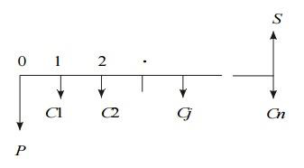
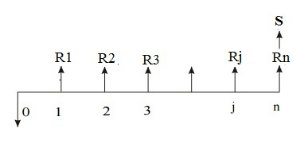

### 💡 Example 1: Technology Selection (Revenue-Dominated PW)

**Given:**
ABC Industry is planning to expand its production operation. It has identified three different technologies.

| Alternative | Initial Investment (Rs.) | Yearly Revenue (Rs.) | Life (Years) |
|-------------|------------------------|---------------------|--------------|
| Technology 1 | 12,00,000 | 4,00,000 | 10 |
| Technology 2 | 20,00,000 | 6,00,000 | 10 |
| Technology 3 | 18,00,000 | 5,00,000 | 10 |

**Interest Rate:** 20%, compounded annually

**Solution:**

**For Technology 1:**
- P = Rs. 12,00,000, A = Rs. 4,00,000, i = 20%, n = 10

$$ \text{PW}(20\%) = -12,00,000 + 4,00,000(\text{P/A}, 20\%, 10) $$

$$ \text{PW}(20\%) = -12,00,000 + 4,00,000 \times 4.1925 $$

$$ \text{PW}(20\%) = -12,00,000 + 16,77,000 $$

$$ \text{PW}(20\%) = \textbf{Rs. 4,77,000} $$

**For Technology 2:**
- P = Rs. 20,00,000, A = Rs. 6,00,000, i = 20%, n = 10

$$ \text{PW}(20\%) = -20,00,000 + 6,00,000(\text{P/A}, 20\%, 10) $$

$$ \text{PW}(20\%) = -20,00,000 + 6,00,000 \times 4.1925 $$

$$ \text{PW}(20\%) = -20,00,000 + 25,15,500 $$

$$ \text{PW}(20\%) = \textbf{Rs. 5,15,500} $$

**For Technology 3:**
- P = Rs. 18,00,000, A = Rs. 5,00,000, i = 20%, n = 10

$$ \text{PW}(20\%) = -18,00,000 + 5,00,000(\text{P/A}, 20\%, 10) $$

$$ \text{PW}(20\%) = -18,00,000 + 5,00,000 \times 4.1925 $$

$$ \text{PW}(20\%) = -18,00,000 + 20,96,250 $$

$$ \text{PW}(20\%) = \textbf{Rs. 2,96,250} $$

| Technology | PW (Rs.) |
|------------|----------|
| Tech 1 | 4,77,000 |
| **Tech 2** | **5,15,500** ← Highest |
| Tech 3 | 2,96,250 |

**Answer:** The PW of Technology 2 is the highest among all three. Therefore, **Technology 2** is suggested for implementation.

---

### 💡 Example 2: Elevator Selection (Cost-Dominated PW)

**Given:** An engineer has two bids for an elevator to be installed in a new building.

| Alternative | Initial Investment (Rs.) | Annual Maintenance Cost (Rs.) | Life (Years) |
|-------------|------------------------|-----------------------------|--------------|
| ABC Company | 4,50,000 | 27,000 | 15 |
| XYZ Company | 5,40,000 | 28,500 | 15 |

**Interest Rate:** 15%, compounded annually

**Solution — For ABC Company:**
- P = Rs. 4,50,000, Annual maintenance = Rs. 27,000, i = 15%, n = 15

$$ \text{PW}(15\%) = 4,50,000 + 27,000(\text{P/A}, 15\%, 15) $$

$$ \text{PW}(15\%) = 4,50,000 + 27,000 \times 5.8474 $$

$$ \text{PW}(15\%) = 4,50,000 + 1,57,879.80 $$

$$ \text{PW}(15\%) = \textbf{Rs. 6,07,879.80} $$

**Solution — For XYZ Company:**
- P = Rs. 5,40,000, Annual maintenance = Rs. 28,500, i = 15%, n = 15

$$ \text{PW}(15\%) = 5,40,000 + 28,500(\text{P/A}, 15\%, 15) $$

$$ \text{PW}(15\%) = 5,40,000 + 28,500 \times 5.8474 $$

$$ \text{PW}(15\%) = 5,40,000 + 1,66,650.90 $$

$$ \text{PW}(15\%) = \textbf{Rs. 7,06,650.90} $$

| Bid | PW Cost (Rs.) |
|-----|---------------|
| **ABC Company** | **6,07,879.80** ← Lower |
| XYZ Company | 7,06,650.90 |

**Answer:** The total present worth cost of ABC Company's bid is less than that of XYZ Company. Hence, the elevator from **ABC Company** should be purchased and installed (Bid 1 is selected).

---

### 💡 Example 3: Investment Proposals with Non-Uniform Cash Flows (Revenue-Dominated PW)

**Given:** Investment proposals A and B have the following net cash flows:

| Year | Proposal A (Rs.) | Proposal B (Rs.) |
|------|-----------------|-----------------|
| 0 | -10,000 | -10,000 |
| 1 | 3,000 | 6,000 |
| 2 | 3,000 | 6,000 |
| 3 | 7,000 | 3,000 |
| 4 | 6,000 | 3,000 |

**Interest Rate:** 18%, compounded annually

> ⚡ **Quick Formula:** Use **P/F** instead of **P/A** when annual revenues are **not uniform**.

**Solution — For Proposal A:**

$$ \text{PW}_A(18\%) = -10,000 + 3,000(\text{P/F}, 18\%, 1) + 3,000(\text{P/F}, 18\%, 2) + 7,000(\text{P/F}, 18\%, 3) + 6,000(\text{P/F}, 18\%, 4) $$

$$ \text{PW}_A(18\%) = -10,000 + 3,000(0.8475) + 3,000(0.7182) + 7,000(0.6086) + 6,000(0.5158) $$

$$ \text{PW}_A(18\%) = -10,000 + 2,542.50 + 2,154.60 + 4,260.20 + 3,094.80 $$

$$ \text{PW}_A(18\%) = \textbf{Rs. 2,052.10} $$

**Solution — For Proposal B:**

$$ \text{PW}_B(18\%) = -10,000 + 6,000(\text{P/F}, 18\%, 1) + 6,000(\text{P/F}, 18\%, 2) + 3,000(\text{P/F}, 18\%, 3) + 3,000(\text{P/F}, 18\%, 4) $$

$$ \text{PW}_B(18\%) = -10,000 + 6,000(0.8475) + 6,000(0.7182) + 3,000(0.6086) + 3,000(0.5158) $$

$$ \text{PW}_B(18\%) = -10,000 + 5,085 + 4,309.20 + 1,825.80 + 1,547.40 $$

$$ \text{PW}_B(18\%) = \textbf{Rs. 2,767.40} $$

| Proposal | PW (Rs.) |
|----------|----------|
| A | 2,052.10 |
| **B** | **2,767.40** ← Higher |

**Answer:** At i = 18%, the present worth of **Proposal B** is higher than that of Proposal A. Therefore, select **Proposal B**.

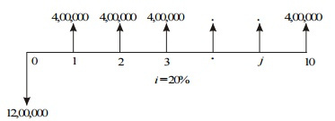
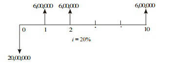
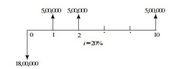
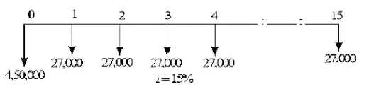
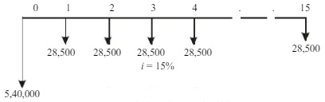
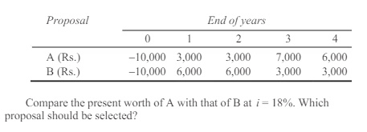
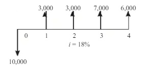
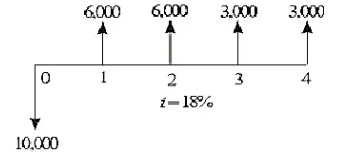

---

### 4.2 Future Worth Method

> **Definition:** In the Future Worth Method, the future worth of various alternatives is computed. Then, the alternative with the **maximum future worth of net revenue** or with the **minimum future worth of net cost** is selected as the best alternative for implementation.

**Notations:**
- **P** — Initial investment
- **Rj** — Net revenue at the end of the *j*th year
- **S** — Salvage value at the end of the *n*th year

**Formula (Revenue-Dominated):**

$$ \text{FW}(i) = -P(\text{F/P}, i, n) + R_1(\text{F/P}, i, n-1) + R_2(\text{F/P}, i, n-2) + \dots + R_n + S $$

**Simplified (Uniform Revenue):**

$$ \text{FW}(i) = -P(\text{F/P}, i, n) + A(\text{F/A}, i, n) + S $$

**For Cost-Dominated Cash Flow:**

$$ \text{FW}(i) = P(\text{F/P}, i, n) + C(\text{F/A}, i, n) - S $$

**Decision Rule for Cost-Dominated:** Select alternative with the **minimum** future worth.

**Decision Rule:**
- **Revenue-Dominated:** Select alternative with the **maximum** future worth
- **Cost-Dominated:** Select alternative with the **minimum** future worth

---

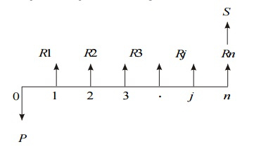

### 💡 Example 1: Mutually Exclusive Alternatives (Future Worth)

**Given:** Two mutually exclusive alternatives with cash flows:

| Alternative | Year 0 (Rs.) | Year 1 (Rs.) | Year 2 (Rs.) | Year 3 (Rs.) | Year 4 (Rs.) |
|-------------|-------------|-------------|-------------|-------------|-------------|
| A | -50,00,000 | 20,00,000 | 20,00,000 | 20,00,000 | 20,00,000 |
| B | -45,00,000 | 18,00,000 | 18,00,000 | 18,00,000 | 18,00,000 |

**Interest Rate:** 18%, compounded annually

**Solution — For Alternative A:**
- P = Rs. 50,00,000, A = Rs. 20,00,000, i = 18%, n = 4

$$ \text{FW}_A(18\%) = -50,00,000(\text{F/P}, 18\%, 4) + 20,00,000(\text{F/A}, 18\%, 4) $$

$$ \text{FW}_A(18\%) = -50,00,000(1.939) + 20,00,000(5.215) $$

$$ \text{FW}_A(18\%) = -96,95,000 + 1,04,30,000 $$

$$ \text{FW}_A(18\%) = \textbf{Rs. 7,35,000} $$

**Solution — For Alternative B:**
- P = Rs. 45,00,000, A = Rs. 18,00,000, i = 18%, n = 4

$$ \text{FW}_B(18\%) = -45,00,000(\text{F/P}, 18\%, 4) + 18,00,000(\text{F/A}, 18\%, 4) $$

$$ \text{FW}_B(18\%) = -45,00,000(1.939) + 18,00,000(5.215) $$

$$ \text{FW}_B(18\%) = -87,25,500 + 93,87,000 $$

$$ \text{FW}_B(18\%) = \textbf{Rs. 6,61,500} $$

| Alternative | FW (Rs.) |
|-------------|----------|
| **A** | **7,35,000** ← Higher |
| B | 6,61,500 |

**Answer:** The future worth of **Alternative A** is greater than that of Alternative B. Thus, **Alternative A** should be selected.

---

### 💡 Example 2: Gas Station vs. Ice Cream Stand (Future Worth)

**Given:** A man owns a corner plot and must decide between two alternatives:

| Alternative | Initial Investment (Rs.) | Annual Income (Rs.) | Annual Property Tax (Rs.) | Life (Years) |
|-------------|------------------------|-------------------|--------------------------|--------------|
| Build Gas Station | 20,00,000 | 8,00,000 | 80,000 | 20 |
| Build Ice Cream Stand | 36,00,000 | 9,80,000 | 1,50,000 | 20 |

**Interest Rate:** 12%, compounded annually (no salvage value mentioned)

**Solution — For Gas Station:**
- P = Rs. 20,00,000, i = 12%, n = 20

$$ \text{Net Annual Income} = 8,00,000 - 80,000 = \text{Rs. 7,20,000} $$

$$ \text{FW}(12\%) = -20,00,000(\text{F/P}, 12\%, 20) + 7,20,000(\text{F/A}, 12\%, 20) $$

$$ \text{FW}(12\%) = -20,00,000(9.646) + 7,20,000(72.052) $$

$$ \text{FW}(12\%) = -1,92,92,000 + 5,18,77,440 $$

$$ \text{FW}(12\%) = \textbf{Rs. 3,25,85,440} $$

**Solution — For Ice Cream Stand:**
- P = Rs. 36,00,000, i = 12%, n = 20

$$ \text{Net Annual Income} = 9,80,000 - 1,50,000 = \text{Rs. 8,30,000} $$

$$ \text{FW}(12\%) = -36,00,000(\text{F/P}, 12\%, 20) + 8,30,000(\text{F/A}, 12\%, 20) $$

$$ \text{FW}(12\%) = -36,00,000(9.646) + 8,30,000(72.052) $$

$$ \text{FW}(12\%) = -3,47,25,600 + 5,98,03,160 $$

$$ \text{FW}(12\%) = \textbf{Rs. 2,50,77,560} $$

| Alternative | FW (Rs.) |
|-------------|----------|
| **Gas Station** | **3,25,85,440** ← Higher |
| Ice Cream Stand | 2,50,77,560 |

**Answer:** The future worth of building the gas station is greater. Thus, **building the gas station** is the best alternative.

---

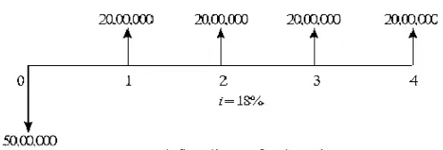
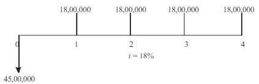
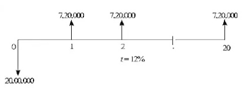
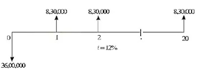

### 4.3 Annual Worth Method

> **Definition:** The Annual Worth Method converts all incomes and expenditures (irregular and uniform) into an equivalent uniform annual amount (AW), which is the same each period. AW values of alternatives are calculated for **one life cycle only**.

> ⭐ **Key Takeaway:** If the project continues for more than one cycle, the equivalent annual worth for the next cycle and all succeeding cycles will be **exactly the same** (because the provided cash flows are the same for each cycle in constant-value terms).

**Demonstration of Repeatability:**

For an asset with first cost of $20,000, annual operating cost of $8,000, and a 3-year life:

$$ \text{AW (1st cycle, 3 years)} = -20,000(\text{A/P}, 22\%, 3) - 8,000 = -\$17,793 $$

$$ \text{AW (2nd cycle, 6 years)} = -20,000(\text{A/P}, 22\%, 6) - 20,000(\text{P/F}, 22\%, 3)(\text{A/P}, 22\%, 6) - 8,000 = -\$17,793 $$

The AW value for the first life cycle is exactly the same as for two life cycles. This holds for any number of cycles.

**General Formula (with Salvage Value):**

$$ \text{AW} = -P(\text{A/P}, i, n) + S(\text{A/F}, i, n) $$

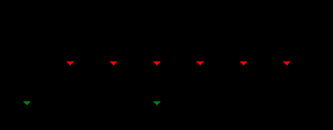

Where:
- **P** = Initial investment
- **S** = Salvage value at end of life
- **i** = Interest rate
- **n** = Life in years

**Decision Rule:**
- **Revenue Projects:** Select if **AW > 0**; among alternatives, select the one with numerically larger AW
- **Cost Projects:** Select the alternative with the **minimum** AW (least negative)

---

### 💡 Example 1: Equipment Purchase Decision (Annual Worth)

**Given:**
- Equipment cost: $25,000
- Market value at end of 5 years: $5,000
- Annual productivity improvement: $8,000
- MARR: 20% per year
- Life: 5 years

**Solution:**
- P = $25,000, S = $5,000, Annual benefit = $8,000, i = 20%, n = 5

$$ \text{AW}(20\%) = -25,000(\text{A/P}, 20\%, 5) + 8,000 + 5,000(\text{A/F}, 20\%, 5) $$

$$ \text{AW}(20\%) = -25,000(0.33438) + 8,000 + 5,000(0.13438) $$

$$ \text{AW}(20\%) = -8,359.50 + 8,000 + 671.90 $$

$$ \text{AW}(20\%) = \textbf{\$312.40} $$

**Answer:** Since AW(20%) = $312.40 > 0, the equipment **should be purchased**.

---

### 💡 Example 2: Project Selection (Annual Worth — Cost Comparison)

**Given:** Two projects under consideration:

| Item | Project A | Project B |
|------|-----------|-----------|
| First Cost | $62,000 | $77,000 |
| Annual Operating Costs | $15,000 | $21,000 |
| Salvage Value | $8,000 | $10,000 |
| Life (Years) | 4 | 6 |

**Interest Rate:** 15% per year

**Solution — For Project A:**
- P = $62,000, AOC = $15,000, S = $8,000, i = 15%, n = 4

$$ \text{AW}_A(15\%) = -62,000(\text{A/P}, 15\%, 4) - 15,000 + 8,000(\text{A/F}, 15\%, 4) $$

$$ \text{AW}_A(15\%) = -62,000(0.35027) - 15,000 + 8,000(0.20027) $$

$$ \text{AW}_A(15\%) = -21,716.74 - 15,000 + 1,602.16 $$

$$ \text{AW}_A(15\%) = \textbf{-\$35,114.58} $$

**Solution — For Project B:**
- P = $77,000, AOC = $21,000, S = $10,000, i = 15%, n = 6

$$ \text{AW}_B(15\%) = -77,000(\text{A/P}, 15\%, 6) - 21,000 + 10,000(\text{A/F}, 15\%, 6) $$

$$ \text{AW}_B(15\%) = -77,000(0.26424) - 21,000 + 10,000(0.11424) $$

$$ \text{AW}_B(15\%) = -20,346.48 - 21,000 + 1,142.40 $$

$$ \text{AW}_B(15\%) = \textbf{-\$40,204.08} $$

| Project | AW (Rs.) |
|---------|----------|
| **A** | **-\$35,114.58** ← Numerically larger |
| B | -\$40,204.08 |

**Answer:** On comparing the Annual Worth, **Project A** is selected because its AW value is numerically larger (less negative).

---

### 4.4 Internal Rate of Return (IRR)

> **Definition:** The Internal Rate of Return (IRR) is a discounting cash flow technique that gives the rate of return earned by a project. It is the discounting rate where the total of initial cash outlay and discounted cash inflows are equal to zero.

> **Formal Definition:** *"It is the break-even interest rate which equates the present worth of a project's cash outflows to the present worth of cash inflows."*

> ⚡ **Quick Formula:**
> IRR is the rate \(i\) that satisfies:
> 
> $$ \text{NPV} = \sum_{t=0}^{n} \frac{\text{Cash Flow}_t}{(1 + \text{IRR})^t} = 0 $$
> 
> Where:
> - **Cash Flowₜ** = Net cash flow at time t
> - **t** = Time period (0, 1, 2, ..., n)

**Purpose:**
- Used as a financial metric to evaluate the performance of an investment or project
- Commonly used to compare the profitability of different investments or projects
- Determines the expected return on an investment

**Decision Rule:**
- **Higher IRR** → More profitable the project
- **Accept if:** IRR ≥ MARR (Minimum Acceptable Rate of Return)
- **Reject if:** IRR < MARR

> ⚠️ **Important:** In real-life scenarios, since investment in any project is huge and has long-term effects, organizations use a combination of various techniques of capital budgeting like **NPV, IRR, and Payback Period** to select the best project.

---

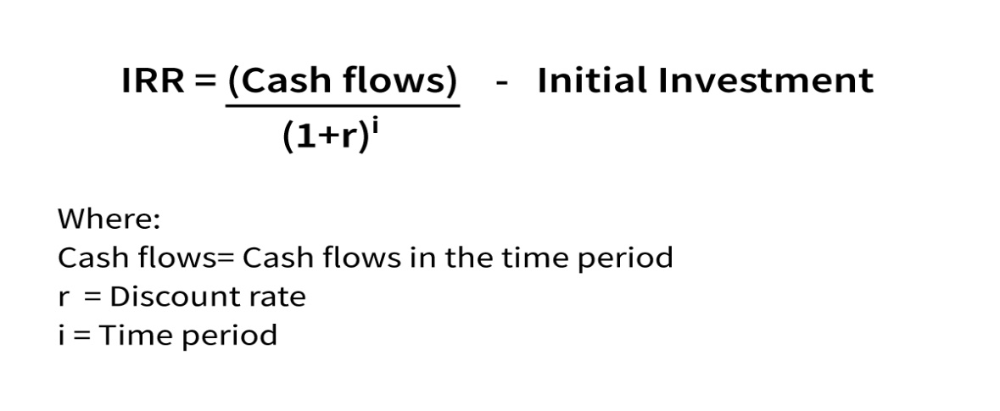

### 4.5 Benefit-Cost Ratio (BCR)

> **Definition:** Benefit-Cost Ratio (BCR) refers to the financial metric that helps in assessing the viability of an upcoming project based on its expected costs and benefits. It determines the relationship between the expected incremental benefit from a project and the corresponding costs incurred to complete the project.

**Formula:**

$$ \text{BCR} = \frac{\text{Present Value of Expected Benefits}}{\text{Present Value of Expected Costs}} $$

**Decision Rules:**
| Condition | Decision |
|-----------|----------|
| BCR > 1 | Project is a good investment (economically feasible) |
| BCR = 1 | Break-even (benefits equal costs) |
| BCR < 1 | Project is a poor investment (not feasible) |

---

### 💡 Example: Benefit-Cost Ratio Calculation

**Given:** A company invested Rs. 10,000 for replacing machinery components. Expected incremental benefits:

| Year | Benefit |
|------|---------|
| 1st Year | Rs. 5,000 |
| 2nd Year | Rs. 3,000 |
| 3rd Year | Rs. 4,000 |

**Discount Rate:** 5%

**Solution:**

**Step 1: Calculate PV of each benefit**

$$ \text{PV of benefit in 1st year} = \frac{5,000}{(1 + 0.05)^1} = \text{Rs. 4,761.90} $$

$$ \text{PV of benefit in 2nd year} = \frac{3,000}{(1 + 0.05)^2} = \text{Rs. 2,721.09} $$

$$ \text{PV of benefit in 3rd year} = \frac{4,000}{(1 + 0.05)^3} = \text{Rs. 3,455.35} $$

**Step 2: Sum the PV of all benefits**

$$ \text{PV of Expected Benefits} = 4,761.90 + 2,721.09 + 3,455.35 $$

$$ \text{PV of Expected Benefits} = \textbf{Rs. 10,938.34} $$

**Step 3: Calculate BCR**

$$ \text{BCR} = \frac{10,938.34}{10,000} = \textbf{1.09} $$

**Answer:** The BCR is 1.09, which is greater than 1. This indicates that the project will create additional value and should be **considered positively**.

---

### 4.6 Uniform Gradient Cash Flow

> **Definition:** A uniform gradient cash flow is one where the cash flow increases or decreases by a constant amount (the gradient) in each cash flow period.

**Key Concept:**
- The gradient (**G**) is the constant amount by which cash flows increase or decrease each period
- It is used to calculate BCR by assuming benefits and costs are received/incurred at a uniform rate over time

**Example:** If cash flow in period 1 is $500, then in period 2 it will be $600, in period 3 it will be $700, and so on. This is a gradient cash flow with **G = $100**.

> ⚡ **Quick Formula:**
> 
> $$ \text{PW} = A_1\left(\frac{1-(1+i)^{-n}}{i}\right) + G\left(\frac{1-(1+i)^{-n}}{i} - \frac{n}{(1+i)^n}\right) $$
> 
> Where:
> - **A₁** = Cash flow in period 1
> - **G** = Gradient (constant increase/decrease per period)
> - **i** = Interest rate
> - **n** = Number of periods

---

## Comparison of Alternatives

### Mutually Exclusive Alternatives

> **Definition:** When alternatives are **mutually exclusive**, only one can be selected because only one is needed. The alternatives are compared against each other, and the one with the most favorable PW (or AW, FW) is identified as "the best."

**Examples:**
- Evaluating locations for construction of a new manufacturing facility — only one site is selected

**Key Rules:**
1. As soon as the best one is identified, **all others are automatically excluded**
2. Alternatives are compared against each other (not just against a baseline)
3. The alternative with the **highest PW at MARR** is selected

### Independent Alternatives

> **Definition:** When alternatives are **independent**, all alternatives that yield a return of at least the minimum acceptable rate of return (MARR) are accepted.

**Key Rules:**
1. All alternatives with **PW ≥ 0** at i = MARR are acceptable
2. Multiple alternatives can be selected simultaneously
3. No comparison between alternatives is needed — each is evaluated on its own merits

### Comparison Table

| Aspect | Mutually Exclusive Alternatives | Independent Alternatives |
|--------|-------------------------------|------------------------|
| **Selection Rule** | Only one can be selected | Multiple can be selected |
| **Decision Basis** | Compare against each other | Compare against MARR threshold |
| **PW Criteria** | Select highest PW | Accept if PW ≥ 0 |
| **BCR Criteria** | Select highest BCR | Accept if BCR > 1 |
| **Example** | Choosing one location for a factory | Approving multiple investment proposals |

---

## Solved Numerical Problems

---

### 6.1 Discounted Payback Period Problems

> **Definition:** Discounted Payback Period is the time required to recover the initial investment in terms of discounted (present value) cash flows. It considers the time value of money.

> ⚠️ **Important:** When discount rate is not given, assume **10%** as the default rate.

---

#### 💡 Problem 1: Project Selection Based on Discounted Payback Period

**Given:** Two projects with the following cash flows:

| Year | Project 1 (Cash Flow) | Project 2 (Cash Flow) |
|------|---------------------|---------------------|
| 0 | -80,000 | -70,000 |
| 1 | 30,000 | 60,000 |
| 2 | 40,000 | 20,000 |
| 3 | — | — |
| 4 | 60,000 | 40,000 |
| 5 | 40,000 | 40,000 |

**Discount Rate:** 10% (assumed since not given)

> ⚡ **Quick Formula:**
> $$ \text{Discount} = \frac{\text{Cash Flow}}{(1 + r)^n} $$

---

**Step 1 — Find Missing Year 3 Cash Flow**

Since Year 3 is not given, we interpolate:

$$ \text{Year 3 Cash Flow} = \text{Year 2 Cash Flow} + \frac{\text{Year 4 CF} - \text{Year 2 CF}}{2 - 1} $$

**For Project 1:**
$$ \text{Year 3 CF} = 40,000 + \frac{60,000 - 40,000}{1} = \textbf{60,000} $$

**For Project 2:**
$$ \text{Year 3 CF} = 20,000 + \frac{40,000 - 20,000}{1} = \textbf{40,000} $$

---

**Step 2 — Calculate Discounted Cash Flows for Project 1**

| Year | Cash Flow | Discount Factor | Discounted CF | Cumulative Discounted CF |
|------|-----------|----------------|---------------|-------------------------|
| 0 | -80,000 | $1/(1.10)^0$ | -80,000.00 | -80,000.00 |
| 1 | 30,000 | $1/(1.10)^1$ | 27,272.72 | -52,727.28 |
| 2 | 40,000 | $1/(1.10)^2$ | 33,057.85 | -19,669.43 |
| 3 | 60,000 | $1/(1.10)^3$ | 45,078.88 | 25,409.45 |
| 4 | 60,000 | $1/(1.10)^4$ | 40,980.80 | 66,390.25 |
| 5 | 40,000 | $1/(1.10)^5$ | 24,836.85 | 91,227.10 |

**Step 3 — Calculate Discounted Payback Period for Project 1**

The cumulative discount turns positive in Year 3.

$$ \text{Payback Period} = 2 + \frac{19,669.43}{45,078.88} $$

$$ \text{Payback Period} = 2 + 0.436 $$

$$ \text{Payback Period (Project 1)} = \textbf{2.436 years} $$

---

**Step 4 — Calculate Discounted Cash Flows for Project 2**

| Year | Cash Flow | Discount Factor | Discounted CF | Cumulative Discounted CF |
|------|-----------|----------------|---------------|-------------------------|
| 0 | -70,000 | $1/(1.10)^0$ | -70,000.00 | -70,000.00 |
| 1 | 60,000 | $1/(1.10)^1$ | 54,545.45 | -15,454.55 |
| 2 | 20,000 | $1/(1.10)^2$ | 16,528.92 | 1,074.37 |
| 3 | 40,000 | $1/(1.10)^3$ | 30,052.59 | 31,126.96 |
| 4 | 40,000 | $1/(1.10)^4$ | 27,320.53 | 58,447.49 |
| 5 | 40,000 | $1/(1.10)^5$ | 24,836.85 | 83,284.34 |

**Step 5 — Calculate Discounted Payback Period for Project 2**

The cumulative discount turns positive in Year 2.

$$ \text{Payback Period} = 1 + \frac{15,454.55}{16,528.92} $$

$$ \text{Payback Period} = 1 + 0.935 $$

$$ \text{Payback Period (Project 2)} = \textbf{1.935 years} $$

---

**Step 6 — Compare Results**

| Project | Discounted Payback Period |
|---------|--------------------------|
| Project 1 | 2.436 years |
| **Project 2** | **1.935 years** ← Shorter |

**Answer:** **Project 2** is more worthwhile because we recover the initial cost faster (1.935 years) than Project 1 (2.436 years), which will lead to more profit.

---

#### 💡 Problem 2: Project A vs. Project B — Discounted Payback Period

**Given:**

| Year | Project A (Cash Flow) | Project B (Cash Flow) |
|------|---------------------|---------------------|
| 0 | -40,000 | -80,000 |
| 1 | 5,000 | 2,000 |
| 2 | 15,000 | 10,000 |
| 3 | 5,000 | 70,000 |
| 4 | 40,000 | 50,000 |
| 5 | 50,000 | 50,000 |

**Discount Rate:** 10% (assumed since not given)

---

**Step 1 — Calculate Discounted Cash Flows for Project A**

| Year | Cash Flow | Discount Factor | Discounted CF | Cumulative Discounted CF |
|------|-----------|----------------|---------------|-------------------------|
| 0 | -40,000 | $1/(1.10)^0$ | -40,000.00 | -40,000.00 |
| 1 | 5,000 | $1/(1.10)^1$ | 4,545.45 | -35,454.55 |
| 2 | 15,000 | $1/(1.10)^2$ | 12,396.69 | -23,057.86 |
| 3 | 5,000 | $1/(1.10)^3$ | 3,756.57 | -19,301.29 |
| 4 | 40,000 | $1/(1.10)^4$ | 27,320.53 | 8,019.24 |
| 5 | 50,000 | $1/(1.10)^5$ | 31,046.06 | 39,065.30 |

**Step 2 — Discounted Payback Period for Project A**

Cumulative discount turns positive in Year 4.

$$ \text{Payback Period} = 3 + \frac{19,301.29}{27,320.53} $$

$$ \text{Payback Period} = 3 + 0.706 $$

$$ \text{Payback Period (Project A)} = \textbf{3.706 years} $$

---

**Step 3 — Calculate Discounted Cash Flows for Project B**

| Year | Cash Flow | Discount Factor | Discounted CF | Cumulative Discounted CF |
|------|-----------|----------------|---------------|-------------------------|
| 0 | -80,000 | $1/(1.10)^0$ | -80,000.00 | -80,000.00 |
| 1 | 2,000 | $1/(1.10)^1$ | 1,818.18 | -78,181.82 |
| 2 | 10,000 | $1/(1.10)^2$ | 8,264.46 | -69,917.36 |
| 3 | 70,000 | $1/(1.10)^3$ | 52,592.03 | -17,325.33 |
| 4 | 50,000 | $1/(1.10)^4$ | 34,150.67 | 16,825.34 |
| 5 | 50,000 | $1/(1.10)^5$ | 31,046.06 | 47,871.40 |

**Step 4 — Discounted Payback Period for Project B**

Cumulative discount turns positive in Year 4.

$$ \text{Payback Period} = 3 + \frac{17,325.33}{34,150.67} $$

$$ \text{Payback Period} = 3 + 0.507 $$

$$ \text{Payback Period (Project B)} = \textbf{3.507 years} $$

---

**Step 5 — Compare Results**

| Project | Discounted Payback Period |
|---------|--------------------------|
| Project A | 3.706 years |
| **Project B** | **3.507 years** ← Shorter |

**Answer:** **Project B** is more worthwhile because we recover the initial cost faster (3.507 years) than Project A (3.706 years).

---

### 6.2 ROI Problems

> **Definition:** Return on Investment (ROI) measures the profitability of an investment as a percentage of the total investment.

> ⚡ **Quick Formula:**
> $$ \text{ROI} = \frac{\text{Profit}}{\text{Total Investment}} \times 100\% $$

---

#### 💡 Problem 1: Pants Reselling ROI

**Given:**
- Purchased: 1,000 pieces of pants at Rs. 800 per piece
- Selling price: Rs. 1,000 per piece
- Transportation cost: Rs. 1,500

**Solution:**

**Step 1 — Calculate Total Cost Price**

$$ \text{Cost Price (CP)} = 800 \times 1,000 = \text{Rs. 8,00,000} $$

**Step 2 — Calculate Total Investment**

$$ \text{Total Investment} = \text{CP} + \text{Transportation Cost} $$

$$ \text{Total Investment} = 8,00,000 + 1,500 = \textbf{Rs. 8,01,500} $$

**Step 3 — Calculate Total Selling Price**

$$ \text{Selling Price (SP)} = 1,000 \times 1,000 = \textbf{Rs. 10,00,000} $$

**Step 4 — Calculate Profit**

$$ \text{Profit} = \text{SP} - \text{Total Investment} $$

$$ \text{Profit} = 10,00,000 - 8,01,500 = \textbf{Rs. 1,98,500} $$

**Step 5 — Calculate ROI**

$$ \text{ROI} = \frac{1,98,500}{8,01,500} \times 100\% $$

$$ \text{ROI} = \textbf{24.76\%} $$

**Answer:** The ROI for the investment is **24.76%**.

---

#### 💡 Problem 2: Project ROI Calculation

**Given:**

| Year | Transactions |
|------|-------------|
| 0 | -50,000 |
| 1 | 5,000 |
| 2 | 5,000 |
| 3 | 20,000 |
| 4 | 40,000 |
| 5 | 50,000 |

**Solution:**

**Step 1 — Calculate Total Investment**

$$ \text{Total Investment} = \text{Rs. 50,000} $$

**Step 2 — Calculate Total Returns (Sum of all positive cash flows)**

$$ \text{Total Returns} = 5,000 + 5,000 + 20,000 + 40,000 + 50,000 = \textbf{Rs. 1,20,000} $$

**Step 3 — Calculate Profit**

$$ \text{Profit} = \text{Total Returns} - \text{Total Investment} $$

$$ \text{Profit} = 1,20,000 - 50,000 = \textbf{Rs. 70,000} $$

**Step 4 — Calculate ROI**

$$ \text{ROI} = \frac{70,000}{50,000} \times 100\% $$

$$ \text{ROI} = \textbf{140\%} $$

**Answer:** The ROI for the project is **140%**.

---

## Key Formulas Reference

| Method | Formula | Decision Rule | Cash Flow Type |
|--------|---------|---------------|----------------|
| **Present Worth (RDCF)** | `PW(i) = -P + ΣRj(P/F,i,j) + S(P/F,i,n)` | Max PW | Revenue |
| **Present Worth (CDCF)** | `PW(i) = P + ΣCj(P/F,i,j) - S(P/F,i,n)` | Min PW | Cost |
| **Future Worth** | `FW(i) = -P(F/P,i,n) + A(F/A,i,n) + S` | Max FW (revenue) / Min FW (cost) | Revenue |
| **Annual Worth** | `AW = -P(A/P,i,n) + S(A/F,i,n)` | Max AW (revenue) / Min AW (cost) | Both |
| **IRR** | `PW = 0` (solve for i) | Accept if IRR ≥ MARR | Rate |
| **BCR** | `BCR = PV(Benefits) / PV(Costs)` | Accept if BCR > 1 | Ratio |

### Standard Compound Interest Factors

| Factor | Formula | Purpose |
|--------|---------|---------|
| (P/F, i, n) | $1/(1+i)^n$ | Converts future value to present value |
| (F/P, i, n) | $(1+i)^n$ | Converts present value to future value |
| (P/A, i, n) | $\frac{(1+i)^n - 1}{i(1+i)^n}$ | Converts uniform series to present value |
| (A/P, i, n) | $\frac{i(1+i)^n}{(1+i)^n - 1}$ | Converts present value to uniform series |
| (F/A, i, n) | $\frac{(1+i)^n - 1}{i}$ | Converts uniform series to future value |
| (A/F, i, n) | $\frac{i}{(1+i)^n - 1}$ | Converts future value to uniform series |

### Discounted Payback Period

$$ \text{Payback Period} = \text{Last Negative Year} + \frac{|\text{Cumulative Discount at that Year}|}{\text{Discounted CF of Next Year}} $$

### Return on Investment (ROI)

$$ \text{ROI} = \frac{\text{Profit}}{\text{Total Investment}} \times 100\% $$

---

## Quick Revision Summary

### 1. Project Analysis — Overview

- **Strategic Assessment:** Evaluates project alignment with organizational long-term goals (Programme & Portfolio Management)
- **Technical Assessment:** Evaluates functionality against available hardware/software via reviews and indicators (KPPs, TPMs)
- **Economic Analysis:** Evaluates financial feasibility using DCF methods

### 2. Economic Analysis Decision Rules

| Method | Criterion | Selection Rule |
|--------|-----------|----------------|
| Present Worth (Revenue) | Max PW | PW > 0 → viable |
| Present Worth (Cost) | Min PW | Lower cost → better |
| Future Worth (Revenue) | Max FW | FW > 0 → viable |
| Annual Worth (Revenue) | AW > 0 | Select highest AW |
| Annual Worth (Cost) | Min AW | Select least negative AW |
| IRR | IRR ≥ MARR | Higher IRR → better |
| BCR | BCR > 1 | Higher BCR → better |

### 3. Quick Reference: Revenue-Dominated vs. Cost-Dominated

| Aspect | Revenue-Dominated | Cost-Dominated |
|--------|------------------|----------------|
| **Inflows** | Positive sign | Negative sign |
| **Outflows** | Negative sign | Positive sign |
| **Select** | Max PW/FW/AW | Min PW/FW/AW |

### 4. Discounted Payback — Key Points

- Considers time value of money (unlike simple payback)
- Assumes 10% discount rate if not specified
- Shorter payback period → more desirable project
- Formula: Year before positive + (Remaining / Discounted CF of recovery year)

### 5. Comparison Types

- **Mutually Exclusive:** Select the single best (highest PW/AW/FW)
- **Independent:** Accept all with PW ≥ 0 at MARR

## Glossary

| Term | Definition |
|------|-----------|
| **Present Worth (PW)** | Value of all cash flows discounted to time zero at a given interest rate |
| **Future Worth (FW)** | Value of all cash flows compounded to the end of the project life |
| **Annual Worth (AW)** | Equivalent uniform annual amount derived from all cash flows over the project life |
| **IRR** | Internal Rate of Return — discount rate that makes the net present value zero |
| **MARR** | Minimum Attractive Rate of Return — the minimum acceptable return on investment |
| **BCR** | Benefit-Cost Ratio — ratio of present value of benefits to present value of costs |
| **NPV** | Net Present Value — same as Present Worth (PW) |
| **Discounted Payback Period** | Time required to recover initial investment in terms of discounted cash flows |
| **ROI** | Return on Investment — profit as a percentage of total investment |
| **Salvage Value** | Estimated value of an asset at the end of its useful life |
| **Gradient (G)** | Constant amount by which cash flows increase or decrease each period |
| **RDCF** | Revenue-Dominated Cash Flow — inflows positive, outflows negative |
| **CDCF** | Cost-Dominated Cash Flow — outflows positive, inflows negative |
| **Mutually Exclusive Alternatives** | Only one alternative can be selected among several |
| **Independent Alternatives** | Multiple alternatives can be selected if each meets the acceptance criteria |

---

