# Unit 03: Activity Planning and Scheduling

> **Hours:** 7 Hrs. | **Source:** `Chapter_3_Activity Planning and Scheduling.pdf`

---

## Table of Contents

- [1. Objectives of Activity Planning](#1-objectives-of-activity-planning)
  - [Key Characteristics of an Activity](#key-characteristics-of-an-activity)
  - [Defining Activities](#defining-activities)
  - [Activity Attributes](#activity-attributes)
  - [Sequencing Activities](#sequencing-activities)
  - [Objectives Summary](#objectives-summary)
  - [Planning as an Ongoing Process](#planning-as-an-ongoing-process)
- [2. Identifying Activities](#2-identifying-activities)
  - [2.1 Activity-Based Approach](#2-1-activity-based-approach)
  - [2.2 Product-Based Approach](#2-2-product-based-approach)
  - [2.3 Hybrid Approach](#2-3-hybrid-approach)
  - [Comparison of Approaches](#comparison-of-approaches)
- [3. Work Breakdown Structure (WBS)](#3-work-breakdown-structure-wbs)
  - [Principles of WBS](#principles-of-wbs)
  - [Advantages and Disadvantages](#advantages-and-disadvantages)
  - [IBM Recommended WBS Levels](#ibm-recommended-wbs-levels)
  - [IBM 5-Level WBS Example: Library Management System](#ibm-5-level-wbs-example-library-management-system)
- [4. Bar Chart (Gantt Chart)](#4-bar-chart-gantt-chart)
  - [Uses and Benefits](#uses-and-benefits)
- [5. Network Planning Models](#5-network-planning-models)
  - [5.1 ADM vs PDM](#5-1-adm-vs-pdm)
  - [5.2 Critical Path Method (CPM)](#5-2-critical-path-method-cpm)
  - [5.3 Program Evaluation and Review Technique (PERT)](#5-3-program-evaluation-and-review-technique-pert)
  - [5.4 Precedence Diagramming Method (PDM)](#5-4-precedence-diagramming-method-pdm)
- [6. Shortening Project Duration](#6-shortening-project-duration)
  - [Approaches to Shorten Duration](#approaches-to-shorten-duration)
- [7. Identifying Critical Activities](#7-identifying-critical-activities)
  - [Approaches for Identifying Critical Activities](#approaches-for-identifying-critical-activities)
- [8. Quick Revision Summary](#8-quick-revision-summary)
  - [Key Concepts](#key-concepts)
  - [CPM vs PERT](#cpm-vs-pert)
  - [Key Formulas](#key-formulas)
  - [Probability Interpretation](#probability-interpretation)
- [Appendix: Practice Problems](#appendix-practice-problems)
  - [Problem 1](#problem-1)
  - [Assignment-II Questions](#assignment-ii-questions)

---

## 1. Objectives of Activity Planning

> **Definition:** An **activity** is a unit of work performed that converts inputs into desired outputs — with a clear start, end, and a tangible deliverable.

A project is composed of a number of interrelated activities. A project may start when at least one of its activities is ready to start and will be completed when all of the activities it encompasses have been completed.

### Key Characteristics of an Activity

- An activity must have a clearly defined **start** and a clearly defined **end-point**, normally marked by the production of a tangible deliverable.
- If an activity requires a resource, then that resource requirement must be forecastable and is assumed to be required at a constant level throughout the duration of the activity.
- The duration of an activity must be forecastable assuming normal circumstances and the reasonable availability of resources.
- Some activities might require that others are completed before they can begin — these are known as **precedence requirements**.

### Defining Activities

**Defining activities** refers to the process of identifying as well as documenting actions that need to be implemented and performed in order to produce the deliverables of the project. Once the activities have been defined, it is up to the project manager and other stakeholders to sequence them.

Activities are typically tracked with:
- **Network diagram** — represents all the activities for a project in a sequential, workflow format
- **Gantt chart** — represents tasks via horizontal bars that demonstrate their length and duration

### Activity Attributes

**Activity attributes** are details of project activities which are used to help project planning and scheduling. Activity attributes may be captured and logged either manually via a standard form or template or they may be entered into project and scheduling software.

After the scope of the project is defined, it is necessary to divide the overall statement of work into the list of activities that are to be completed to finish the project. An activity list is developed based on the work breakdown structure.

In the initial phases of the project, an activity is described by a unique code/ID or identifier. With time, some more attributes are added or removed. These include:
- Activity durations
- Relation of the activity with other activities (successor and predecessor)
- Slack
- Expected completion time/date
- Required resources to perform the activity
- Constraints

Activity attributes can also be used in schedule development and its related reports.

### Sequencing Activities

**Sequence activities** is the process of identifying and documenting relationships among the project activities. The key benefit of this type of process is that it defines the logical sequence of work to obtain the greatest efficiency given all project constraints.

> **How to Sequence Activities in a Project?** Sequencing can be performed utilizing project management software or by using manual or mechanized procedures. The Sequence Activities process concentrates on converting the project activities from a list to a diagram to act as a first step to publish the schedule baseline.

### Objectives Summary

An activity plan should provide a means of evaluating the consequences of not meeting any of the activity target dates. It must include guidance as to how the plan might most effectively be modified to bring the project back to target.

| Objective | Description |
|-----------|-------------|
| **Feasibility Assessment** | Is the project possible within required timescales and resource constraints? |
| **Resource Allocation** | What are the most effective ways of allocating resources to the project and when should they be available? (Timescale vs resource availability) |
| **Detailed Costing** | How much will the project cost and when is that expenditure likely to take place? |
| **Motivation** | Providing targets and monitoring achievement against targets is an effective way of motivating staff, particularly where they have been involved in setting those targets. |
| **Co-ordination** | When do staff in different departments need to be available to work on a particular project and when do staff need to be transferred between projects? |

### Planning as an Ongoing Process

Planning is an ongoing process of refinement, each iteration becoming more detailed and more accurate than the last.

- During **feasibility study and project start-up**: The main purpose of planning will be to estimate timescales and the risks of not achieving target completion dates or keeping within budget.
- As the project proceeds beyond the feasibility study: The emphasis will be placed upon the production of activity plans for ensuring resource availability and cash flow control.
- Throughout the project, until the final deliverable has reached the customer: Monitoring and re-planning must continue to correct any drift that might prevent meeting time or cost targets.

> **Project Schedule:** A project schedule is a mechanism to communicate what tasks need to be done, which resources are required, and the time duration to perform that task. It is a document collecting all the work (start and end dates of tasks, schedules of human resources like vacations and leave) needed to deliver the project on time.

**Three questions to answer before start:**
1. What needs to be done?
2. When will it be done?
3. Who will do it?

> **Activity Plan:** A plan that describes how each activity will be undertaken. Some assumptions (criteria) need to be made that will be relevant when we start to produce an activity plan. Any activity that does not meet these criteria must be redefined.

**Ideal Activity Plan:**
- An activity plan without any constraints
- Risk consideration for each activity
- Resource consideration for whole project
- Schedule production and publication

---

## 2. Identifying Activities

There are essentially three approaches to identifying activities that make up a project:

### 2.1 Activity-Based Approach

The **activity-based approach** consists of creating a list of all the activities that the project is thought to involve. This might involve a brainstorming session involving the whole project team, or it might stem from an analysis of similar past projects.

When listing activities, particularly for a large project, it might be helpful to subdivide the project into the main life-cycle stages and consider each of these separately. Generating a task list is to create a **Work Breakdown Structure (WBS)**.

### 2.2 Product-Based Approach

This consists of producing a **Product Breakdown Structure (PBS)** and a **Product Flow Diagram (PFD)**.

| Component | Description |
|-----------|-------------|
| **PBS** | Used to show how a system can be broken down into different products for development |
| **PFD** | Indicates, for each product, which other products are required as inputs. The PFD can therefore be easily transformed into an ordered list of activities identifying the transformations that turn products into others |

This approach is particularly appropriate if using a methodology such as **Structured Systems Analysis and Design Method (SSADM)** — a methodology that pre-defines the required deliverable products at each stage and the activities needed to produce them.

*Figure: PBS Structure for Book Website (Product Breakdown)*

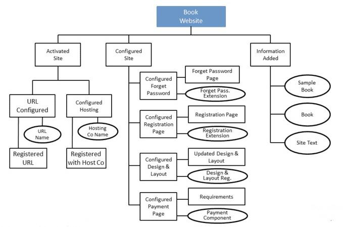

*Figure: PFD for Product Delivery System (Product Flow)*

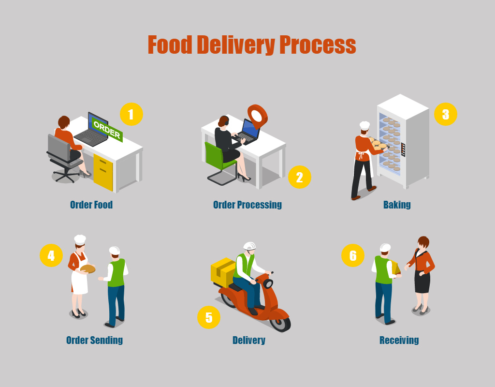

### 2.3 Hybrid Approach

The **hybrid approach** is a combination of the activity-based approach and the product-based approach. These approaches are more commonly used than other approaches.

An alternative WBS based on:
- A simple list of final deliverables.
- For each deliverable, a set of activities required to produce that product.

As with a purely activity-based WBS, having identified the activities, we are then left with the task of sequencing them.

*Figure: WBS Based on Deliverables (Hybrid Approach)*

```mermaid
flowchart TB
    A[Software Project]

    A --> B[System Installation]
    A --> C[Software Component]
    A --> D[User Manual]
    A --> E[User Training]

    %% System Installation
    B --> B1[Analyse requirements]
    B --> B2[Detailed design]
    B --> B3[Integrate system]
    B --> B4[Test system]
    B --> B5[Deliver system]

    %% Software Component
    C --> C1[Review requirements]
    C --> C2[Outline design]
    C --> C3[Detailed design]
    C --> C4[Code software]
    C --> C5[Test software]

    %% User Manual
    D --> D1[Analyse requirements]
    D --> D2[Design manual]
    D --> D3[Document manual]
    D --> D4[Capture screens]
    D --> D5[Print Manual]

    %% User Training
    E --> E1[Design course]
    E --> E2[Write materials]
    E --> E3[Print course materials]
    E --> E4[Training]
```

### Comparison of Approaches

| Aspect | Activity-Based | Product-Based | Hybrid |
|--------|---------------|---------------|--------|
| **Focus** | Lists all activities directly | Breaks down products, then derives activities | Combination of both |
| **Method** | Brainstorming, past project analysis | PBS + PFD | Deliverable-based WBS |
| **Strengths** | Simple, intuitive | Complete, non-overlapping tasks | Most practical |
| **Weaknesses** | May miss activities | Requires methodology (e.g., SSADM) | More complex to set up |

---

## 3. Work Breakdown Structure (WBS)

> **Definition:** **Work Breakdown Structure (WBS)** is a hierarchical decomposition of a project into smaller, manageable tasks — starting with high-level tasks and breaking them down into lower-level components.

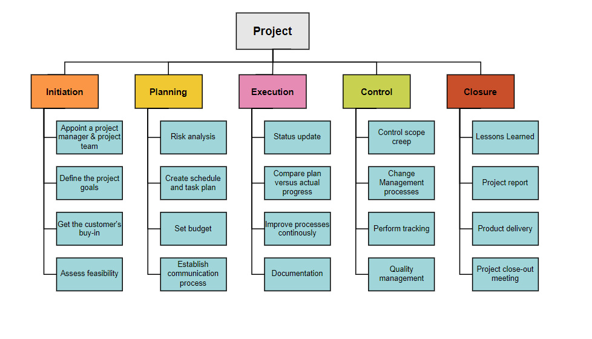
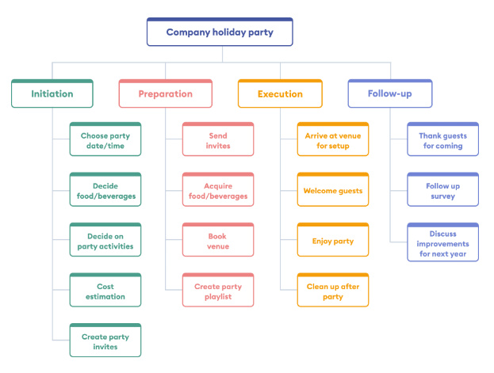

### Principles of WBS

- Activities are added to a branch in the structure if they **directly contribute** to the task immediately above — if they do not contribute to the parent task, then they should not be added to that branch.
- The tasks at each level in any branch should include **everything that is required** to complete the task at the higher level — if they are not a comprehensive definition of the parent task, then something is missing.
- When preparing a WBS, consideration must be given to the **final level of detail**.

### Advantages and Disadvantages

| Advantages | Disadvantages |
|------------|---------------|
| More likely to obtain a task catalogue that is complete and composed of non-overlapping tasks | Very likely to miss some activities if unstructured activity list is used |
| Represents a structure that can be refined as the project proceeds | — |
| The structure already suggests the dependencies among the activities | — |

### IBM Recommended WBS Levels

IBM recommends the following five levels should be used in a WBS:

| Level | Name | Description |
|-------|------|-------------|
| **Level 1** | **Project** | The overall project |
| **Level 2** | **Deliverables** | Software, manuals, training courses |
| **Level 3** | **Components** | Key work items needed to produce deliverables (e.g., modules and tests required to produce the system software) |
| **Level 4** | **Work-packages** | Major work items or collections of related tasks required to produce a component |
| **Level 5** | **Tasks** | Normally the responsibility of a single person |

### IBM 5-Level WBS Example: Library Management System

```
Library Management System (Level 1: Project)
├── 1.0 Software (Level 2: Deliverable)
│   ├── 1.1 Frontend Module (Level 3: Component)
│   │   ├── 1.1.1 User Interface Design (Level 4: Work-package)
│   │   │   ├── 1.1.1.1 Design login page (Level 5: Task)
│   │   │   ├── 1.1.1.2 Design dashboard
│   │   │   ├── 1.1.1.3 Design book catalog UI
│   │   │   └── 1.1.1.4 Design member registration form
│   │   ├── 1.1.2 User Authentication (Level 4: Work-package)
│   │   │   ├── 1.1.2.1 Implement login/logout
│   │   │   ├── 1.1.2.2 Implement role-based access
│   │   │   └── 1.1.2.3 Implement password reset
│   │   └── 1.1.3 Book Management (Level 4: Work-package)
│   │       ├── 1.1.3.1 Build book search feature
│   │       ├── 1.1.3.2 Build book issue/return UI
│   │       └── 1.1.3.3 Build reservation system
│   ├── 1.2 Backend API (Level 3: Component)
│   │   ├── 1.2.1 REST API Development (Level 4: Work-package)
│   │   │   ├── 1.2.1.1 Develop book CRUD endpoints
│   │   │   ├── 1.2.1.2 Develop member management API
│   │   │   └── 1.2.1.3 Develop transaction API
│   │   └── 1.2.2 Database Layer (Level 4: Work-package)
│   │       ├── 1.2.2.1 Design database schema
│   │       ├── 1.2.2.2 Set up database server
│   │       └── 1.2.2.3 Implement stored procedures
│   └── 1.3 Testing (Level 3: Component)
│       ├── 1.3.1 Unit Testing (Level 4: Work-package)
│       │   ├── 1.3.1.1 Write frontend unit tests
│       │   └── 1.3.1.2 Write backend unit tests
│       └── 1.3.2 Integration Testing (Level 4: Work-package)
│           ├── 1.3.2.1 Test API endpoints
│           └── 1.3.2.2 Test end-to-end workflows
├── 2.0 Documentation (Level 2: Deliverable)
│   ├── 2.1 User Manual (Level 3: Component)
│   │   ├── 2.1.1 Manual Design (Level 4: Work-package)
│   │   │   ├── 2.1.1.1 Outline manual structure
│   │   │   └── 2.1.1.2 Capture screenshots
│   │   └── 2.1.2 Manual Production (Level 4: Work-package)
│   │       ├── 2.1.2.1 Write user guide
│   │       ├── 2.1.2.2 Review and edit
│   │       └── 2.1.2.3 Print and bind
│   └── 2.2 Technical Documentation (Level 3: Component)
│       └── 2.2.1 API Documentation (Level 4: Work-package)
│           ├── 2.2.1.1 Document REST endpoints
│           └── 2.2.1.2 Document database schema
└── 3.0 Training (Level 2: Deliverable)
    ├── 3.1 Training Material (Level 3: Component)
    │   ├── 3.1.1 Course Design (Level 4: Work-package)
    │   │   ├── 3.1.1.1 Design training curriculum
    │   │   └── 3.1.1.2 Prepare slide decks
    │   └── 3.1.2 Material Production (Level 4: Work-package)
    │       ├── 3.1.2.1 Write training workbook
    │       └── 3.1.2.2 Print course materials
    └── 3.2 Training Delivery (Level 3: Component)
        └── 3.2.1 Conduct Training (Level 4: Work-package)
            ├── 3.2.1.1 Conduct admin training session
            └── 3.2.1.2 Conduct librarian training session
```

---

## 4. Bar Chart (Gantt Chart)

> **Definition:** A **Bar Chart (Gantt Chart)** is a time-scaled graphical representation of project activities as horizontal bars, showing start and end dates without dependency links. Developed by Henry L. Gantt in 1917.

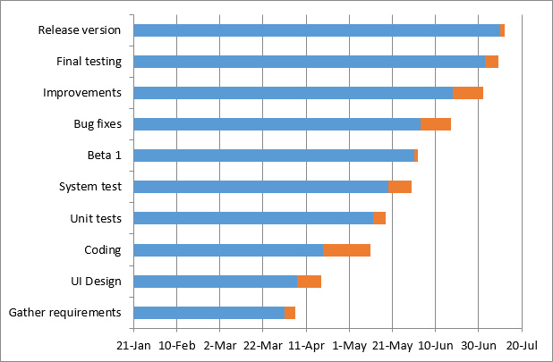
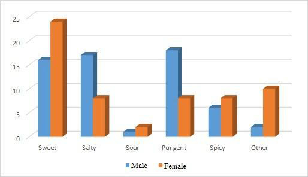

The bar chart was originally developed by **Henry L. Gantt** in 1917 and is alternatively called a **Gantt Chart**. It quickly became popular, especially in the construction industry, because of its ability to graphically represent a project's activities on a time scale.

### Uses and Benefits

- A Gantt chart is used for planning projects of all sizes.
- It is a useful way of showing what work is scheduled to be done on a specific day.
- It can also help you view the start and end dates of a project in one simple chart.
- A Gantt chart reflects the project schedule, which is composed of the WBS, the projected start and completion dates of each task, the milestones, and the resources assigned.

Throughout a project, we will require a schedule that clearly indicates when each of the project's activities is planned to occur and what resources it will need. Once we have a project plan (or project schedule), we need to schedule the activities in a project taking into account the resource constraints. One way of presenting such a plan is to use a **Bar Chart**.

---

## 5. Network Planning Models

> **Definition:** **Network Planning Model (NPM)** is a scheduling technique that models project activities and their dependencies as a network, enabling calculation of the earliest project completion date.

> 💡 **Why This Matters:** Network models answer the most important scheduling question: *"What is the fastest possible completion time, and which activities must be on time to achieve it?"* Without a network model, you're guessing.

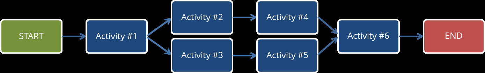

It permits the calculation of the earliest project completion date. Network Planning Models are the method that is adopted in the majority of computer applications currently available. These project scheduling techniques model the project's activities and their relationships as a network, where time flows from left to right.

**Network diagrams** are the preferred technique for showing activity sequencing. A network diagram is a schematic display of the logical relationships among, or sequencing of, project activities.

These techniques were originally developed in the 1950s. The best known among them are:
- **Critical Path Method (CPM)**
- **Program Evaluation Review Technique (PERT)**
- **Precedence Diagramming Method (PDM)**

> 💡 **CPM vs PERT at a Glance:**
>
> | Aspect | CPM | PERT |
> |--------|-----|------|
> | **Model Type** | Deterministic (fixed times) | Probabilistic (uncertain times) |
> | **Time Estimates** | One estimate per activity | Three estimates (to, tm, tp) |
> | **Focus** | Time-cost trade-off, crashing | Time uncertainty, probability |
> | **Best For** | Construction, repetitive projects | R&D, new/unique projects |
> | **Output** | Single completion date | Probability of meeting a deadline |

### 5.1 ADM vs PDM

Two main formats of network diagrams are **Arrow Diagramming Method (ADM)** and **Precedence Diagramming Method (PDM)**.

| Aspect | Arrow Diagramming Method (ADM) | Precedence Diagramming Method (PDM) |
|--------|-------------------------------|-------------------------------------|
| **Also called** | Activity-on-Arrow (AOA) | Activity-on-Node (AON) |
| **Representation** | Activities are represented by arrows | Activities are represented by boxes |
| **Nodes** | Nodes or circles are the starting and ending points of activities | Arrows show relationships between activities |
| **Dependencies** | Can only show finish-to-start dependencies | Better at showing different types of dependencies (FS, FF, SS, SF) |
| **Popularity** | Less popular | More popular, used by project management software |

---

### 5.2 Critical Path Method (CPM)

> **Definition:** **CPM** is a deterministic network technique that calculates the longest path (critical path) through a project to determine minimum project duration and activities with zero scheduling flexibility.

It calculates **ES, EF, LS, LF** for all activities via forward and backward pass analysis, assuming unlimited resources.

> **Definition — Float (Slack):** The amount of time an activity can be delayed without delaying the project completion date. Activities on the critical path have **zero float**.
>
> $$ \text{Float} = \text{LS} - \text{ES} = \text{LF} - \text{EF} $$
>
> **Interpretation:**
> - Float = 0 → Activity is **critical** (any delay delays the project)
> - Float > 0 → Activity has scheduling **flexibility**

#### Calculation of Critical Path

1. Develop a good network diagram.
2. Add the duration estimates for all activities on each path through the network diagram.
3. The **longest path** is the critical path.
4. If one or more of the activities on the critical path takes longer than planned, the whole project schedule will slip unless the project manager takes corrective action.

> 🧠 **Memory Aid — Forward vs Backward Pass:**
> - **Forward Pass** = *"How soon can we start?"* → Go forward, choose the **maximum** (the bottleneck determines the start)
> - **Backward Pass** = *"How late can we finish?"* → Go backward, choose the **minimum** (the tightest successor sets the limit)
>
> Think: *"Forward = Max (add), Backward = Min (subtract)"*

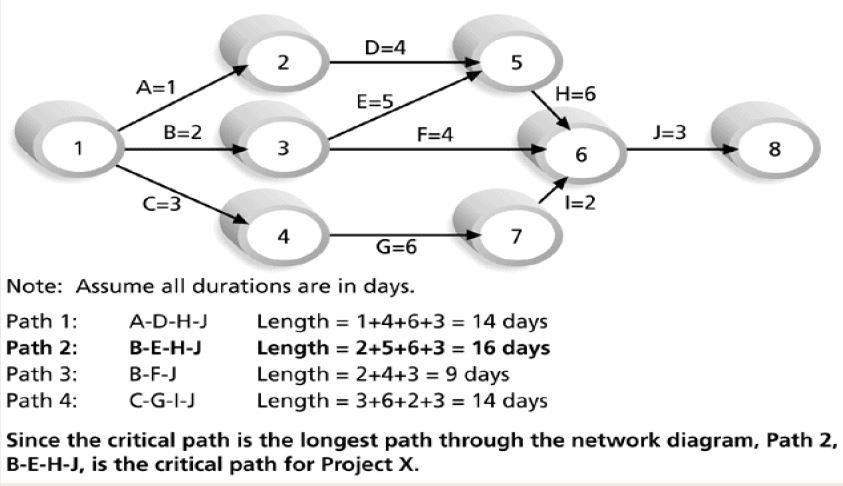

#### Forward Pass and Backward Pass

| Term | Definition | Formula |
|------|-----------|---------|
| **Early Start (ES)** | The earliest start of an activity considering the dependency of preceding task. If an activity has more than one predecessor, ES will be the highest EF of the dependency task. | ES = Max(EF of immediate predecessors) |
| **Early Finish (EF)** | Calculated by moving from ES towards right | EF = ES + Duration |
| **Late Finish (LF)** | The latest date that the activity can finish without causing delay to the project completion date | — |
| **Late Start (LS)** | Calculated by applying backward pass, moving from LF and deducting activity duration | LS = LF − Duration |

**Node Representation:**
```
┌─────────┬──────────┬─────────┐
│   ES    │ Duration │   EF    │
├─────────┼──────────┼─────────┤
│   LS    │  Slack   │   LF    │
└─────────┴──────────┴─────────┘
```

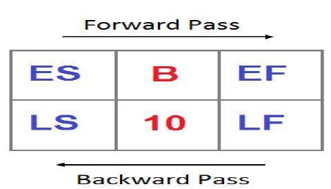

> ⚠️ **Important:** ES is plotted on the top-left corner box. EF is plotted on top-right corner box. LF is on the bottom-right corner box. LS is plotted on the bottom-left corner box.

> ⚡ **Quick Formula:**
> - ES = Maximum (or Highest) EF value from immediate Predecessor(s)
> - EF = ES + Duration
> - LS = LF − Duration

#### CPM Example 1

Calculate the critical path for given data using Forward and Backward Pass.

| Activity | Predecessor | Duration |
|----------|-------------|----------|
| A | — | 5 |
| B | A | 7 |
| C | A | 4 |
| D | B | 10 |
| E | C | 3 |
| F | C | 5 |
| G | D, E | 6 |
| H | F, G | 4 |

> ⚡ **Quick Formula:**
> $$ \text{ES}(i) = \max[\text{EF}(\text{predecessors})], \quad \text{EF}(i) = \text{ES}(i) + \text{Duration}(i) $$
> $$ \text{LF}(i) = \min[\text{LS}(\text{successors})], \quad \text{LS}(i) = \text{LF}(i) - \text{Duration}(i) $$

**Solution:**

Step 1 — Draw the network diagram. Start from the independent activity (whose precedence is not present). Here the independent activity is A. Each activity is treated as a node represented as:

```
┌─────────┬──────┬─────────┐
│   ES    │ Dur  │   EF    │
├─────────┼──────┼─────────┤
│   LS    │ ID   │   LF    │
└─────────┴──────┴─────────┘
```

**Activity dependencies:**

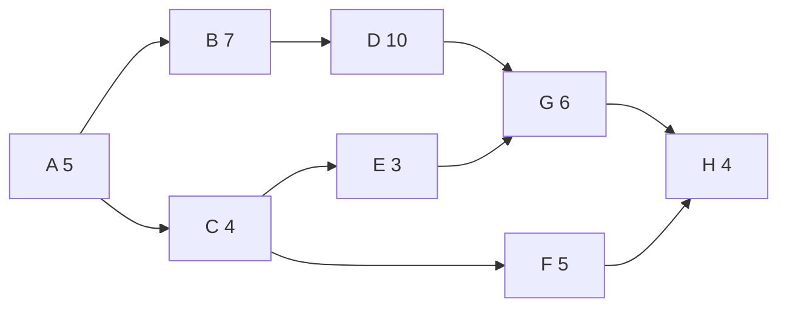


Step 2 — Identify all paths and their total durations:

| Path | Calculation | Total Duration |
|------|------------|----------------|
| A → B → D → G → H | 5 + 7 + 10 + 6 + 4 | **32 days** |
| A → C → E → G → H | 5 + 4 + 3 + 6 + 4 | 22 days |
| A → C → F → H | 5 + 4 + 5 + 4 | 18 days |

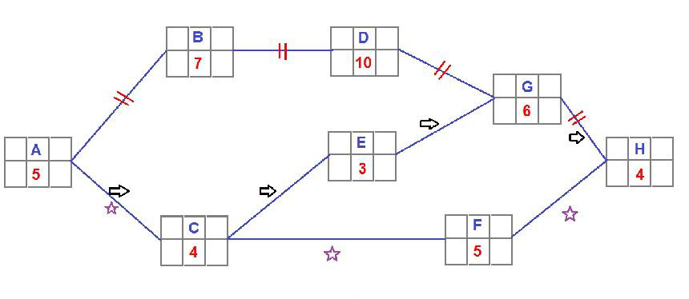
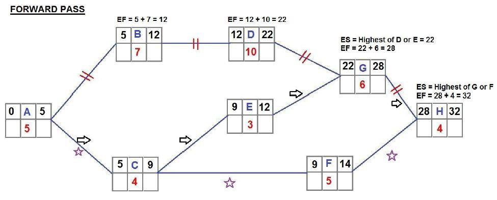
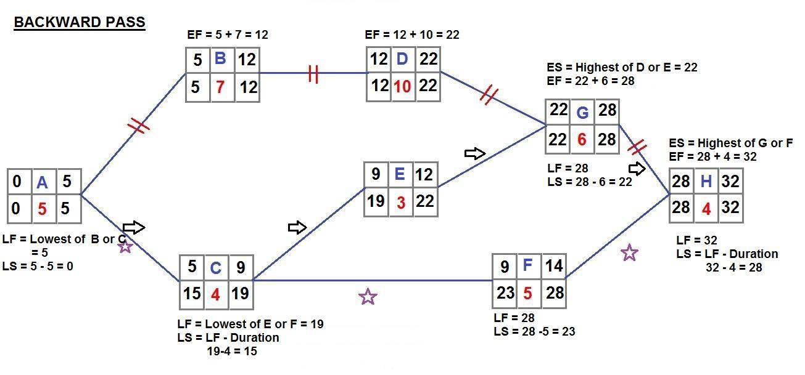

Step 3 — The critical path is the one with the **longest duration**: **A → B → D → G → H = 32 days**.
`
> ⭐ **Key Takeaway:** The critical path determines the minimum project completion time. Any delay on the critical path directly delays the project.


#### CPM Example 2 (Practice Question)

Do CPM analysis and identify the critical path for the project.

| Activity | Predecessor | Duration |
|----------|-------------|----------|
| A | — | 5 |
| B | A | 4 |
| C | A | 5 |
| D | B | 6 |
| E | C | 3 |
| F | D, E | 4 |

---

### 5.3 Program Evaluation and Review Technique (PERT)

> **Definition:** **PERT** is a probabilistic scheduling technique that uses three time estimates (optimistic, most likely, pessimistic) to handle uncertainty in activity durations and calculate the probability of meeting deadlines.

In PERT, we assume that it is not possible to have a precise time estimate for each activity; instead, **probabilistic estimates of time alone are possible**.

#### Three Time Estimates

A multiple time estimate approach is considered with three estimates:

| Estimate | Symbol | Description |
|----------|--------|-------------|
| **Optimistic Time** | to | Based on the assumption that an activity will not involve any difficulty during execution and can be completed within a short period |
| **Most Likely Time** | tm | Made in between the optimistic and the pessimistic estimates |
| **Pessimistic Time** | tp | Made on the assumption that there would be unexpected problems during execution, consuming more time |

The relationship among the three estimates: **t_o ≤ t_m ≤ t_p**

#### Expected Time (te)

The expected time (te) is the weighted average of these estimates:

$$
te = \frac{to + 4tm + tp}{6}
$$

#### Variance and Standard Deviation

$$
\text{Variance } (\sigma^2) = \left(\frac{tp - to}{6}\right)^2
$$

$$
\text{Standard Deviation } (\sigma) = \sqrt{\sigma^2} = \frac{tp - to}{6}
$$

> ⚡ **Quick Formula:**
> - Expected time: $$te = \frac{to + 4tm + tp}{6}$$
> - Variance: $$\sigma^2 = \left(\frac{tp - to}{6}\right)^2$$
> - Standard deviation: $$\sigma = \frac{tp - to}{6}$$

#### PERT Numerical Example

The following table shows the jobs of a network along with their time estimates.

| Activity | Optimistic (to) | Most Likely (tm) | Pessimistic (tp) |
|----------|:---------------:|:----------------:|:----------------:|
| 1-2 | 1 | 7 | 13 |
| 1-6 | 2 | 5 | 14 |
| 2-3 | 2 | 14 | 26 |
| 2-4 | 2 | 5 | 8 |
| 3-5 | 7 | 10 | 19 |
| 4-5 | 5 | 5 | 17 |
| 6-7 | 5 | 8 | 29 |
| 5-8 | 3 | 3 | 9 |
| 7-8 | 8 | 17 | 32 |

**Questions:**
1. Draw the project network.
2. Find the expected duration and variance of each activity.
3. Calculate the earliest and latest occurrence for each event.
4. Calculate expected project length.
5. Calculate the variance and standard deviation of project length.
6. Find the probability of the project completing in 40 weeks.

> ⚡ **Quick Formula:**
> $$ te = \frac{to + 4tm + tp}{6}, \quad \sigma^2 = \left( \frac{tp - to}{6} \right)^2, \quad \sigma = \frac{tp - to}{6} $$

---

##### Step 1: Draw the Project Network

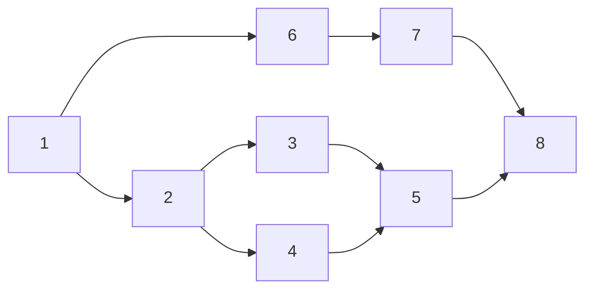

---

##### Step 2: Calculate Expected Duration (te) and Variance of Each Activity

Using the formulas:

$$
te = \frac{to + 4tm + tp}{6}, \quad \sigma^2 = \left(\frac{tp - to}{6}\right)^2
$$

| Activity | to | tm | tp | te | Variance (σ²) |
|----------|:--:|:--:|:--:|:--:|:-------------:|
| 1-2 | 1 | 7 | 13 | $$\frac{1 + 4(7) + 13}{6} = 7$$ | $$\left(\frac{13-1}{6}\right)^2 = 4$$ |
| 1-6 | 2 | 5 | 14 | $$\frac{2 + 4(5) + 14}{6} = 6$$ | $$\left(\frac{14-2}{6}\right)^2 = 4$$ |
| 2-3 | 2 | 14 | 26 | $$\frac{2 + 4(14) + 26}{6} = 14$$ | $$\left(\frac{26-2}{6}\right)^2 = 16$$ |
| 2-4 | 2 | 5 | 8 | $$\frac{2 + 4(5) + 8}{6} = 5$$ | $$\left(\frac{8-2}{6}\right)^2 = 1$$ |
| 3-5 | 7 | 10 | 19 | $$\frac{7 + 4(10) + 19}{6} = 11$$ | $$\left(\frac{19-7}{6}\right)^2 = 4$$ |
| 4-5 | 5 | 5 | 17 | $$\frac{5 + 4(5) + 17}{6} = 7$$ | $$\left(\frac{17-5}{6}\right)^2 = 4$$ |
| 6-7 | 5 | 8 | 29 | $$\frac{5 + 4(8) + 29}{6} = 11$$ | $$\left(\frac{29-5}{6}\right)^2 = 16$$ |
| 5-8 | 3 | 3 | 9 | $$\frac{3 + 4(3) + 9}{6} = 4$$ | $$\left(\frac{9-3}{6}\right)^2 = 1$$ |
| 7-8 | 8 | 17 | 32 | $$\frac{8 + 4(17) + 32}{6} = 18$$ | $$\left(\frac{32-8}{6}\right)^2 = 16$$ |

**Network with te values placed on respective paths:**

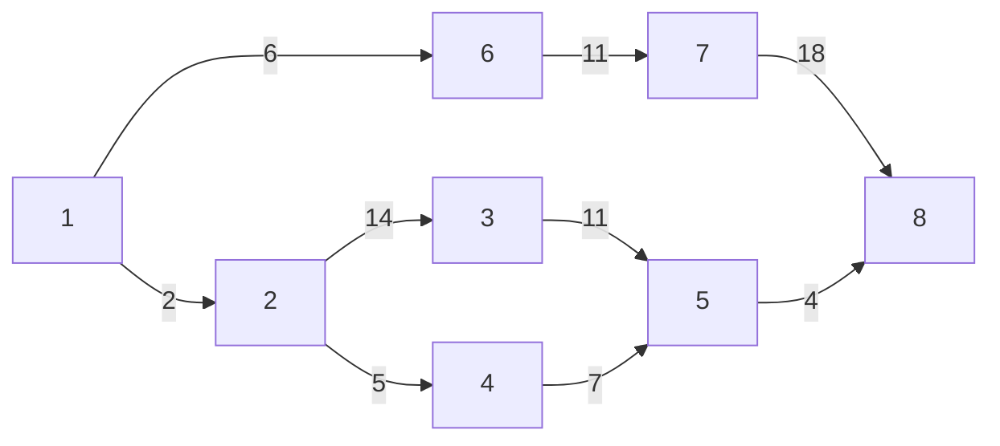

---

##### Step 3: Calculate Earliest and Latest Occurrence for Each Event

Using forward pass (for earliest times) and backward pass (for latest times):

> **Forward Pass Rules:**
> - Start with event 1 at time 0
> - Earliest time of an event = Max(Earliest time of predecessor + te of connecting activity)
>
> **Backward Pass Rules:**
> - Start with last event's earliest time as its latest time
> - Latest time of an event = Min(Latest time of successor − te of connecting activity)

| Event | Earliest Time | Latest Time |
|:-----:|:-------------:|:-----------:|
| 1 | 0 | 0 |
| 2 | 0 + 7 = **7** | 36 − (14 + 11 + 4) = **7** |
| 3 | 7 + 14 = **21** | 36 − (11 + 4) = **21** |
| 4 | 7 + 5 = **12** | 36 − (7 + 4) = **25** |
| 5 | Max(21 + 11, 12 + 7) = **32** | 36 − 4 = **32** |
| 6 | 0 + 6 = **6** | 36 − (11 + 18) = **7** |
| 7 | 6 + 11 = **17** | 36 − 18 = **18** |
| 8 | Max(32 + 4, 17 + 18) = **36** | **36** |

> ⚠️ **Important — Forward Pass:** If depends on more than one node, choose the **maximum** values after addition.
>
> ⚠️ **Important — Backward Pass:** If depends on more than one node, choose the **minimum** values after subtraction. Calculate backwards after finish of forward pass (e.g., 36 − 18 = 18).

---

##### Step 4: Calculate Expected Project Length (Critical Path)

Identify all paths and their total durations:

| Path | Total Duration |
|------|:--------------:|
| 1 → 2 → 3 → 5 → 8 | 7 + 14 + 11 + 4 = **36 weeks** |
| 1 → 2 → 4 → 5 → 8 | 7 + 5 + 7 + 4 = 23 weeks |
| 1 → 6 → 7 → 8 | 6 + 11 + 18 = 35 weeks |

> ⭐ **Key Takeaway:** The **longest path** is 1 → 2 → 3 → 5 → 8 with a total duration of **36 weeks**. This is the critical path and the expected project length.
>
> **Project length = 36 weeks**

---

##### Step 5: Calculate Variance and Standard Deviation of Project Length

Only the variance of activities on the critical path contributes to the project variance.

**Critical path activities:** 1-2, 2-3, 3-5, 5-8
**Variance values on critical path:** 4, 16, 4, 1

$$
\text{Variance of project length } (\sigma^2) = 4 + 16 + 4 + 1 = 25
$$

$$
\text{Standard deviation } (\sigma) = \sqrt{25} = 5
$$

---

> ⚡ **Quick Formula:**
> $$ Z = \frac{Ts - Te}{\sigma}, \quad P(\text{complete by } Ts) = \Phi(Z) $$

##### Step 6: Find Probability of Completing in 40 Weeks

Given:
- **Schedule time (Ts)** = 40 weeks
- **Expected project length (Te)** = 36 weeks
- **Standard deviation (σ)** = 5 weeks

Calculate the standard normal deviate (Z):

$$
Z = \frac{Ts - Te}{\sigma} = \frac{40 - 36}{5} = 0.8
$$

The probability that the project will be completed in 40 weeks is given by **P(Z ≤ 0.8)**.

From the standard normal distribution table (Z-table), for Z = 0.8:

$$
P(Z \leq 0.8) = 0.78814 = 78.814\%
$$

> 💡 **Result:** The probability that the project will be completed in 40 weeks is **78.814%**.

---

### 5.4 Precedence Diagramming Method (PDM)

> **Definition:** **Precedence Diagramming Method (PDM)** is a network diagramming technique where activities are represented by nodes (boxes) and dependencies by arrows. It supports multiple dependency types (FS, FF, SS, SF) and is the most popular format in project management software.

> **Definition — Float (Slack):** The amount of time an activity can be delayed without affecting the project completion date.
>
> $$ \text{Float} = \text{LS} - \text{ES} = \text{LF} - \text{EF} $$
>
> **Interpretation:**
> - Float = 0 → Activity is critical
> - Float > 0 → Activity has scheduling flexibility

CPM and PERT are limited to **"start-end"** relationship (i.e., activity B cannot start until activity A is completed). PDM was developed subsequent to CPM and PERT to permit a more accurate representation of relationships among various activities.

#### Four Types of Dependencies in PDM

| Dependency | Notation | Description |
|-----------|:--------:|-------------|
| **Finish-to-Start** | **FS** | The predecessor activity must be completed before the successor activity can start |
| **Finish-to-Finish** | **FF** | The successor activity requires the predecessor activity to be finished before it can be completed. This can also coincide with start-to-start relationships of the same activities |
| **Start-to-Start** | **SS** | The predecessor activity must have started before the successor activity can start |
| **Start-to-Finish** | **SF** | The predecessor activity must have started before the successor activity can be finished. (In practice, this type does not occur very often) |

#### Benefits of PDM

- Highlights relations and dependencies among activities
- Identifies possible missing activities
- Helps develop overall project schedule
- Good communication tool for project team members

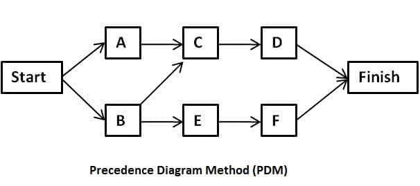

#### PDM Example

Draw the precedence network diagram for the following and identify the critical path.

| Activity | Precedence | Duration |
|----------|------------|:--------:|
| A | — | 5 |
| B | A | 3 |
| C | A | 5 |
| D | B, C | 10 |

> ⚡ **Quick Formula:**
> $$ \text{ES}(i) = \max[\text{EF}(\text{predecessors})], \quad \text{EF}(i) = \text{ES}(i) + \text{Duration}(i) $$
> $$ \text{LF}(i) = \min[\text{LS}(\text{successors})], \quad \text{LS}(i) = \text{LF}(i) - \text{Duration}(i) $$
> $$ \text{Float}(i) = \text{LS}(i) - \text{ES}(i) = \text{LF}(i) - \text{EF}(i) $$

**Solution:**

The network diagram is:

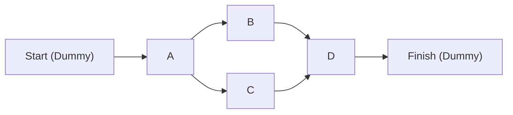

> **Note — Dummy Nodes:** "Start" and "Finish" are dummy nodes with **zero duration**. They exist only to give the network a single entry and exit point. Without them, multiple activities with no predecessors (like A) would each need separate starting points.

Now, calculate as we do in CPM:

| Activity | ES | EF | LS | LF | Float |
|----------|:--:|:--:|:--:|:--:|:-----:|
| A | 0 | 5 | 0 | 5 | 0 |
| B | 5 | 8 | 7 | 10 | 2 |
| C | 5 | 10 | 5 | 10 | 0 |
| D | 10 | 20 | 10 | 20 | 0 |

**Possible paths:**
- A → B → D → Finish: 5 + 3 + 10 = 18 days
- A → C → D → Finish: 5 + 5 + 10 = **20 days** ⬅️ Critical Path

> ⭐ **Key Takeaway:** Path A → C → D is the critical path because the values of Early Start and Late Start are the same (zero float).

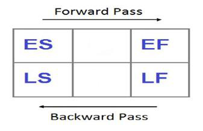

---

## 6. Shortening Project Duration

If we wish to shorten the overall duration of a project, we would normally consider attempting to reduce activity durations. In many cases this can be done by applying **more resources** to the task — working overtime or procuring additional staff, for example.

> 💡 **Example:** The critical path indicates where we must look to save time if we are trying to bring forward the end date of a project. As we reduce activity times along the critical path, we must continuously check for any **new critical path** emerging and redirect attention where necessary.

**Parkinson's Law** states: *"Work expands to meet the time available for its completion."* The project corollary is that tasks are not completed before their planned finish date.

### Approaches to Shorten Duration

- Establish scope before the project starts
- Eliminate false dependencies
- Develop a comprehensive testing strategy
- Save days

---

## 7. Identifying Critical Activities

> **Definition:** **Critical activities** are activities with zero float — any delay in them directly delays the entire project. They form the **critical path** (the longest path through the network).

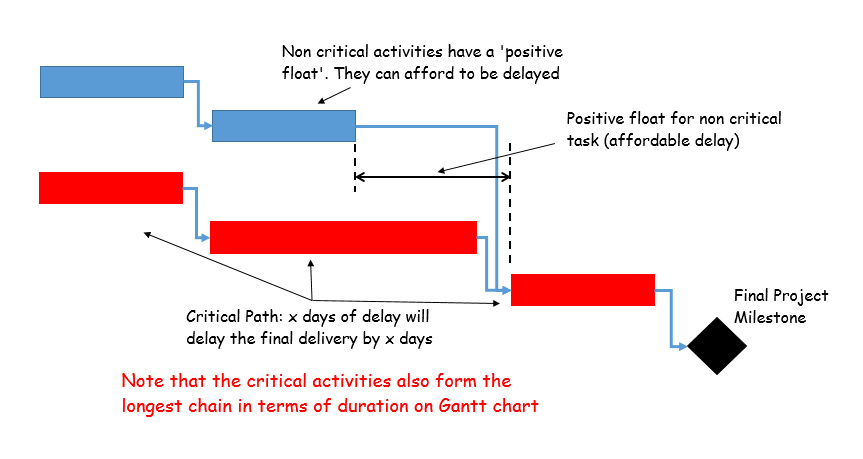

The **critical path** indicates or identifies those activities which are critical to the end date of a project. However, activities that are **not** on the critical path may become critical as the project proceeds — activities will require a periodic calculation of network.

As soon as the activities along the critical path use up their **total float**, that path will become a critical path and a number of previous non-critical activities will suddenly become critical.

### Approaches for Identifying Critical Activities

- Define high-level project roadmap
- Create a detailed work breakdown structure
- Define duration and dependency relationships for project activities
- Identify key milestones
- Use Critical Path Method (CPM) to create a project schedule
- Identify critical activities as per the project schedule

---

## 8. Quick Revision Summary

### Key Concepts

| Concept | Description |
|---------|-------------|
| **Activity** | Amount of work performed that converts input to appropriate outputs; has defined start and end |
| **WBS** | Hierarchical decomposition of project work into smaller, manageable tasks |
| **Gantt Chart** | Time-scaled bar chart showing project activities (developed by Henry L. Gantt, 1917) |
| **Critical Path** | The longest path in the network; determines minimum project completion time |
| **CPM** | Deterministic model — single time estimate for each activity |
| **PERT** | Probabilistic model — three time estimates (optimistic, most likely, pessimistic) |
| **PDM** | Advanced network model supporting FS, FF, SS, SF dependencies |

### CPM vs PERT

| Aspect | CPM | PERT |
|--------|-----|------|
| **Nature** | Deterministic | Probabilistic |
| **Time Estimates** | Single estimate per activity | Three estimates (to, tm, tp) |
| **Focus** | Time-cost trade-off | Time uncertainty |
| **Application** | Repetitive/construction projects | Research/development projects |

### Key Formulas

| Formula | Description |
|---------|-------------|
| $$EF = ES + Duration$$ | Early Finish |
| $$LS = LF - Duration$$ | Late Start |
| $$ES = \text{Max}(EF\text{ of predecessors})$$ | Forward Pass |
| $$LF = \text{Min}(LS\text{ of successors})$$ | Backward Pass |
| $$te = \frac{to + 4tm + tp}{6}$$ | Expected time (PERT) |
| $$\sigma^2 = \left(\frac{tp - to}{6}\right)^2$$ | Variance of activity |
| $$\sigma_{\text{project}} = \sqrt{\sum \sigma^2_{\text{critical path}}}$$ | Standard deviation of project |
| $$Z = \frac{Ts - Te}{\sigma}$$ | Probability calculation (normal deviate) |

### Probability Interpretation

| Z Value | Probability | Interpretation |
|:-------:|:-----------:|----------------|
| Z = 0 | 50% | Equal chance of meeting deadline |
| Z > 0 | > 50% | Favorable — likely to meet deadline |
| Z < 0 | < 50% | Unfavorable — unlikely to meet deadline |

---

## Appendix: Practice Problems

### Problem 1

The table below is an example of project specification with estimated activity duration and precedence requirements:

| Activity | Activity Name | Duration (Weeks) | Precedence |
|:--------:|---------------|:----------------:|:----------:|
| A | Hardware Selection | 6 | — |
| B | System Configuration | 4 | — |
| C | Install Hardware | 3 | A |
| D | Data Migration | 4 | B |
| E | Draft Office Procedure | 3 | B |
| F | Recruit Staff | 10 | — |
| G | User Training | 3 | E, F |
| H | Install and Test System | 2 | C, D |

Find the **critical path** of the project and calculate the **earliest completion time** of the project.

---

### Assignment-II Questions

1. Differentiate between CPM and PERT.
2. Why is planning necessary? Highlight the steps of activity planning.
3. Differentiate between Work Breakdown Structure and Product Breakdown Structure with an example.
4. Why is software project management a challenging activity?
5. Differentiate between activity-based approach and hybrid-based approach for identifying activities.
6. Explain the objectives of activity planning.
7. Explain the Gantt Charts in Scheduling with example.

> **Submission Deadline:** 13th February 2026

## Past Exam Questions

**2082 Q5.** A project has 8 activities with the following optimistic (tₒ), most likely (tₘ), and pessimistic (tₚ) times: A(1,2,3), B(3,4,5), C(3,3,3), D(3,4,5), E(3,4,5), F(5,6,7), G(6,7,8), H(6,10,14). Draw PERT chart, find critical path and project duration. Compute probability of completing in 30 days using Z-table.

**Answer:** Step 1: Calculate expected time for each activity using tₑ = (tₒ + 4tₘ + tₚ)/6: A=(1+8+3)/6=2.0; B=(3+16+5)/6=4.0; C=(3+12+3)/6=3.0; D=(3+16+5)/6=4.0; E=(3+16+5)/6=4.0; F=(5+24+7)/6=6.0; G=(6+28+8)/6=7.0; H=(6+40+14)/6=10.0. Step 2: Draw PERT network showing dependencies (assumed: A→B→C→D→E→F→G→H sequentially). Step 3: Critical path is the longest path = A−B−C−D−E−F−G−H with duration = 2+4+3+4+4+6+7+10 = 40 days. Step 4: Variance σ² = ((tₚ−tₒ)/6)² for critical activities: A=(2/6)²=0.11; B=(2/6)²=0.11; C=0; D=0.11; E=0.11; F=(2/6)²=0.11; G=(2/6)²=0.11; H=(8/6)²=1.78. Total variance = 2.33, σ = 1.53. Step 5: Z = (30−40)/1.53 = −6.54. Since this is far below zero, probability is approximately 0% (30 days is far below the expected 40-day duration).

**2082 Q12a.** Write short note on critical path.

**Answer:** The **critical path** is the longest sequence of dependent activities from project start to finish — it determines the minimum project duration. Activities on this path have zero float/slack — any delay in a critical activity directly delays the entire project. Identifying the critical path helps managers prioritize monitoring efforts, allocate resources to critical activities, and evaluate the impact of scheduling changes. The critical path can change during the project as activities are completed early or delayed.

**2081 Q1.** What is an activity? Draw a precedence network for a project with 8 activities: A(3 days) follows none; B(5) follows A; C(9) follows B; D(4) follows B; E(2) follows D; F(4) follows C, E; G(3) follows F; H(6) follows G. Identify critical path. Suggest how to shorten project duration by 1 day at lowest cost if activity costs (NRs./day): A=500, B=2000, C=700, D=800, E=3000, F=2000, G=600, H=500.

**Answer:** A precedence network places activities in a box with ID, duration, ES, EF, LS, LF, and Float. Forward pass: ES of A=0, EF=3; B: ES=3, EF=8; C: ES=8, EF=17; D: ES=8, EF=12; E: ES=12, EF=14; F: ES=max(17,14)=17, EF=21; G: ES=21, EF=24; H: ES=24, EF=30. Backward pass: H: LF=30, LS=24; G: LF=24, LS=21; F: LF=21, LS=17; E: LF=17, LS=15; D: LF=17, LS=13; C: LF=17, LS=8; B: LF=8, LS=3; A: LF=3, LS=0. Critical path: A→B→C→F→G→H (30 days). To shorten by 1 day at lowest cost, crash activity A (costing NRs. 500/day — the cheapest on the critical path).

**2080 Q5.** What are the objectives of activity planning?

**Answer:** Activity planning has four main objectives: (1) **Feasibility Assessment** — determine if the project can be completed within the required time and resource constraints; (2) **Resource Allocation** — decide what resources (people, equipment, budget) are needed at each stage; (3) **Detailed Scheduling** — create a specific timetable showing when each activity will start and end; (4) **Basis for Monitoring** — provide a baseline schedule against which actual progress can be measured. Without proper activity planning, there is no way to detect delays, track resource usage, or assess whether project milestones are being met.

**2080 Q8.** Draw a precedence network for a project having these activities: A(2) none; B(3) A; C(1) A; D(4) B; E(3) C; F(6) D,E; G(5) F; H(2) G; I(3) G; J(4) H,I. Identify critical path.

**Answer:** Forward pass: A: ES=0, EF=2; B: ES=2, EF=5; C: ES=2, EF=3; D: ES=5, EF=9; E: ES=3, EF=6; F: ES=max(9,6)=9, EF=15; G: ES=15, EF=20; H: ES=20, EF=22; I: ES=20, EF=23; J: ES=max(22,23)=23, EF=27. Backward pass: J: LF=27, LS=23; H: LF=23, LS=21; I: LF=23, LS=20; G: LF=20, LS=15; F: LF=15, LS=9; D: LF=9, LS=5; E: LF=9, LS=6; C: LF=6, LS=5; B: LF=5, LS=2; A: LF=2, LS=0. Floats: B=0, D=0, F=0, G=0, I=0, J=0. Critical path: A→B→D→F→G→I→J (2+3+4+6+5+3+4=27 days) OR A→C→E→F→G→I→J (2+1+3+6+5+3+4=24 days). The longest path is through B and D: **A→B→D→F→G→I→J (27 days)**.

**2079 Q5.** What are the stages to create a project schedule?

**Answer:** The stages to create a project schedule are: (1) **Define activities and their durations** — identify all tasks needed to complete the project (using WBS) and estimate how long each takes; (2) **Determine dependencies** — identify which activities must precede, follow, or run in parallel with others; (3) **Draw activity network** — create a precedence network or PERT chart showing activity relationships; (4) **Forward pass** — calculate Early Start (ES) and Early Finish (EF) for all activities; (5) **Backward pass** — calculate Late Start (LS) and Late Finish (LF) for all activities; (6) **Identify critical path** — activities with zero total float; (7) **Compute float/slack** — for non-critical activities; (8) **Set baseline schedule** — finalize start/finish dates and resource assignments.

**2079 Q7.** Draw a CPM network for a project with these activities: A(2) none; B(4) none; C(5) A; D(7) A; E(6) B,C; F(3) D; G(4) D; H(5) E,F; I(8) E,F; J(8) G,H. Identify critical path and project duration.

**Answer:** Forward pass: A: ES=0, EF=2; B: ES=0, EF=4; C: ES=2, EF=7; D: ES=2, EF=9; E: ES=max(4,7)=7, EF=13; F: ES=9, EF=12; G: ES=9, EF=13; H: ES=max(13,12)=13, EF=18; I: ES=max(13,12)=13, EF=21; J: ES=max(13,18)=18, EF=26. Backward pass: J: LF=26, LS=18; H: LF=18, LS=13; I: LF=21, LS=13; G: LF=18, LS=14; F: LF=18, LS=15; E: LF=13, LS=7; D: LF=9, LS=2; C: LF=7, LS=2; B: LF=7, LS=3; A: LF=2, LS=0. Floats: A=0, C=0, D=0, E=0, H=0, J=0. Critical path: A→D→E→H→J (2+7+6+5+8=28 days).

**2079 Q11.** A project has 8 activities with optimistic (tₒ), most likely (tₘ), pessimistic (tₚ) times. Draw PERT chart, find critical path, expected project duration, standard deviation, and Z-value for completing in 30 days.

**Answer:** (Assumed standard 8-activity PERT network problem) Using tₑ = (tₒ + 4tₘ + tₚ)/6 for each activity, draw the PERT network, identify the longest path as the critical path, sum tₑ values on the critical path for expected duration. Calculate variance σ² = ((tₚ−tₒ)/6)² for each critical activity, sum them, and σ = √(Σσ²). Z = (Target Duration − Expected Duration) / σ. Use the Z-table to find probability P(Z ≤ calculated Z). A negative Z implies probability less than 50%; positive Z implies greater than 50%.

**2078 Q5.** Differentiate between activity-based and hybrid-based approach.

**Answer:** **Activity-based approach** focuses on the tasks and work packages defined in the WBS — the schedule is built by sequencing activities and estimating durations for each. **Hybrid-based approach** combines activity-based scheduling with product-based milestones — it recognizes that some deliverables (products) must be completed at specific points, so both activities and product milestones are tracked. The hybrid approach provides better visibility of progress (milestones are tangible) while preserving the detail of activity networks for day-to-day management.

**2078 Q7.** Draw a precedence network for: A(3) none; B(4) A; C(5) A; D(6) B; E(7) B; F(3) C; G(5) D,E; H(4) E,F; I(4) G,H. Identify critical path.

**Answer:** Forward pass: A: ES=0, EF=3; B: ES=3, EF=7; C: ES=3, EF=8; D: ES=7, EF=13; E: ES=7, EF=14; F: ES=8, EF=11; G: ES=max(13,14)=14, EF=19; H: ES=max(14,11)=14, EF=18; I: ES=max(19,18)=19, EF=23. Backward pass: I: LF=23, LS=19; G: LF=19, LS=14; H: LF=19, LS=15; D: LF=14, LS=8; E: LF=14, LS=7; F: LF=15, LS=12; B: LF=7, LS=3; C: LF=12, LS=7; A: LF=3, LS=0. Floats: A=0, B=0, E=0, G=0, I=0. Critical path: A→B→E→G→I (3+4+7+5+4=23 days).

**2078 Q12b.** Write short note on PERT diagram.

**Answer:** **PERT (Program Evaluation and Review Technique)** is a probabilistic network scheduling method that uses three time estimates per activity: optimistic (tₒ), most likely (tₘ), and pessimistic (tₚ). The expected time tₑ = (tₒ + 4tₘ + tₚ)/6, and variance σ² = ((tₚ−tₒ)/6)². PERT is preferred over CPM when activity durations are uncertain (e.g., research projects). It enables probability-based scheduling — allowing managers to estimate the likelihood of completing the project within a target duration using normal distribution and Z-tables.

## Glossary

| Term | Definition |
|------|-----------|
| **Activity** | Amount of work performed that converts input to appropriate outputs; has defined start and end |
| **WBS** | Work Breakdown Structure — hierarchical decomposition of project work into manageable tasks |
| **Gantt Chart** | Time-scaled bar chart showing project activities and durations (Henry L. Gantt, 1917) |
| **CPM** | Critical Path Method — deterministic network model using single time estimates |
| **PERT** | Program Evaluation & Review Technique — probabilistic model using three time estimates |
| **PDM** | Precedence Diagramming Method — network model supporting FS, FF, SS, SF dependencies |
| **ADM** | Arrow Diagramming Method (AOA) — activities represented by arrows |
| **ES** | Early Start — earliest time an activity can begin |
| **EF** | Early Finish — earliest time an activity can be completed |
| **LS** | Late Start — latest time an activity can begin without delaying the project |
| **LF** | Late Finish — latest time an activity can finish without delaying the project |
| **Float (Slack)** | Amount of time an activity can be delayed without affecting project completion |
| **Critical Path** | The longest path in the network; determines minimum project completion time |
| **Crashing** | Reducing activity duration by adding resources, increasing cost |
| **Fast Tracking** | Overlapping activities that would normally be done sequentially |
| **Z-value** | Standard normal deviate used to calculate probability of meeting a deadline |
| **te** | Expected time in PERT: (to + 4tm + tp) / 6 |
