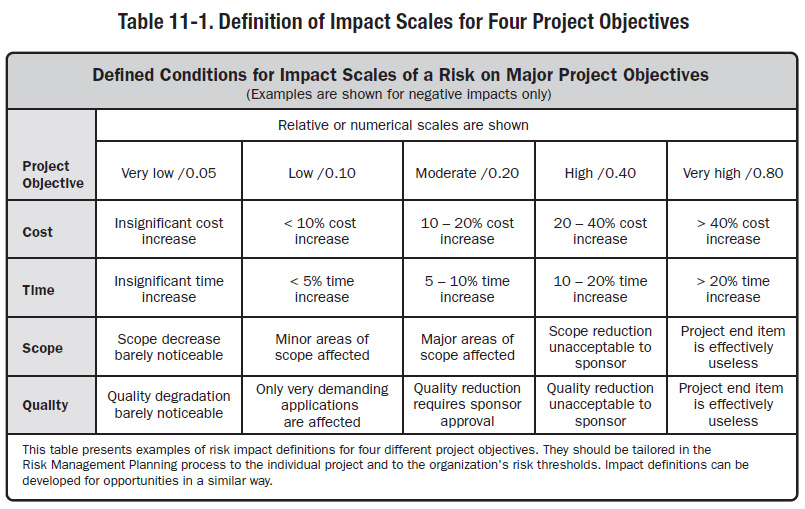
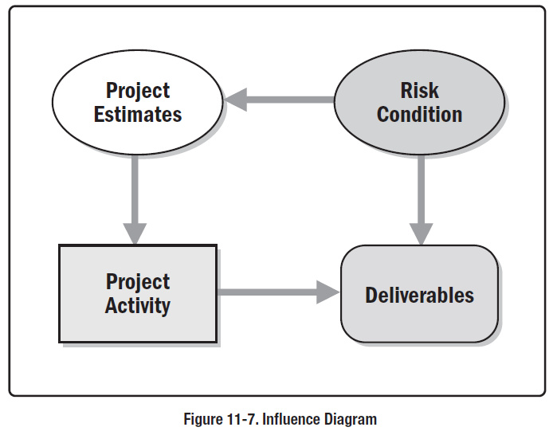
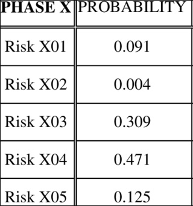
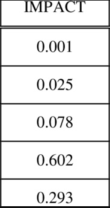
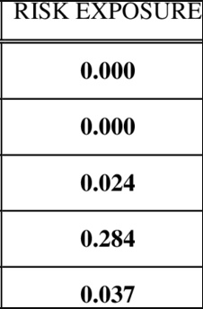
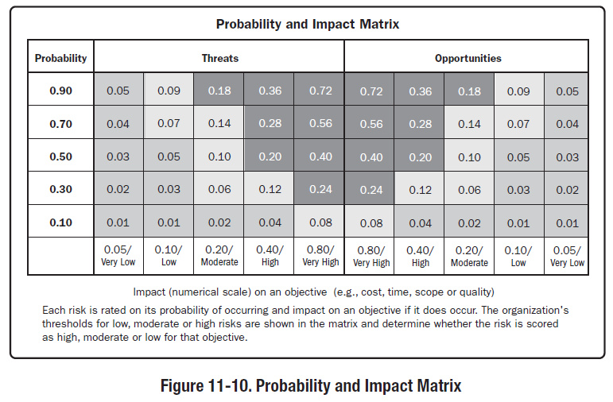
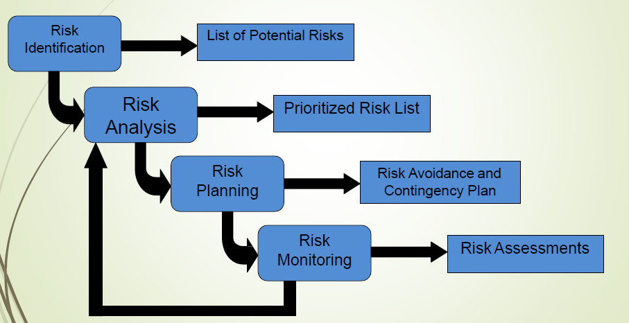

# Unit 04: Risk Management

> **Hours:** 4 Hrs. | **Source:** `Chapter_4_Risk Management.pdf`

---

## Table of Contents

- [1. Introduction to Risk Management](#1-introduction-to-risk-management)
- [2. Types of Risk](#2-types-of-risk)
- [3. Risk Appetite, Tolerance, and Threshold](#3-risk-appetite-tolerance-and-threshold)
- [4. Plan Risk Management](#4-plan-risk-management)
- [5. Risk Identification](#5-risk-identification)
- [6. Risk Register](#6-risk-register)
- [7. Risk Analysis](#7-risk-analysis)
- [8. Qualitative Risk Analysis](#8-qualitative-risk-analysis)
- [9. Quantitative Risk Analysis](#9-quantitative-risk-analysis)
- [10. Risk Response (Avoidance & Mitigation)](#10-risk-response-avoidance--mitigation)
- [11. Risk Monitoring and Control](#11-risk-monitoring-and-control)
- [12. Risk Management Process](#12-risk-management-process)
- [13. PERT Numerical Example](#13-pert-numerical-example)
- [14. Quick Revision Summary](#14-quick-revision-summary)

---

## 1. Introduction to Risk Management

> **Definition:** Risk is any unexpected event that can affect your project — for better or for worse. Risk can affect anything: people, processes, technology, and resources.

> **⚠️ Important:** Risks are **not** the same as *issues*. Issues are things you know you'll have to deal with, and may even have an idea of when they'll occur, like a team member's scheduled vacation, or a big spike in product demand around the holidays. Risks are events that *might* happen, and you may not be able to tell *when*.

### Characteristics of Risk

Risk is an uncertainty which is associated with a future and may or may not occur and a corresponding potential for loss. Two main characteristics of risk are:

1. **Uncertainty:** The risk may or may not happen — there are no 100% risks.
2. **Loss:** If risks become a reality, then losses occur.

---

## 2. Types of Risk

| Risk Type | Description |
|---|---|
| **Cost Risk** | Escalation of project costs due to poor cost estimating accuracy and scope creep. |
| **Schedule Risk** | The risk that activities will take longer than expected. Slippages in schedule typically increase costs and delay the receipt of project benefits, with a possible loss of competitive advantage. |
| **Performance Risk** | The risk that the project will fail to produce results consistent with project specifications. |
| **Governance Risk** | Relates to board and management performance with regard to ethics, community stewardship, and company reputation. |
| **Strategic Risks** | Result from errors in strategy, such as choosing a technology that can't be made to work. |
| **Operational Risk** | Includes risks from poor implementation and process problems such as procurement, production, and distribution. |
| **Market Risks** | Include competition, foreign exchange, commodity markets, and interest rate risk, as well as liquidity and credit risks. |
| **Legal Risks** | Arise from legal and regulatory obligations, including contract risks and litigation brought against the organization. |
| **External Hazards** | Include storms, floods, and earthquakes; vandalism, sabotage, and terrorism; labor strikes; and civil unrest. |

---

## 3. Risk Appetite, Tolerance, and Threshold

Organizations perceive risk as the effect of uncertainty on projects and organizational objectives. Organizations and stakeholders are willing to accept varying degrees of risk depending on their risk attitude.

The risk attitudes may be influenced by a number of factors, which are broadly classified into three themes:

> **Definition — Risk Appetite:** The degree of uncertainty an entity is willing to take on in anticipation of a reward.

> **Definition — Risk Tolerance:** The degree, amount, or volume of risk that an organization or individual will withstand.

> **Definition — Risk Threshold:** Refers to measures along the level of uncertainty or the level of impact at which a stakeholder may have a specific interest. Below that risk threshold, the organization will accept the risk. Above that risk threshold, the organization will not tolerate the risk.

---

## 4. Plan Risk Management

> **Definition:** Plan Risk Management is the process of defining how to conduct risk management activities for a project.

The risk management plan is vital to communicate with and obtain agreement and support from all stakeholders to ensure the risk management process is supported and performed effectively over the project life cycle. Careful and explicit planning enhances the probability of success for other risk management processes. It is important to provide sufficient resources and time for risk management activities and to establish an agreed upon basis for evaluating risk.

### Elements of Plan Risk Management

| Element | Description |
|---|---|
| **Methodology** | Defines the approaches, tools, and data sources that will be used to perform risk management on the project. |
| **Roles and Responsibilities** | Defines the lead, support, and risk management team members for each type of activity in the risk management plan, and clarifies their responsibilities. |
| **Budgeting** | Estimates funds needed, based on assigned resources, for inclusion in the cost baseline and establishes protocols for application of contingency and management reserves. |
| **Timing** | Defines when and how often the risk management processes will be performed throughout the project life cycle and establishes risk management activities for inclusion in the project schedule. |
| **Risk Categories** | Provide a means for grouping potential causes of risk. A **Risk Breakdown Structure (RBS)** helps the project team to look at many sources from which project risk may arise in a risk identification exercise. |
| **Definitions of Risk Probability and Impact** | The quality and credibility of the risk analysis requires that different levels of risk probability and impact be defined that are specific to the project context. |



---

## 5. Risk Identification

> **Definition:** Process of determining which risks may affect the project and documenting their characteristics.

**Key Benefit:** Documentation of existing risks and the knowledge and ability it provides to the project team to anticipate events.

> **⚠️ Important:** It is an **iterative process** — risk cannot be foreseen at once.

### Risk Identification Techniques

| Technique | Description |
|---|---|
| **SWOT Analysis** (Strengths-Weakness-Opportunities-Threat Analysis) | A helpful technique within the greater organization to identify risk. Basically used to formulate strategies for identifying risks and to find out weaknesses and threats. |
| **Brainstorming** | The goal is to obtain a comprehensive list of project risks. |
| **Delphi Technique** | A way to reach a consensus of experts. |
| **Interviewing** | Interviewing experienced project participants, stakeholders, and subject matter experts helps to identify risks. |
| **Root Cause Analysis** | A specific technique used to identify a problem, discover the underlying causes that lead to it, and develop preventive action. |
| **Cause and Effect Diagrams** (Fishbone Diagrams) | Useful for identifying causes of risks. |
| **System or Process Flow Charts** | Show how various elements of a system interrelate and the mechanism of causation. |
| **Influence Diagrams** | Graphical representations of situations showing causal influences, time ordering of events, and other relationships among variables and outcomes. |



### Common Software Project Risks

- Personnel shortfalls
- Unrealistic schedules and budgets
- Developing the wrong software functions
- Developing the wrong user interface
- Gold plating
- Continuing stream of requirements changes
- Shortfalls in externally performed tasks
- Shortfalls in externally furnished components
- Real-time performance shortfalls
- Straining computer science capabilities

---

## 6. Risk Register

> **Definition:** Once the activities related to risk identification is completed, we can make the documentation about the risk called as the **risk register**.

The risk register is a document in which the results of risk analysis and risk response planning are recorded.

### Contents of Risk Register

- **List of Identified Risks**
- **List of Potential Responses**

---

## 7. Risk Analysis

> **Definition:** Risk analysis in project management is a sequence of processes to identify the factors that may affect a project's success.

This process includes risk identification, analysis of risks, and management of risks. It is a **pro-active process** which helps to control possible future events that may harm the overall project.

### Steps in Risk Analysis

| Step | Description |
|---|---|
| **Step 1** | Identifying the problems causing risk in project. |
| **Step 2** | Identifying the probability of occurrence of problems. |
| **Step 3** | Identifying the impact of problem. |
| **Step 4** | Assign value to Step 2 and Step 3 in range of 1–100: |
| | (0–10) **Very Low**, (10–25) **Low**, (25–50) **Moderate**, (50–75) **High**, (75–100) **Very High** |

> **⚡ Quick Formula:**
> $$
> \text{RE} = \text{Potential Damage} \times \text{Probability of Occurrence}
> $$

> Where,
> - **Potential Damage** can be a money value (e.g., flood caused damage of ₹15 crores)
> - **Probability of Occurrence** ranges from 0.00 to 1.00 (e.g., 0.1 = ten times in hundred)

| Step | Description |
|---|---|
| **Step 5** | Calculate **Risk Exposure Factor** using the formula above. |
| **Step 6** | Prepare table consisting of all of these values and order risk on the basis of Risk Exposure Factor (RE). |

### Risk Table







### Probability and Impact Matrix



---

## 8. Qualitative Risk Analysis

> **Definition:** The process of prioritizing risks for further analysis or action by assessing and combining their probability of occurrence and impact.

It assesses the priority of identified risks using their relative probability or likelihood of occurrence and the corresponding impact on project objectives. It enables project managers to reduce the level of uncertainty and to focus on high-priority risks.

### Three Functions of Qualitative Risk Analysis

1. **Prioritize** risks according to probability and impact
2. **Identify** the main areas of risk exposure
3. **Improve** understanding of project risks

---

## 9. Quantitative Risk Analysis

> **Definition:** The process of numerically analyzing the effect of identified risks on overall project objectives.

It produces quantitative risk information to support decision making in order to reduce project uncertainty. It is performed on prioritized risks obtained after qualitative risk analysis.

---

## 10. Risk Response (Avoidance & Mitigation)

### Risk Avoidance

> **Definition:** Risk avoidance is a specific type of approach to managing risk, requiring a methodical process. The purpose of this technique is to **altogether eliminate** the occurrence of risks.

- To avoid risks, these methods reduce the scope of projects by removing non-essential requirements.
- Leaders must identify and assess the risks their organization faces and determine how they will eliminate the chances of those risks causing damage to the organization.
- Because risk avoidance is a deliberate tactic, it is **not** the same as failing to identify a risk or ignoring it altogether.

### Risk Mitigation

> **Definition:** Risk mitigation refers to the strategy of planning and developing options to reduce threats to project objectives often faced by a business or organization.

- The goal of risk mitigation is **not** to eliminate threats.
- Rather, it focuses on planning for inevitable disasters and **mitigating their impact** on business continuity.
- Different types of potential risks include cyberattacks, natural disasters, legal liabilities, strategic management errors, and accidents.

---

## 11. Risk Monitoring and Control

### Risk Monitoring

> **Definition:** Risk monitoring refers to an organization's framework for staying aware of its current risk exposure, including the implemented risk management system and any other activities that inform the organization's risk decisions.

It is a key component of determining individual risk appetites — in other words, the decision of how much risk can be tolerated.

#### Benefits of Risk Monitoring

- **Minimizes** Risk
- **Mitigates** the effects of Risk
- **Provides** a clear picture of the Risk Landscape
- **Promotes** Accountability
- **Creates** Transparency
- **Utilizes** Historical Events
- **Allows** for Improvement

### Risk Control

> **Definition:** The process of implementing risk response plans, tracking identified risks, monitoring residual risks, identifying new risks, and evaluating the risk process.

**Improves efficiency** of the risk approach throughout the project life cycle to continuously optimize risk responses.

---

## 12. Risk Management Process

> **Definition:** Includes the processes of conducting risk management planning, identification, analysis, response planning, and controlling risk on a project.

**Objectives:** To increase the likelihood and impact of positive events, and decrease the likelihood and impact of negative events in the project.



### Six Processes of Risk Management

| # | Process | Description |
|---|---|---|
| 1 | **Plan Risk Management** | The process of defining how to conduct risk management activities for a project. |
| 2 | **Identify Risks** | The process of determining which risks may affect the project and documenting their characteristics. |
| 3 | **Perform Qualitative Risk Analysis** | The process of prioritizing risks for further analysis or action by assessing and combining their probability of occurrence and impact. |
| 4 | **Perform Quantitative Risk Analysis** | The process of numerically analyzing the effect of identified risks on overall project objectives. |
| 5 | **Plan Risk Responses** | The process of developing options and actions to enhance opportunities and to reduce threats to project objectives. |
| 6 | **Control Risks** | The process of implementing risk response plans, tracking identified risks, monitoring residual risks, identifying new risks, and evaluating risk process effectiveness throughout the project. |

> **⭐ Key Takeaway:** Project risk is an uncertain event or condition that, if it occurs, has a positive or negative effect on one or more project objectives such as scope, schedule, cost, and quality.

---

## 13. PERT Numerical Example

> **💡 Example:** The following table shows the jobs of a network along with their time estimates.

### Step 1: Activity Data Table

| Activity | Optimistic ($t_o$) | Most Likely ($t_m$) | Pessimistic ($t_p$) |
|---|---|---|---|
| 1–2 | 4 | 10 | 16 |
| 1–3 | 3 | 6 | 9 |
| 1–4 | 4 | 7 | 16 |
| 2–5 | 5 | 5 | 5 |
| 3–5 | 8 | 11 | 32 |
| 4–6 | 4 | 10 | 16 |
| 5–6 | 2 | 5 | 8 |

> **⚡ Quick Formula:**
> $$
> t_e = \frac{t_o + 4t_m + t_p}{6}
> $$
> $$
> \sigma^2 = \left(\frac{t_p - t_o}{6}\right)^2
> $$

### Step 2: Compute Expected Duration ($t_e$) and Variance ($\sigma^2$)

| Activity | $t_o$ | $t_m$ | $t_p$ | $t_e = \frac{t_o + 4t_m + t_p}{6}$ | $\sigma^2 = \left(\frac{t_p - t_o}{6}\right)^2$ |
|---|---|---|---|---|---|
| 1–2 | 4 | 10 | 16 | $\frac{4 + 40 + 16}{6} = \frac{60}{6} = 10$ | $\left(\frac{12}{6}\right)^2 = 2^2 = 4$ |
| 1–3 | 3 | 6 | 9 | $\frac{3 + 24 + 9}{6} = \frac{36}{6} = 6$ | $\left(\frac{6}{6}\right)^2 = 1^2 = 1$ |
| 1–4 | 4 | 7 | 16 | $\frac{4 + 28 + 16}{6} = \frac{48}{6} = 8$ | $\left(\frac{12}{6}\right)^2 = 2^2 = 4$ |
| 2–5 | 5 | 5 | 5 | $\frac{5 + 20 + 5}{6} = \frac{30}{6} = 5$ | $\left(\frac{0}{6}\right)^2 = 0^2 = 0$ |
| 3–5 | 8 | 11 | 32 | $\frac{8 + 44 + 32}{6} = \frac{84}{6} = 14$ | $\left(\frac{24}{6}\right)^2 = 4^2 = 16$ |
| 4–6 | 4 | 10 | 16 | $\frac{4 + 40 + 16}{6} = \frac{60}{6} = 10$ | $\left(\frac{12}{6}\right)^2 = 2^2 = 4$ |
| 5–6 | 2 | 5 | 8 | $\frac{2 + 20 + 8}{6} = \frac{30}{6} = 5$ | $\left(\frac{6}{6}\right)^2 = 1^2 = 1$ |

> **⚡ Quick Formula:**
> $$ \text{ES}(j) = \max_i [\text{EF}(i)], \quad \text{EF}(j) = \text{ES}(j) + t_j $$
> $$ \text{LF}(i) = \min_j [\text{LS}(j)], \quad \text{LS}(i) = \text{LF}(i) - t_i $$

### Step 3: Network Diagram

Draw the network diagram showing nodes (events) and arcs (activities):

```
    2
   / \
  /   \
 1 --- 3 --- 5 --- 6
  \         /
   \       /
    4 --- 6 (alternate path)
```

With expected durations:

```
    1 → 2 (10)
    1 → 3 (6)
    1 → 4 (8)
    2 → 5 (5)
    3 → 5 (14)
    4 → 6 (10)
    5 → 6 (5)
```

Compute earliest and latest occurrence for each event by forward pass and backward pass (same as calculation of Early Finish and Late Finish in Critical Path Method).

```
         Node: 1    2    3    4    5    6
  Earliest:    0   10    6    8   20   25
  Latest:      0   15    6   15   20   25
```

> **⚡ Quick Formula:**
> $$ \text{Critical Path} = \max(\text{Path Duration}) $$

### Step 4: Identify the Critical Path

Possible paths and their durations:

| Path | Activities | Duration |
|---|---|---|
| 1 → 2 → 5 → 6 | 10 + 5 + 5 | 20 days |
| **1 → 3 → 5 → 6** | **6 + 14 + 5** | **25 days** |
| 1 → 4 → 6 | 8 + 10 | 18 days |

> **✅ Critical Path:** 1 → 3 → 5 → 6 with project length = **25 days**
>
> The critical path is the one with the **longest duration**.

> **⚡ Quick Formula:**
> $$
> \sigma_{\text{project}}^2 = \sum \sigma_{\text{critical path}}^2
> $$

### Step 5: Compute Project Variance and Standard Deviation

Critical path activities: 1→3, 3→5, 5→6

$$
\sigma^2 = 1 + 16 + 1 = 18
$$

$$
\sigma = \sqrt{18} = 4.24 \text{ days}
$$

> **⚡ Quick Formula:**
> $$
> z = \frac{T_s - T_e}{\sigma}
> $$
> Where:
> - $T_s$ = Schedule time (target)
> - $T_e$ = Project length (expected duration)
> - $\sigma$ = Standard deviation of project

### Step 6: Probability of Completing 5 Days Early

> **Given:** Critical path duration = 25 days. 5 days earlier = $25 - 5 = 20$ days.

$$
z = \frac{20 - 25}{4.24} = \frac{-5}{4.24} = -1.18
$$

$$
P(z \leq -1.18) = 0.1190 = 11.90\%
$$

> **Answer:** The probability that the project will be completed in **20 days** is **11.90%**.
>
> *(Value from standard normal distribution table for $z = -1.18$)*

> **⚡ Quick Formula:**
> $$
> T_s = T_e + z \cdot \sigma
> $$

### Step 7: Project Duration for 95% Confidence Level

> **Given:** 95% confidence. From the $z$-value table, the value for 0.95 is $z = 1.65$.

$$
1.65 = \frac{T_s - 25}{4.24}
$$

$$
T_s = 25 + 1.65 \times 4.24 = 25 + 6.97 = 31.97 \text{ days}
$$

> **Answer:** Project duration for **95% level of confidence** is **31.97 days**.
>
> *(Value from standard normal distribution table where 0.95053 is in row 1.6 and column 0.05, so $z = 1.65$)*

---

## 14. Quick Revision Summary

### Key Formulas

| Formula | Description |
|---|---|
| $t_e = \dfrac{t_o + 4t_m + t_p}{6}$ | Expected duration of an activity (PERT) |
| $\sigma^2 = \left(\dfrac{t_p - t_o}{6}\right)^2$ | Variance of an activity |
| $\sigma_{\text{project}} = \sqrt{\sum \sigma_{\text{critical path}}^2}$ | Standard deviation of project |
| $\text{RE} = \text{Potential Damage} \times \text{Probability of Occurrence}$ | Risk Exposure Factor |
| $z = \dfrac{T_s - T_e}{\sigma}$ | Z-value for probability calculation |

### Decision Rules

| Concept | Rule |
|---|---|
| **Risk vs Issue** | Risks *might* happen (uncertain); Issues *will* happen (certain) |
| **Risk Appetite** | Degree of uncertainty willing to take on for reward |
| **Risk Tolerance** | Amount of risk an organization will withstand |
| **Risk Threshold** | Level above which risk is not tolerated |
| **Qualitative Analysis** | Prioritize risks by probability & impact (subjective) |
| **Quantitative Analysis** | Numerically analyze effect on project objectives (objective) |
| **Risk Avoidance** | Eliminate the risk altogether |
| **Risk Mitigation** | Reduce the impact of risk |
| **Critical Path** | The path with the **longest** duration in the network |
| **Project Duration** | Sum of expected durations on the critical path |

### PERT Example Quick Reference

| Item | Value |
|---|---|
| Critical Path | 1 → 3 → 5 → 6 |
| Expected Duration | 25 days |
| Project Variance | 18 |
| Standard Deviation | 4.24 days |
| $P(\text{complete in 20 days})$ | 11.90% ($z = -1.18$) |
| Duration for 95% Confidence | 31.97 days ($z = 1.65$) |

## Glossary

| Term | Definition |
|------|-----------|
| **Risk** | An uncertain event that, if it occurs, has a positive or negative effect on project objectives |
| **Issue** | A known event that will definitely occur (unlike risk, which is uncertain) |
| **Risk Appetite** | Degree of uncertainty an entity is willing to take on in anticipation of reward |
| **Risk Tolerance** | Amount of risk an organization or individual will withstand |
| **Risk Threshold** | Level of impact above which a stakeholder will not tolerate the risk |
| **Risk Register** | Document recording identified risks, their analysis, and planned responses |
| **Risk Exposure (RE)** | Potential damage × Probability of occurrence |
| **Qualitative Analysis** | Prioritizing risks by assessing probability and impact subjectively |
| **Quantitative Analysis** | Numerically analyzing the effect of risks on project objectives |
| **Risk Avoidance** | Eliminating the risk altogether by changing the project plan |
| **Risk Mitigation** | Reducing the probability or impact of a risk |
| **SWOT Analysis** | Strengths-Weaknesses-Opportunities-Threats analysis for risk identification |
| **Delphi Technique** | Consensus-building technique using anonymous expert feedback |
| **RBS** | Risk Breakdown Structure — hierarchical grouping of potential risk sources |
