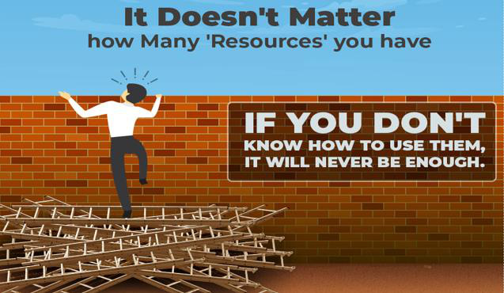
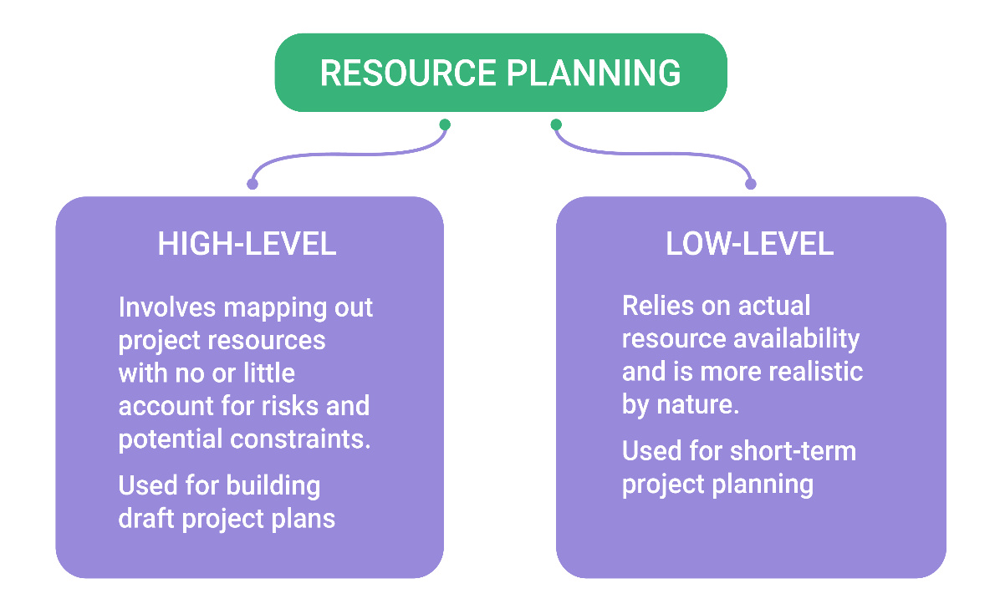
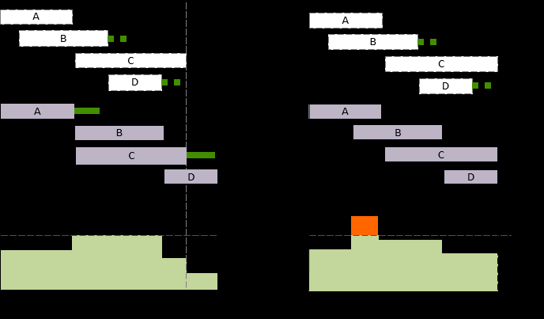
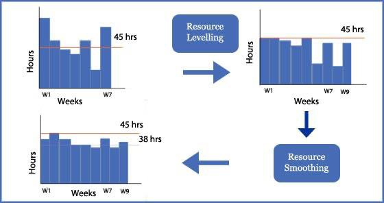

# Unit 05: Resource Allocation

> **Hours:** 4 Hrs. | **Source:** `Chapter_5_Resource Allocation.pdf`

---

## Table of Contents

- [1. Identifying Resource Requirements](#1-identifying-resource-requirements)
  - [1.1 Types of Resources](#1-1-types-of-resources)
  - [1.2 Identifying Resources via WBS](#1-2-identifying-resources-via-wbs)
- [2. Resource Allocation](#2-resource-allocation)
  - [2.1 Goal of Resource Allocation](#2-1-goal-of-resource-allocation)
  - [2.2 Resulting Schedules](#2-2-resulting-schedules)
  - [2.3 Factors Influencing Resource Allocation](#2-3-factors-influencing-resource-allocation)
  - [2.4 Organization for Allocation](#2-4-organization-for-allocation)
- [3. Resource Requirements & Planning](#3-resource-requirements-planning)
  - [3.1 Steps to Determine Resource Requirements](#3-1-steps-to-determine-resource-requirements)
  - [3.2 Example: Install Network Hardware for 20 Computers](#3-2-example-install-network-hardware-for-20-computers)
  - [3.3 Benefits of Proper Resource Planning](#3-3-benefits-of-proper-resource-planning)
- [4. Resource Scheduling](#4-resource-scheduling)
  - [4.1 Benefits of Strong Resource Scheduling](#4-1-benefits-of-strong-resource-scheduling)
  - [4.2 Tools for Project Scheduling](#4-2-tools-for-project-scheduling)
- [5. Resource Leveling](#5-resource-leveling)
  - [5.1 Key Characteristics](#5-1-key-characteristics)
- [6. Resource Smoothing](#6-resource-smoothing)
  - [6.1 Key Characteristics](#6-1-key-characteristics)
- [7. Comparison: Resource Leveling vs Resource Smoothing](#7-comparison-resource-leveling-vs-resource-smoothing)
- [8. Multiple Projects & Priority Rules](#8-multiple-projects-priority-rules)
- [9. Quick Revision Summary](#9-quick-revision-summary)

---

## 1. Identifying Resource Requirements

> **Definition:** A **resource** is anything needed to complete a project — including people, materials, equipment, funding, and technology.

Resources can be project-specific, or they can be general and used across multiple projects. It is important to accurately assess all of the resources necessary for the successful completion of a project plan and deliverables before work begins. Without sufficient resources allocated across each stage of the development process, a project will ultimately fail. Therefore, appropriate budgeting and allocations are made for each aspect of the activities associated with the project.

### 1.1 Types of Resources

All organizations have at least four types of resources (or assets) that can be used to achieve desired objectives:

| Resource Type | Examples |
| :--- | :--- |
| **Financial Resources** | Capital, funds, budgets |
| **Physical Resources** | Equipment, raw materials, facilities |
| **Human Resources** | Staff, labor, management |
| **Technological Resources** | Software, hardware, IT infrastructure |
| **Intangible Resources** | Licensing rights, patents, research outputs, organizational knowledge |

### 1.2 Identifying Resources via WBS

After the activities have been identified using various techniques and tabulated into a Work-Breakdown-Structure (WBS), the resources need to be allocated to complete the identified tasks.

---

## 2. Resource Allocation

> **Definition:** **Resource Allocation** is the process of assigning and scheduling available resources in the most effective way to ensure project tasks are completed on time and within budget.

> 💡 **Why This Matters:** A project can have the best plan in the world, but if the right people and tools aren't available at the right time, the plan is useless. Resource allocation bridges the gap between *what you planned* and *what you actually have*.

Projects always need resources, but they can often be scarce. The task, therefore, lies with the project manager to determine the proper timing and allocation of those resources within the project schedule.

### 2.1 Goal of Resource Allocation

The goal of resource allocation is to optimize the use of a limited supply, which requires making trade-offs among:

- **Time Constraint** — fixed project deadline
- **Resource Constraint** — limited availability of resources

Resource allocation can also be used as a **control mechanism** of the project. Allocating more, less, or different physical resources can affect the progress of activities, and can affect their cost and/or the quality of outputs/deliverables as well.

### 2.2 Resulting Schedules

The final result of resource allocation will normally be a number of schedules including:

| Schedule | Description |
| :--- | :--- |
| **Activity Schedule** | Indicating start and completion dates for each activity |
| **Resource Schedule** | Indicating dates when resources are needed and the level of resources |
| **Cost Schedule** | Shows accumulative expenditures |

> ⚡ **Quick Formula:** Resource Allocation = Assigning Resources → Trade-offs → Resulting Schedules (Activity + Resource + Cost)

### 2.3 Factors Influencing Resource Allocation

| Factor | Description |
| :--- | :--- |
| **Availability** | We need to know if a particular individual is available when required. |
| **Criticality** | Allocate the more experienced person to the critical activity, which may be a tough task to do. |
| **Risk** | Allocate the highly experienced personnel to the highest risk activity to reduce overall project uncertainty. |
| **Training** | Proper training needs to be provided to every person about the task they are given. |
| **Team Building** | Proper selection of members for a particular team to do a particular task. |

### 2.4 Organization for Allocation

A program organization chart is essential to allocate staff effectively:

1. Develop the hierarchical program organization.
2. Identify Roles and Responsibilities.
3. Plan for number of staff in each role (at a high level).
4. Establish Teams.

> ⭐ **Key Takeaway:** Resource allocation optimizes limited resources through trade-offs between time and resource constraints, producing three key schedules — activity, resource, and cost.

---

## 3. Resource Requirements & Planning

> **Definition:** **Resource Requirements** are the materials, personnel, equipment, and budget needed to execute project tasks and deliver the project on time and within budget.

Resource requirements differ from project to project, but also depend on how productive your team can be and even project switching (as team members pass tasks to one another).

### 3.1 Steps to Determine Resource Requirements

| Step | Description |
| :--- | :--- |
| 1 | **Establish Project Scope** |
| 2 | **Make Activity Breakdown Structure** |
| 3 | **Estimate Task Duration** |
| 4 | **Identify Requirements of Each Task** |
| 5 | **Create Resource Schedule** |
| 6 | **Assign Resources to Tasks** |
| 7 | **Use Resource Tracking Tools** |

### 3.2 Example: Install Network Hardware for 20 Computers

| Parameter | Value |
| :--- | :--- |
| **Work units** | 20 |
| **Basic Skill** | Bachelor's Degree in related field |
| **Task Complexity** | 5 |
| **Task Category** | Skilled *(other categories may include: Management, Leadership, Expert)* |

### 3.3 Benefits of Proper Resource Planning

- Proper skills and talent utilization ensuring better productivity and job satisfaction
- Easier and more accurate capacity tracking
- Simple project progress tracking
- Better team collaboration and productivity
- Improved job satisfaction and retention in your team
- Stop team burnout

> ⚠️ **Important:** Lack of project resources can become a constraint on the completion of project activities; therefore, proper resource planning and scheduling are key to successful project management.

---

## 4. Resource Scheduling

> **Definition:** **Resource Scheduling** is the process of assigning resources to activities over time — considering earliest and latest start dates to ensure resources are balanced and available when needed.

It should always be in the project planner's mind, right from the start of the project. During the resource scheduling and allocation phase of the planning activity, a lot of the plan will change. Most of the issues with respect to resource allocation and scheduling arise after the project starts (normally after about 30% of the activities are complete).

### 4.1 Benefits of Strong Resource Scheduling

- Easier project progress monitoring
- Optimize resource schedules anytime

### 4.2 Tools for Project Scheduling

| Tool | Description |
| :--- | :--- |
| **PERT Chart** | A graphical representation of a project's schedule. Shows the sequence of tasks and which tasks can be performed simultaneously. |
| **Gantt Chart** | Illustrates the start and finish dates of the terminal elements and summary elements of a project. |
| **Work Breakdown Structure (WBS)** | Defines what tasks are to be done to complete the project. |

> ⚡ **Quick Formula:** Resource Scheduling = Identify Resources → Balance → Schedule (using PERT, Gantt, WBS)

---

## 5. Resource Leveling

> **Definition:** **Resource Leveling** is a technique that re-adjusts project timelines based on available resources — it addresses resource shortages by extending the schedule, which may delay the critical path.

With this technique, you can allocate resources accordingly to ensure goals and objectives are met.

### 5.1 Key Characteristics
- Re-adjusts timelines based on available resources
- Addresses resource shortages and over-allocation
- Balances the resource demands by leveling the under-allocated and over-allocated critical resources
- Answers the question: *"When will you be able to complete the project with the given resources?"*
- **May impact the critical path** — project could delay

> 🧠 **Memory Aid — Leveling vs Smoothing:**
> - **Leveling** = *"I only have 3 developers, so the project will take longer."* → Affects the deadline.
> - **Smoothing** = *"I have 3 developers, and the deadline is fixed, so I'll shift tasks to keep everyone busy but not overloaded."* → Deadline stays.
>
> *Simple rule:* If the deadline moves → Leveling. If the deadline stays → Smoothing.

---

## 6. Resource Smoothing

> **Definition:** **Resource Smoothing** is a technique that adjusts activities using available float to keep resource usage within predefined limits — it does **not** change the project completion date.

There are only few reusable resources that are limitless, thus the time schedules have to be imposed and adjusted to manage limited availability resources in a given time.

### 6.1 Key Characteristics

- The main objective is to complete work/activity within the required date while avoiding peaks and troughs in resource demand.
- Ensures resources are evenly allocated.
- Performed *after* resource leveling to eliminate the peaks and troughs from the schedule using total and free floats.
- **Does not impact the critical path** — project delays do not occur.

---

## 7. Comparison: Resource Leveling vs Resource Smoothing

| Aspect | Resource Leveling | Resource Smoothing |
| :--- | :--- | :--- |
| **Impact on Critical Path** | ⚠️ **May delay** the project (impacts critical path) | ✅ **Does not impact** critical path |
| **Objective** | Balances resource demand by leveling under/over allocated critical resources | Eliminates peaks and troughs in resource demand |
| **Order of Execution** | Performed first | Performed *after* resource leveling |
| **Float Usage** | May not use float | Uses total and free floats to shift activities |
| **Key Question** | *"When will you be able to complete the project with given resources?"* | *"How can resources be evenly distributed within the schedule?"* |
| **Schedule Adjustment** | Timelines are re-adjusted to match resource availability | Activities adjusted within float without delaying the project |

> ⭐ **Key Takeaway:** Resource Leveling adjusts the schedule to fit resource constraints (may delay the project), while Resource Smoothing adjusts resource usage within existing float (does not delay the project).

---

## 8. Multiple Projects & Priority Rules

Sometimes a limited resource is needed (at the same time) by several activities in one project or by different activities in multiple projects (so some of the activities must wait).

- **Setting priority rules** for which activity gets the constrained resource first can be a means of project control.
- In the case of **multiple projects**, the goals and importance of all the projects should be considered.

> 💡 **Example — Priority Rules in Action:**
>
> A company has **one senior developer** needed by three projects simultaneously:
>
> | Project | Deadline | Penalty for Delay | Priority |
> |---------|----------|-------------------|----------|
> | Project A: Client Billing System | Next week | ₹50,000/day penalty | **Highest** |
> | Project B: Internal Dashboard | 2 weeks | Low (internal) | Medium |
> | Project C: R&D Prototype | 1 month | None (exploratory) | Lowest |
>
> **Decision:** The senior developer is assigned to Project A first due to financial penalty. Project B gets the next available slot. Project C is delayed — acceptable given its exploratory nature.

---

## 9. Quick Revision Summary

| Topic | Key Points |
| :--- | :--- |
| **Identifying Resource Requirements** | Resources are anything needed to complete a project. Types: Financial, Physical, Human, Technological, Intangible. |
| **Resource Allocation** | Assigning & scheduling resources effectively. Trade-offs between **Time** and **Resource** constraints. Produces Activity, Resource, and Cost schedules. |
| **Factors for Allocation** | Availability, Criticality, Risk, Training, Team Building. |
| **Resource Requirements** | Steps: Scope → WBS → Duration → Requirements → Schedule → Assign → Track. |
| **Resource Scheduling** | Tools: **PERT** (task sequence), **Gantt** (start/finish dates), **WBS** (task breakdown). |
| **Resource Leveling** | Re-adjusts timelines for available resources. ⚠️ *May delay critical path.* |
| **Resource Smoothing** | Adjusts activities within float to avoid peaks/troughs. ✅ *No impact on critical path.* Performed after leveling. |
| **Multiple Projects** | Set priority rules; consider goals of all projects when allocating constrained resources. |

---

*Content derived from class notes and `Chapter_5_Resource Allocation.pdf`.*

## Glossary

| Term | Definition |
|------|-----------|
| **Resource** | Anything needed to complete a project successfully (financial, physical, human, technological, intangible) |
| **Resource Allocation** | Process of assigning and scheduling available resources in the most effective and economical way |
| **Resource Leveling** | Re-adjusting timelines to match resource availability; may delay the critical path |
| **Resource Smoothing** | Adjusting activities within available float to avoid peaks and troughs in resource demand; does not impact critical path |

| **Resource Schedule** | Document indicating dates when resources are needed and the level required |
| **Activity Schedule** | Document indicating start and completion dates for each activity |
| **Cost Schedule** | Document showing cumulative expenditures over time |
| **Float** | Amount of time an activity can be delayed without affecting project completion |
| **Critical Path** | The longest path in the network; determines minimum project completion time |
