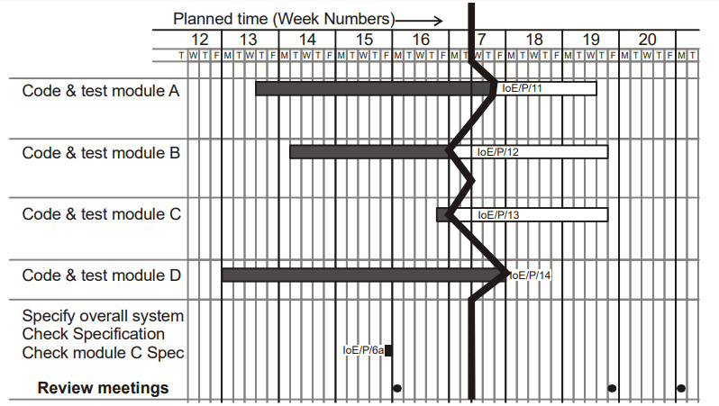
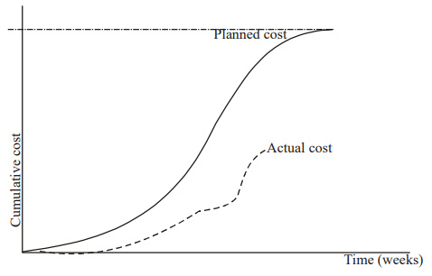
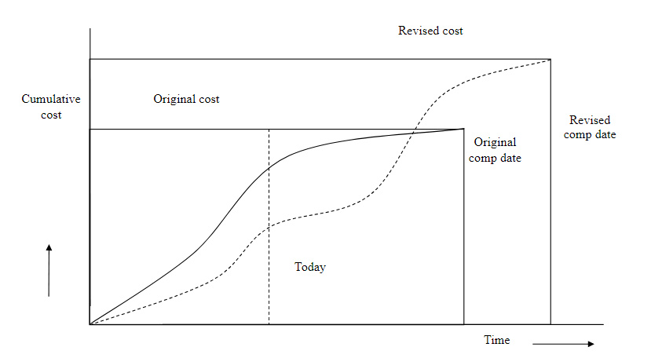

# Unit 06: Monitoring and Control

> **Hours:** 4 Hrs. | **Source:** `Chapter_6_Monitoring and Control.pdf`

---

## Table of Contents

- [1. Introduction to Monitoring and Control](#1-introduction-to-monitoring-and-control)
- [2. Project Monitoring](#2-project-monitoring)
  - [2.1 5W Questions of Monitoring](#2-1-5w-questions-of-monitoring)
  - [2.2 Setting Check Points](#2-2-setting-check-points)
  - [2.3 Collecting Data](#2-3-collecting-data)
- [3. Visualizing Progress](#3-visualizing-progress)
  - [3.1 Gantt Chart](#3-1-gantt-chart)
  - [3.2 Slip Chart](#3-2-slip-chart)
  - [3.3 Ball Chart](#3-3-ball-chart)
- [4. Cost Monitoring](#4-cost-monitoring)
- [5. Earned Value Analysis](#5-earned-value-analysis)
  - [5.1 EVA Base Quantities](#5-1-eva-base-quantities)
  - [5.2 EVA Formulas](#5-2-eva-formulas)
  - [5.3 EVA Example 1 — Project Progress After 8th Day](#5-3-eva-example-1-project-progress-after-8th-day)
  - [5.4 EVA Example 2 — Project Progress After 12th Day](#5-4-eva-example-2-project-progress-after-12th-day)
  - [5.5 EVA Example 3 — Project Progress After 10th Day](#5-5-eva-example-3-project-progress-after-10th-day)
- [6. Project Control](#6-project-control)
  - [6.1 Monitoring vs. Controlling](#6-1-monitoring-vs-controlling)
- [7. Quick Revision Summary](#7-quick-revision-summary)

---

## 1. Introduction to Monitoring and Control

In a project life cycle, **monitoring and controlling** is the process of regularly observing and tracking the progress of your project and making any necessary proactive corrections. This stage is vital in ensuring your project stays on track and within budget.

> **Key Statistic:** A staggering **70%** of projects fail to deliver their intended outcome. But when a proper management process is put in place, this number drops drastically to a failure rate of **20% or below**.

Once work schedules have been published and the project is under way, attention must be focused on ensuring progress. This requires:

- **Monitoring** — *What is happening?*
- **Comparison** of actual achievement against the schedule
- **Revision** of plans and schedules to bring project as far as possible back on target.

There are two ways for tracking the performance:
1. **Setting Check Points**
2. **Collecting Data**

---

## 2. Project Monitoring

> **Definition:** **Project Monitoring** is the process of regularly observing and tracking project progress by collecting data on scope, schedule, cost, and quality — focused on detection, not correction.

**Project Monitoring focuses on:**
- Measuring planned performance vs. actual performance
- Identifying ongoing project performance and preventing problems
- Keeping timely accurate information based on project progress
- Forecasting updates on current costs and project schedule

**Project monitoring activities include:**
- Tracking project milestones and deliverables
- Checking the project's performance is on track to meet goals, objectives, and Key Performance Index (KPI), and developing performance metric reports
- Monitoring project manager performance metrics, so nothing falls through the cracks
- Checking the project schedule and timeline is on track
- Assessing the project budget and costs compared with the forecasts
- Staying on top of the project scope and making sure scope creep doesn't happen
- Carrying out an overall quality control assessment, and conducting quality reviews (and creating reports)
- Watching out for any general issues that arise, and building an issue log
- Conducting risk assessments and producing risk management plans
- Setting up progress meetings and conducting status reports and reviews

### 2.1 5W Questions of Monitoring

| Question | Answer |
|----------|--------|
| **Why** do we monitor? | To detect and react appropriately to deviations and changes to plans |
| **What** do we monitor? | Men (human resources), Machines, Time, Materials, Tasks, Money, Quality/Technical Performance |
| **When** do we monitor? | End of the project, Continuously, Regularly, Logically, While there is still time to react, As soon as possible, At task completion, At pre-planned decision points (milestones) |
| **Where** do we monitor? | At head office? At the site office? On the spot? Depends on situation |
| **How** do you monitor? | Through meetings with clients, parties involved in project (Contractor, supplier, etc.). For schedule — Update CPA, PERT Charts, Update Gantt Charts, Using Earned Value Analysis, Calculate Critical Ratios, Milestones Reports, Tests and inspections |

---

### 2.2 Setting Check Points

- **Based on regular time intervals:** Can be weekly or monthly or quarterly. Depends on what to check and how to check.
- **Based on a particular event:** At the end of each activity. In the middle of a critical activity.
- Should be set before the plan was published
- Make sure everyone knows when and what the check points are

### 2.3 Collecting Data

As a rule, the managers will try to break down activities into more controllable tasks of one or two weeks duration. But it is still necessary to gather information about partially completed activities and particular forecasts how much work is left to be completed.

Where there is a series of products, partial completion of activities is easier to estimate by counting the number of records, specifications, or screen layouts produced.

#### Partial Completion Report

Indicates the work done by the personnel and the time spent on the work. Generally weekly time sheets are used to represent partial completion reports as they provide good information about what has been achieved.

**Optional information from Partial Completion Report:**
- Likelihood of failing to complete the task by the scheduled date
- Estimated time of completion

#### Risk Report

Indicates the likelihood of meeting the scheduled target date. Instead of asking the estimated completion date, use the **traffic-light method**.

#### Traffic-Light Method

1. Identify the key (First Level) elements for assessment in a piece of work
2. Break these key elements into constituent elements (second level)
3. Assess each of the second level elements on the scale:
   - 🟢 **Green** for "on target"
   - 🟡 **Amber** for "not on target but recoverable"
   - 🔴 **Red** for "not on target and recoverable only with difficulty"
4. Review all the second level assessments to arrive at first level assessment
5. Review first and second level assessments to produce an overall assessment

**Activity Assessment Sheet**

| Staff: Zobel | Ref: IoE/P/100 |
|---|---|
| **Activity:** Code and test module A | **Week number:** \_\_\_\_\_ |

| Component | Activity Summary | Comments |
|-----------|-----------------|----------|
| Screen handling procedures | | |
| File updating | | |
| Compilation | | |
| Run test data | | |

---

## 3. Visualizing Progress

Having collected data about project progress, the manager needs a way for presenting that data to greatest effect — in a way that is easy to understand and helps to easily identify the problem activities or areas that need to be taken care of.

Progress can be visualized through:
1. **Gantt Chart**
2. **Slip Chart**
3. **Ball Chart**

### 3.1 Gantt Chart

> One of the oldest and simplest techniques for tracking the project visually. It is a static picture showing the current progress of activity, indicating scheduled activity date, with a **'today cursor'** (i.e. today's task).

An activity bar chart showing the activities, their scheduled dates, duration, and the reported progress of the activities.

### 3.2 Slip Chart

Provides a more striking visual indication of those activities that are not progressing to schedule. The **slip line** indicates those activities that are either ahead or behind the schedule.

> ⚠️ **Important:** Too much bending indicates a need for rescheduling of the overall plan. The more the slip line bends, the greater the variation from the plan.

### 3.3 Ball Chart

A more prominent way of showing whether or not targets have been met. In this technique, the circles indicate start and completion points for activities. The circles initially contain the original scheduled dates. Whenever revisions are produced, these are added as second dates in the appropriate circle when:
- An activity is actually started or completed
- The relevant date replaces the revised estimate

---

## 4. Cost Monitoring

> **Definition:** **Cost Monitoring** tracks actual project expenditure against the budget to identify whether the project is spending more or less than planned — revealing if being on time is due to cost overruns.

A project might be on time but only because more money has been spent on activities than originally budgeted.

A **cumulative expenditure chart** provides a simple method of comparing actual and planned expenditure. It illustrates whether a project is:
- Running late, OR
- On time but with substantial cost savings

**Tracking Cumulative Expenditure:** Cost graph with cost/time extension.

---

## 5. Earned Value Analysis

> **Definition:** **Earned Value Analysis (EVA)** integrates cost, schedule, and scope into a single framework to measure project performance and forecast future completion dates and costs.

> 💡 **Why This Matters:** EVA answers three critical questions at any point in a project: *"Are we on schedule? Are we on budget? What will the final cost be?"* Without EVA, you might think you're ahead because you spent a lot — but EVA tells you if that spending actually produced value.

EVA is based on assigning a **'value'** to each task or work package as identified in the Work Breakdown Structure (WBS) based on the original expenditure forecasts. A task that has not started is assigned the value zero, and when it has been completed, it is credited with the value of the task.

### 5.1 EVA Base Quantities

Three quantities form the basis for cost performance measurement using Earned Value Analysis:

> **Definition — BCWS = Budgeted Cost of Work Scheduled (PV = Planned Value):** The budgeted cost of work that was **planned** to be completed by a given time — *"How much work should be done?"*

> **Definition — BCWP = Budgeted Cost of Work Performed (EV = Earned Value):** The budgeted cost of work **actually** completed by a given time — *"How much work was actually done (in budget terms)?"*

> **Definition — ACWP = Actual Cost of Work Performed (AC = Actual Cost):** The **actual** cost incurred for the work performed by a given time — *"How much did the completed work actually cost?"*

### 5.2 EVA Formulas

| Metric | Formula | Description |
|--------|---------|-------------|
| **Schedule Variance (SV)** | $$SV = BCWP - BCWS$$ | BCWP − BCWS. Negative = behind schedule |
| **Cost Variance (CV)** | $$CV = BCWP - ACWP$$ | BCWP − ACWP. Negative = over budget |
| **Cost Performance Index (CPI)** | $$CPI = \frac{BCWP}{ACWP}$$ | (Earned Value) ÷ (Actual Cost). **CPI > 1.0** = under budget; **CPI = 1.0** = on budget; **CPI < 1.0** = cost overrun |
| **Schedule Performance Index (SPI)** | $$SPI = \frac{BCWP}{BCWS}$$ | (Earned Value) ÷ (Planned Value). **SPI < 1.0** = behind schedule |

> **Full Forms:** BCWP = Budgeted Cost of Work Performed (Earned Value) · BCWS = Budgeted Cost of Work Scheduled (Planned Value) · ACWP = Actual Cost of Work Performed (Actual Cost) · SV = Schedule Variance · CV = Cost Variance · CPI = Cost Performance Index · SPI = Schedule Performance Index

> ⚠️ **Important:** A CPI of **1.0** implies that the actual cost matches the estimated cost. CPI **greater than 1.0** indicates work is accomplished for less cost than planned. CPI **less than 1.0** indicates the project is facing cost overrun.

> 💡 **CPI / SPI Quick Interpretation Guide:**
>
> | Scenario | CPI | SPI | Meaning |
> |----------|-----|-----|---------|
> | Under budget & ahead | > 1.0 | > 1.0 | ✅ Best case — doing more for less |
> | Over budget & behind | < 1.0 | < 1.0 | ⚠️ Worst case — needs immediate attention |
> | Over budget & ahead | < 1.0 | > 1.0 | 🔶 Spending too much to get ahead (re-evaluate budget) |
> | Under budget & behind | > 1.0 | < 1.0 | 🔶 Moving too slowly but cheap (re-evaluate schedule) |

> 🧠 **Memory Aid — EVA Formulas:**
>
> - **CV (Cost Variance)** = **EV − AC** — same as profit formula (Revenue − Cost). Positive = profit = under budget.
> - **SV (Schedule Variance)** = **EV − PV** — same logic: "Earned" minus "Planned." Positive = ahead.
> - **CPI** = **EV / AC** — > 1 means earning more value per dollar spent.
> - **SPI** = **EV / PV** — > 1 means earning value faster than planned.
>
> *Tip: If you remember "EV is always on top" (numerator), you can derive all four: CV = EV − AC, SV = EV − PV, CPI = EV/AC, SPI = EV/PV.*

---

### 5.3 EVA Example 1 — Project Progress After 8th Day

#### Activity Data

| Activity | Duration (Days) | Precedence | Cost/Day | Total Cost |
|----------|----------------|------------|----------|------------|
| A | 3 | — | 500 | 1500 |
| B | 3 | A | 100 | 300 |
| C | 4 | B | 400 | 1600 |
| D | 2 | B | 500 | 1000 |
| E | 3 | D | 500 | 1500 |

**Total Project Cost:** 5900

#### Progress After 8th Day

| Activity | % Completion | Incurred Cost (ACWP) |
|----------|-------------|----------------------|
| A | 100% | 2000 |
| B | 100% | 500 |
| C | 25% | 500 |
| D | 50% | 500 |
| E | 0% | 0 |

#### EVA Calculations

| Activity | ACWP | BCWP (Total Cost × %Complete) | BCWS (Scheduled by Day 8) |
|----------|------|------------------------------|---------------------------|
| A | 2000 | 1500 | 1500 |
| B | 500 | 300 | 300 |
| C | 500 | 400 (1600 × 25%) | 800 (2 days × 400/day) |
| D | 500 | 500 (1000 × 50%) | 1000 (2 days × 500/day) |
| E | 0 | 0 | 0 |
| **Total** | **3500** | **2700** | **3600** |

> 💡 **BCWS Calculation Notes:**
> - For activities A and B, both are completed within 8 days, so BCWS = BCWP.
> - For activity C: total cost = 1600, total duration = 4 days. By day 8, only 2 days of work were scheduled, so BCWS = 2 × 400 = 800.
> - For activity D: total cost = 1000, total duration = 2 days. By day 8, 2 days of work were scheduled, so BCWS = 2 × 500 = 1000.

#### Results

| Metric | Formula | Value | Status |
|--------|---------|-------|--------|
| **SV** | BCWP − BCWS = 2700 − 3600 | $$-900$$ | ⚠️ Behind schedule |
| **CV** | BCWP − ACWP = 2700 − 3500 | $$-800$$ | ⚠️ Over budget |
| **SPI** | BCWP / BCWS = 2700 / 3600 | $$0.75$$ | ⚠️ Behind schedule |
| **CPI** | BCWP / ACWP = 2700 / 3500 | $$0.771$$ | ⚠️ Over budget |

---

### 5.4 EVA Example 2 — Project Progress After 12th Day

#### Activity Data

| Activity | Duration (Days) | Precedence | Cost/Day | Total Cost |
|----------|----------------|------------|----------|------------|
| A | 8 | — | 200 | 1600 |
| B | 4 | — | 200 | 800 |
| C | 4 | A, B | 300 | 1200 |
| D | 4 | B | 400 | 1600 |

#### Progress After 12th Day

| Activity | % Completion | Incurred Cost (ACWP) |
|----------|-------------|----------------------|
| A | 100% | 1400 |
| B | 100% | 400 |
| C | 75% | 1000 |
| D | 50% | 1000 |

#### EVA Calculations

| Activity | ACWP | BCWP (Total Cost × %Complete) | BCWS |
|----------|------|------------------------------|------|
| A | 1400 | 1600 | 1600 |
| B | 400 | 800 | 800 |
| C | 1000 | 900 (1200 × 75%) | 1200 |
| D | 1000 | 800 (1600 × 50%) | 1600 |
| **Total** | **3800** | **4100** | **5200** |

#### Results

| Metric | Formula | Value | Status |
|--------|---------|-------|--------|
| **SV** | BCWP − BCWS = 4100 − 5200 | $$-1100$$ | ⚠️ Behind schedule |
| **CV** | BCWP − ACWP = 4100 − 3800 | $$300$$ | ✅ Under budget |
| **SPI** | BCWP / BCWS = 4100 / 5200 | $$0.788$$ | ⚠️ Behind schedule |
| **CPI** | BCWP / ACWP = 4100 / 3800 | $$1.078$$ | ✅ Under budget |

---

### 5.5 EVA Example 3 — Project Progress After 10th Day

#### Activity Data

| Activity | Duration (Days) | Precedence | Cost/Day | Total Cost |
|----------|----------------|------------|----------|------------|
| A | 5 | — | 200 | 1000 |
| B | 5 | A | 200 | 1000 |
| C | 10 | A | 100 | 1000 |
| D | 5 | A, B | 200 | 1000 |

#### Progress After 10th Day

| Activity | % Completion | Incurred Cost (ACWP) |
|----------|-------------|----------------------|
| A | 100% | 1200 |
| B | 100% | 800 |
| C | 40% | 800 |
| D | 0% | 0 |

#### EVA Calculations

| Activity | ACWP | BCWP (Total Cost × %Complete) | BCWS |
|----------|------|------------------------------|------|
| A | 1200 | 1000 | 1000 |
| B | 800 | 1000 | 1000 |
| C | 800 | 400 (1000 × 40%) | 500 |
| D | 0 | 0 | 0 |
| **Total** | **2800** | **2400** | **2500** |

#### Results

| Metric | Formula | Value | Status |
|--------|---------|-------|--------|
| **SV** | BCWP − BCWS = 2400 − 2500 | $$-100$$ | ⚠️ Behind schedule |
| **CV** | BCWP − ACWP = 2400 − 2800 | $$-400$$ | ⚠️ Over budget |
| **SPI** | BCWP / BCWS = 2400 / 2500 | $$0.96$$ | ⚠️ Slightly behind schedule |
| **CPI** | BCWP / ACWP = 2400 / 2800 | $$0.85$$ | ⚠️ Over budget |

---

## 6. Project Control

> **Definition:** **Project Controlling** is the process of taking corrective action based on monitoring data — making decisions and implementing changes to bring the project back on track.

This is compared to project monitoring which is focused on **observation and evaluation**.

**Project controlling activities include:**
- **Analyzing the data and information** collected during the project monitoring stage
- **Assessing any changes from your original plan**, and the impact of these variances on the project's course to success
- **Prioritizing activities** according to their potential impact on your project
- **Making decisions about the best course of action** to get the project back on track, including controlling decisions about:
  - Any changes to your plan
  - Any changes to your overall costs or budget
  - Any changes to the schedule or timeline of the project
- **Delivering any updated documentation**, such as revised project schedules
- **Informing and negotiating with key stakeholders** as needed throughout the project

### 6.1 Monitoring vs. Controlling

| Aspect | Monitoring | Controlling |
|--------|-----------|-------------|
| **Focus** | Observing and tracking the project's progress | Taking any corrective measures necessary |
| **Purpose** | To ensure the project is on track and tasks are being completed on time | To ensure the project meets its goals and objectives |
| **Nature** | Observation and evaluation | Action and correction |

---

## 7. Quick Revision Summary

### 7.1 Key Takeaways

1. **Monitoring** = observing and tracking progress; **Controlling** = taking corrective action
2. **Checkpoints** can be time-based or event-based; set them before plan publication
3. **Traffic-light method** uses 🟢 Green / 🟡 Amber / 🔴 Red for risk assessment
4. **Three visualization techniques:** Gantt Chart, Slip Chart, Ball Chart
5. **Cumulative expenditure chart** compares actual vs. planned spending
6. **EVA** integrates cost, schedule, and scope into a single analysis framework

### 7.2 EVA Formula Summary Table

| Metric | Formula | Interpretation |
|--------|---------|---------------|
| **BCWS = Budgeted Cost of Work Scheduled (PV)** | Sum of budgets for work scheduled | Planned value for a given period |
| **BCWP = Budgeted Cost of Work Performed (EV)** | Sum of budgets for work completed | Value of work actually performed |
| **ACWP = Actual Cost of Work Performed (AC)** | Actual costs incurred | Real cost of work done |
| **SV (Schedule Variance)** | $$BCWP - BCWS$$ | Positive = ahead; Negative = behind |
| **CV (Cost Variance)** | $$BCWP - ACWP$$ | Positive = under budget; Negative = over budget |
| **SPI (Schedule Performance Index)** | $$\frac{BCWP}{BCWS}$$ | > 1.0 = ahead; = 1.0 = on schedule; < 1.0 = behind |
| **CPI (Cost Performance Index)** | $$\frac{BCWP}{ACWP}$$ | > 1.0 = under budget; = 1.0 = on budget; < 1.0 = over budget |

> ⚠️ **Important:** 70% of projects fail without proper management; with proper monitoring and control, failure rate drops to 20% or below.

## Past Exam Questions

**2082 Q2.** Explain any three visualization techniques used for monitoring progress.

**Answer:** Three visualization techniques: (1) **Gantt Chart** — a bar chart showing planned vs actual activity times. Each activity is a horizontal bar on a timeline. Actual progress is shown by shading the bar proportionally. Easy to read but does not show dependencies clearly on complex projects. (2) **Slip Chart** — tracks the slip (delay) of activities over time. The x-axis shows planned dates and y-axis shows actual dates. Activities above the diagonal line are behind schedule, and those below are ahead. Useful for detecting trends in schedule delays. (3) **Earned Value Analysis Chart** — plots Budgeted Cost of Work Scheduled (BCWS/Planned Value), Actual Cost of Work Performed (ACWP/Actual Cost), and Budgeted Cost of Work Performed (BCWP/Earned Value) over time. Deviations indicate cost/schedule problems before they become critical.

**2081 Q7.** What are the different methods used for visualizing project progress? Explain any two.

**Answer:** Methods: Gantt Chart, Slip Chart, Earned Value Analysis, Ball Charts, Timeline Charts, and Progress Reports. **Gantt Chart**: Bar chart on a timeline showing planned durations (hollow) and actual progress (filled). Facilitates visual comparison of planned vs actual. **Earned Value Analysis**: Uses three lines — BCWS (budgeted cost), ACWP (actual cost), BCWP (earned value). Cost Variance = BCWP − ACWP, Schedule Variance = BCWP − BCWS. Positive variance is favorable (under budget or ahead of schedule); negative variance means over budget or behind schedule.

**2081 Q12b.** Write short note on schedule variance.

**Answer:** **Schedule Variance (SV)** = Earned Value (BCWP) − Planned Value (BCWS). A positive SV indicates the project is ahead of schedule (more work completed than planned); a negative SV means the project is behind schedule. SV is measured in monetary terms (rupees/dollars), not time. Schedule Performance Index (SPI) = BCWP / BCWS — an SPI > 1 means ahead of schedule, SPI < 1 means behind. SV alone may be misleading: a project past its planned completion date may show SV = 0 (all tasks completed) but still have taken longer than planned.

**2080 Q1.** EVA calculation: A project at month 6 shows BCWS = NRs. 4,50,000, BCWP = NRs. 4,20,000, ACWP = NRs. 3,90,000. Calculate CV, SV, CPI, SPI, and interpret results.

**Answer:** **Cost Variance (CV)** = BCWP − ACWP = 4,20,000 − 3,90,000 = +30,000 (under budget). **Schedule Variance (SV)** = BCWP − BCWS = 4,20,000 − 4,50,000 = −30,000 (behind schedule). **Cost Performance Index (CPI)** = BCWP / ACWP = 4,20,000 / 3,90,000 = 1.077 (cost efficient). **Schedule Performance Index (SPI)** = BCWP / BCWS = 4,20,000 / 4,50,000 = 0.933 (behind schedule). **Interpretation**: The project is 7.7% under budget (CPI > 1) but 6.7% behind schedule (SPI < 1). Management should investigate schedule delays while maintaining cost control. If trends continue, the project will finish over time but under budget.

**2080 Q12b.** Write short note on bubble chart.

**Answer:** A **bubble chart** is a project visualization technique that shows three dimensions: the x-axis represents time, the y-axis represents resource usage or cost, and the **bubble size** represents the number of activities active at that time. Large bubbles indicate periods with many concurrent activities (high complexity/resource contention), while small bubbles indicate simpler periods. Bubble charts help project managers identify periods of resource overload, visualize project complexity over time, and plan resource allocation to avoid bottlenecks.

**2079 Q1.** A student has budgeted NRs. 400 per semester for 8 semesters. After 5 semesters, he spent NRs. 2,500 and actually completed 4 semesters' worth of credits. Calculate EVA metrics.

**Answer:** **BCWS (Planned Value)** = 5 semesters × 400 = NRs. 2,000. **ACWP (Actual Cost)** = NRs. 2,500. **BCWP (Earned Value)** = 4 semesters × 400 = NRs. 1,600. **Cost Variance** = 1,600 − 2,500 = −900 (over budget). **Schedule Variance** = 1,600 − 2,000 = −400 (behind schedule). **CPI** = 1,600 / 2,500 = 0.64 (cost inefficient). **SPI** = 1,600 / 2,000 = 0.80 (behind schedule). **Interpretation**: The student has spent more than planned (over budget) and completed less work than planned (behind schedule) — a problematic situation requiring corrective action.

**2079 Q3.** Explain the different methods used for visualizing project progress. Why is the monitoring and control of projects challenging?

**Answer:** Methods: Gantt Chart (bar chart on timeline), Slip Chart (actual vs planned dates), Earned Value Analysis (BCWS/BCWP/ACWP tracking), Ball Charts (balls representing milestones), and Bubble Charts (three-dimensional visualization). Monitoring is challenging because: (1) **Progress intangibility** — software progress is not physically visible like construction; 90% complete can stay at 90% for weeks; (2) **Multiple dimensions** — cost, schedule, scope, and quality must all be tracked simultaneously and they interact; (3) **Data accuracy** — progress reports rely on developer self-reporting, which may be subjective or optimistic; (4) **Late detection** — problems may only become visible near milestones, leaving little recovery time.

**2078 Q1.** A project budgeted at NRs. 80,000 for 10 months. After 5 months, NRs. 50,000 spent and 30% work completed. Find BCWS, ACWP, BCWP, CV, SV, CPI, SPI.

**Answer:** **BCWS** = (5/10) × 80,000 = NRs. 40,000. **ACWP** = NRs. 50,000. **BCWP** = 30% of 80,000 = NRs. 24,000. **Cost Variance** = 24,000 − 50,000 = −26,000 (over budget). **Schedule Variance** = 24,000 − 40,000 = −16,000 (behind schedule). **CPI** = 24,000 / 50,000 = 0.48 (severely cost inefficient). **SPI** = 24,000 / 40,000 = 0.60 (behind schedule). **Interpretation**: The project is spending more than planned while completing only 30% of work at the halfway point — both cost and schedule performance are seriously below target. Immediate corrective action is needed: the project may need additional resources or scope reduction to recover.

**2078 Q11.** Differentiate between Gantt chart and slip chart.

**Answer:** **Gantt chart** shows planned vs actual activity durations as horizontal bars on a timeline — hollow bars represent planned duration, filled portions show actual progress. It gives a clear visual of what activities are in progress, completed, or delayed. **Slip chart** (or deviation chart) plots actual completion dates against planned dates on a scatter plot. The diagonal line represents "on schedule." Points above the line are delayed (slip), points below are ahead. The slip chart excels at showing **trends** over time and whether delays are widening. The Gantt chart is better for day-to-day task tracking, while the slip chart is better for detecting systemic schedule slippage patterns.

## Glossary

| Term | Definition |
|------|-----------|
| **Monitoring** | Process of regularly observing and tracking the progress of a project |
| **Controlling** | Process of taking corrective action based on monitoring data to keep the project on track |
| **EVA (Earned Value Analysis)** | Cost monitoring technique integrating cost, schedule, and scope |
| **BCWS / PV** | Budgeted Cost of Work Scheduled (Planned Value) |
| **BCWP / EV** | Budgeted Cost of Work Performed (Earned Value) |
| **ACWP / AC** | Actual Cost of Work Performed (Actual Cost) |
| **SV (Schedule Variance)** | BCWP − BCWS; positive = ahead of schedule |
| **CV (Cost Variance)** | BCWP − ACWP; positive = under budget |
| **SPI (Schedule Performance Index)** | BCWP / BCWS; > 1.0 = ahead of schedule |
| **CPI (Cost Performance Index)** | BCWP / ACWP; > 1.0 = under budget |
| **Slip Chart** | Visual chart showing activities ahead or behind schedule using a slip line |
| **Ball Chart** | Progress chart using circles to track start and completion dates of activities |
| **Traffic-light Method** | Risk assessment using Green (on target), Amber (recoverable), Red (difficult) |
