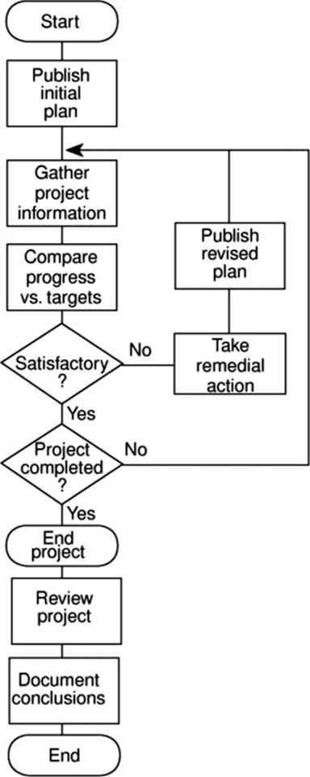
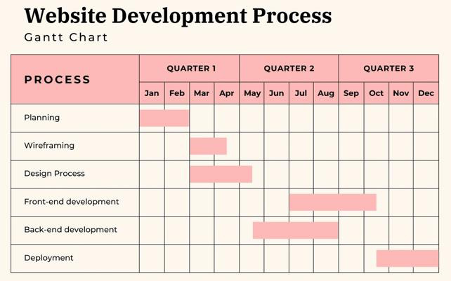
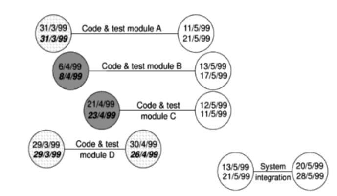
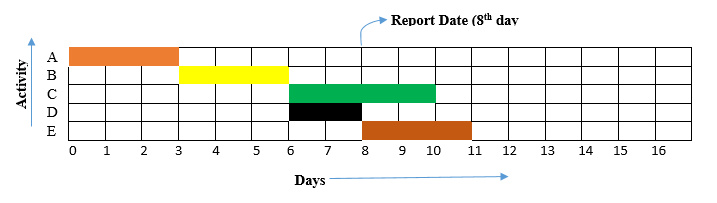

# Unit 06: Monitoring and Control

> **Hours:** 4 Hrs. | **Source:** `Chapter_6_Monitoring and Control.pdf`

---

## Table of Contents

- [Introduction to Monitoring and Control](#introduction-to-monitoring-and-control)
- [Project Monitoring](#project-monitoring)
  - [5W Questions of Monitoring](#5w-questions-of-monitoring)
  - [Setting Check Points](#setting-check-points)
  - [Collecting Data](#collecting-data)
- [Visualizing Progress](#visualizing-progress)
  - [Gantt Chart](#gantt-chart)
  - [Slip Chart](#slip-chart)
  - [Ball Chart](#ball-chart)
- [Cost Monitoring](#cost-monitoring)
- [Earned Value Analysis](#earned-value-analysis)
  - [EVA Formulas](#eva-formulas)
  - [EVA Example 1](#-eva-example-1---project-progress-after-8th-day)
  - [EVA Example 2](#-eva-example-2---project-progress-after-12th-day)
  - [EVA Example 3](#-eva-example-3---project-progress-after-10th-day)
- [Project Control](#project-control)
  - [Monitoring vs. Controlling](#monitoring-vs-controlling)
- [Quick Revision Summary](#quick-revision-summary)

---

## Introduction to Monitoring and Control

In a project life cycle, **monitoring and controlling** is the process of regularly observing and tracking the progress of your project and making any necessary proactive corrections. This stage is vital in ensuring your project stays on track and within budget.

> **Key Statistic:** A staggering **70%** of projects fail to deliver their intended outcome. But when a proper management process is put in place, this number drops drastically to a failure rate of **20% or below**.

Once work schedules have been published and the project is under way, attention must be focused on ensuring progress. This requires:

- **Monitoring** — *What is happening?*
- **Comparison** of actual achievement against the schedule
- **Revision** of plans and schedules to bring project as far as possible back on target.

There are two ways for tracking the performance:
1. **Setting Check Points**
2. **Collecting Data**

---

## Project Monitoring

> **Definition:** Project monitoring is the process of regularly observing and tracking the progress of your project. This is the first step in the project monitoring and controlling phase and involves collecting data and information about various aspects of the project.

**Project Monitoring focuses on:**
- Measuring planned performance vs. actual performance
- Identifying ongoing project performance and preventing problems
- Keeping timely accurate information based on project progress
- Forecasting updates on current costs and project schedule

**Project monitoring activities include:**
- Tracking project milestones and deliverables
- Checking the project's performance is on track to meet goals, objectives, and Key Performance Index (KPI), and developing performance metric reports
- Monitoring project manager performance metrics, so nothing falls through the cracks
- Checking the project schedule and timeline is on track
- Assessing the project budget and costs compared with the forecasts
- Staying on top of the project scope and making sure scope creep doesn't happen
- Carrying out an overall quality control assessment, and conducting quality reviews (and creating reports)
- Watching out for any general issues that arise, and building an issue log
- Conducting risk assessments and producing risk management plans
- Setting up progress meetings and conducting status reports and reviews

### 5W Questions of Monitoring

| Question | Answer |
|----------|--------|
| **Why** do we monitor? | To detect and react appropriately to deviations and changes to plans |
| **What** do we monitor? | Men (human resources), Machines, Time, Materials, Tasks, Money, Quality/Technical Performance |
| **When** do we monitor? | End of the project, Continuously, Regularly, Logically, While there is still time to react, As soon as possible, At task completion, At pre-planned decision points (milestones) |
| **Where** do we monitor? | At head office? At the site office? On the spot? Depends on situation |
| **How** do you monitor? | Through meetings with clients, parties involved in project (Contractor, supplier, etc.). For schedule — Update CPA, PERT Charts, Update Gantt Charts, Using Earned Value Analysis, Calculate Critical Ratios, Milestones Reports, Tests and inspections |

---

### Setting Check Points

- **Based on regular time intervals:** Can be weekly or monthly or quarterly. Depends on what to check and how to check.
- **Based on a particular event:** At the end of each activity. In the middle of a critical activity.
- Should be set before the plan was published
- Make sure everyone knows when and what the check points are

### Collecting Data

As a rule, the managers will try to break down activities into more controllable tasks of one or two weeks duration. But it is still necessary to gather information about partially completed activities and particular forecasts how much work is left to be completed.

Where there is a series of products, partial completion of activities is easier to estimate by counting the number of records, specifications, or screen layouts produced.

#### Partial Completion Report

Indicates the work done by the personnel and the time spent on the work. Generally weekly time sheets are used to represent partial completion reports as they provide good information about what has been achieved.

**Optional information from Partial Completion Report:**
- Likelihood of failing to complete the task by the scheduled date
- Estimated time of completion

#### Risk Report

Indicates the likelihood of meeting the scheduled target date. Instead of asking the estimated completion date, use the **traffic-light method**.

#### Traffic-Light Method

1. Identify the key (First Level) elements for assessment in a piece of work
2. Break these key elements into constituent elements (second level)
3. Assess each of the second level elements on the scale:
   - 🟢 **Green** for "on target"
   - 🟡 **Amber** for "not on target but recoverable"
   - 🔴 **Red** for "not on target and recoverable only with difficulty"
4. Review all the second level assessments to arrive at first level assessment
5. Review first and second level assessments to produce an overall assessment

**Activity Assessment Sheet**

| Staff: Zobel | Ref: IoE/P/100 |
|---|---|
| **Activity:** Code and test module A | **Week number:** \_\_\_\_\_ |

| Component | Activity Summary | Comments |
|-----------|-----------------|----------|
| Screen handling procedures | | |
| File updating | | |
| Compilation | | |
| Run test data | | |

---

## Visualizing Progress

Having collected data about project progress, the manager needs a way for presenting that data to greatest effect — in a way that is easy to understand and helps to easily identify the problem activities or areas that need to be taken care of.

Progress can be visualized through:
1. **Gantt Chart**
2. **Slip Chart**
3. **Ball Chart**

### Gantt Chart

> One of the oldest and simplest techniques for tracking the project visually. It is a static picture showing the current progress of activity, indicating scheduled activity date, with a **'today cursor'** (i.e. today's task).

An activity bar chart showing the activities, their scheduled dates, duration, and the reported progress of the activities.

### Slip Chart

Provides a more striking visual indication of those activities that are not progressing to schedule. The **slip line** indicates those activities that are either ahead or behind the schedule.

> ⚠️ **Important:** Too much bending indicates a need for rescheduling of the overall plan. The more the slip line bends, the greater the variation from the plan.

### Ball Chart

A more prominent way of showing whether or not targets have been met. In this technique, the circles indicate start and completion points for activities. The circles initially contain the original scheduled dates. Whenever revisions are produced, these are added as second dates in the appropriate circle when:
- An activity is actually started or completed
- The relevant date replaces the revised estimate

---

## Cost Monitoring

> **Definition:** Expenditure (Cost) monitoring is a vital component of project control because it provides an indication of the effort that has gone into (or at least been charged to) a project.

A project might be on time but only because more money has been spent on activities than originally budgeted.

A **cumulative expenditure chart** provides a simple method of comparing actual and planned expenditure. It illustrates whether a project is:
- Running late, OR
- On time but with substantial cost savings

**Tracking Cumulative Expenditure:** Cost graph with cost/time extension.

---

## Earned Value Analysis

> **Definition:** Earned Value Analysis (EVA) is a cost monitoring technique which integrates **cost**, **schedule**, and **scope** and can be used to forecast future performance and project completion dates.

EVA is based on assigning a **'value'** to each task or work package as identified in the Work Breakdown Structure (WBS) based on the original expenditure forecasts. A task that has not started is assigned the value zero, and when it has been completed, it is credited with the value of the task.

### EVA Base Quantities

Three quantities form the basis for cost performance measurement using Earned Value Analysis:

> **Definition — BCWS (PV):** **Budgeted Cost of Work Scheduled (Planned Value)** — The sum of budgets for all work packages scheduled to be accomplished within a given time period.

> **Definition — BCWP (EV):** **Budgeted Cost of Work Performed (Earned Value)** — The sum of budgets for completed work packages and completed portions of open work packages.

> **Definition — ACWP (AC):** **Actual Cost of Work Performed (Actual Cost)** — The actual cost incurred in accomplishing the work performed within a given time period.

### EVA Formulas

| Metric | Formula | Description |
|--------|---------|-------------|
| **Schedule Variance (SV)** | $$SV = BCWP - BCWS$$ | Difference between work actually performed (BCWP) and work scheduled (BCWS). Negative = behind schedule |
| **Cost Variance (CV)** | $$CV = BCWP - ACWP$$ | Difference between planned cost of work performed (BCWP) and actual cost incurred (ACWP). Negative = over budget |
| **Cost Performance Index (CPI)** | $$CPI = \frac{BCWP}{ACWP}$$ | Ratio of earned value to actual cost. **CPI > 1.0** = under budget; **CPI = 1.0** = on budget; **CPI < 1.0** = cost overrun |
| **Schedule Performance Index (SPI)** | $$SPI = \frac{BCWP}{BCWS}$$ | Ratio of work accomplished to work planned. Indicates the rate at which the project is progressing. **SPI < 1.0** = behind schedule |

> ⚠️ **Important:** A CPI of **1.0** implies that the actual cost matches the estimated cost. CPI **greater than 1.0** indicates work is accomplished for less cost than planned. CPI **less than 1.0** indicates the project is facing cost overrun.

---

### 💡 EVA Example 1 — Project Progress After 8th Day

#### Activity Data

| Activity | Duration (Days) | Precedence | Cost/Day | Total Cost |
|----------|----------------|------------|----------|------------|
| A | 3 | — | 500 | 1500 |
| B | 3 | A | 100 | 300 |
| C | 4 | B | 400 | 1600 |
| D | 2 | B | 500 | 1000 |
| E | 3 | D | 500 | 1500 |

**Total Project Cost:** 5900

#### Progress After 8th Day

| Activity | % Completion | Incurred Cost (ACWP) |
|----------|-------------|----------------------|
| A | 100% | 2000 |
| B | 100% | 500 |
| C | 25% | 500 |
| D | 50% | 500 |
| E | 0% | 0 |

#### EVA Calculations

| Activity | ACWP | BCWP (Total Cost × %Complete) | BCWS (Scheduled by Day 8) |
|----------|------|------------------------------|---------------------------|
| A | 2000 | 1500 | 1500 |
| B | 500 | 300 | 300 |
| C | 500 | 400 (1600 × 25%) | 800 (2 days × 400/day) |
| D | 500 | 500 (1000 × 50%) | 1000 (2 days × 500/day) |
| E | 0 | 0 | 0 |
| **Total** | **3500** | **2700** | **3600** |

> 💡 **BCWS Calculation Notes:**
> - For activities A and B, both are completed within 8 days, so BCWS = BCWP.
> - For activity C: total cost = 1600, total duration = 4 days. By day 8, only 2 days of work were scheduled, so BCWS = 2 × 400 = 800.
> - For activity D: total cost = 1000, total duration = 2 days. By day 8, 2 days of work were scheduled, so BCWS = 2 × 500 = 1000.

#### Results

| Metric | Formula | Value | Status |
|--------|---------|-------|--------|
| **SV** | BCWP − BCWS = 2700 − 3600 | $$-900$$ | ⚠️ Behind schedule |
| **CV** | BCWP − ACWP = 2700 − 3500 | $$-800$$ | ⚠️ Over budget |
| **SPI** | BCWP / BCWS = 2700 / 3600 | $$0.75$$ | ⚠️ Behind schedule |
| **CPI** | BCWP / ACWP = 2700 / 3500 | $$0.771$$ | ⚠️ Over budget |

---

### 💡 EVA Example 2 — Project Progress After 12th Day

#### Activity Data

| Activity | Duration (Days) | Precedence | Cost/Day | Total Cost |
|----------|----------------|------------|----------|------------|
| A | 8 | — | 200 | 1600 |
| B | 4 | — | 200 | 800 |
| C | 4 | A, B | 300 | 1200 |
| D | 4 | B | 400 | 1600 |

#### Progress After 12th Day

| Activity | % Completion | Incurred Cost (ACWP) |
|----------|-------------|----------------------|
| A | 100% | 1400 |
| B | 100% | 400 |
| C | 75% | 1000 |
| D | 50% | 1000 |

#### EVA Calculations

| Activity | ACWP | BCWP (Total Cost × %Complete) | BCWS |
|----------|------|------------------------------|------|
| A | 1400 | 1600 | 1600 |
| B | 400 | 800 | 800 |
| C | 1000 | 900 (1200 × 75%) | 1200 |
| D | 1000 | 800 (1600 × 50%) | 1600 |
| **Total** | **3800** | **4100** | **5200** |

#### Results

| Metric | Formula | Value | Status |
|--------|---------|-------|--------|
| **SV** | BCWP − BCWS = 4100 − 5200 | $$-1100$$ | ⚠️ Behind schedule |
| **CV** | BCWP − ACWP = 4100 − 3800 | $$300$$ | ✅ Under budget |
| **SPI** | BCWP / BCWS = 4100 / 5200 | $$0.788$$ | ⚠️ Behind schedule |
| **CPI** | BCWP / ACWP = 4100 / 3800 | $$1.078$$ | ✅ Under budget |

---

### 💡 EVA Example 3 — Project Progress After 10th Day

#### Activity Data

| Activity | Duration (Days) | Precedence | Cost/Day | Total Cost |
|----------|----------------|------------|----------|------------|
| A | 5 | — | 200 | 1000 |
| B | 5 | A | 200 | 1000 |
| C | 10 | A | 100 | 1000 |
| D | 5 | A, B | 200 | 1000 |

#### Progress After 10th Day

| Activity | % Completion | Incurred Cost (ACWP) |
|----------|-------------|----------------------|
| A | 100% | 1200 |
| B | 100% | 800 |
| C | 40% | 800 |
| D | 0% | 0 |

#### EVA Calculations

| Activity | ACWP | BCWP (Total Cost × %Complete) | BCWS |
|----------|------|------------------------------|------|
| A | 1200 | 1000 | 1000 |
| B | 800 | 1000 | 1000 |
| C | 800 | 400 (1000 × 40%) | 500 |
| D | 0 | 0 | 0 |
| **Total** | **2800** | **2400** | **2500** |

#### Results

| Metric | Formula | Value | Status |
|--------|---------|-------|--------|
| **SV** | BCWP − BCWS = 2400 − 2500 | $$-100$$ | ⚠️ Behind schedule |
| **CV** | BCWP − ACWP = 2400 − 2800 | $$-400$$ | ⚠️ Over budget |
| **SPI** | BCWP / BCWS = 2400 / 2500 | $$0.96$$ | ⚠️ Slightly behind schedule |
| **CPI** | BCWP / ACWP = 2400 / 2800 | $$0.85$$ | ⚠️ Over budget |

---

## Project Control

> **Definition:** Project controlling is the second stage of the project management phase. It is the process of taking any action needed for issues or changes that have been identified during the monitoring stage. This is about putting controls in place to ensure that things don't go further off track, and also taking action on anything that needs fixing.

This is compared to project monitoring which is focused on **observation and evaluation**.

**Project controlling activities include:**
- **Analyzing the data and information** collected during the project monitoring stage
- **Assessing any changes from your original plan**, and the impact of these variances on the project's course to success
- **Prioritizing activities** according to their potential impact on your project
- **Making decisions about the best course of action** to get the project back on track, including controlling decisions about:
  - Any changes to your plan
  - Any changes to your overall costs or budget
  - Any changes to the schedule or timeline of the project
- **Delivering any updated documentation**, such as revised project schedules
- **Informing and negotiating with key stakeholders** as needed throughout the project

### Monitoring vs. Controlling

| Aspect | Monitoring | Controlling |
|--------|-----------|-------------|
| **Focus** | Observing and tracking the project's progress | Taking any corrective measures necessary |
| **Purpose** | To ensure the project is on track and tasks are being completed on time | To ensure the project meets its goals and objectives |
| **Nature** | Observation and evaluation | Action and correction |

---

## Quick Revision Summary

### ⭐ Key Takeaways

1. **Monitoring** = observing and tracking progress; **Controlling** = taking corrective action
2. **Checkpoints** can be time-based or event-based; set them before plan publication
3. **Traffic-light method** uses 🟢 Green / 🟡 Amber / 🔴 Red for risk assessment
4. **Three visualization techniques:** Gantt Chart, Slip Chart, Ball Chart
5. **Cumulative expenditure chart** compares actual vs. planned spending
6. **EVA** integrates cost, schedule, and scope into a single analysis framework

### ⚡ EVA Formula Summary Table

| Metric | Formula | Interpretation |
|--------|---------|---------------|
| **BCWS (PV)** | Sum of budgets for work scheduled | Planned value for a given period |
| **BCWP (EV)** | Sum of budgets for work completed | Value of work actually performed |
| **ACWP (AC)** | Actual costs incurred | Real cost of work done |
| **SV** | $$BCWP - BCWS$$ | Positive = ahead; Negative = behind |
| **CV** | $$BCWP - ACWP$$ | Positive = under budget; Negative = over budget |
| **SPI** | $$\frac{BCWP}{BCWS}$$ | > 1.0 = ahead; = 1.0 = on schedule; < 1.0 = behind |
| **CPI** | $$\frac{BCWP}{ACWP}$$ | > 1.0 = under budget; = 1.0 = on budget; < 1.0 = over budget |

> ⚠️ **Important:** 70% of projects fail without proper management; with proper monitoring and control, failure rate drops to 20% or below.
