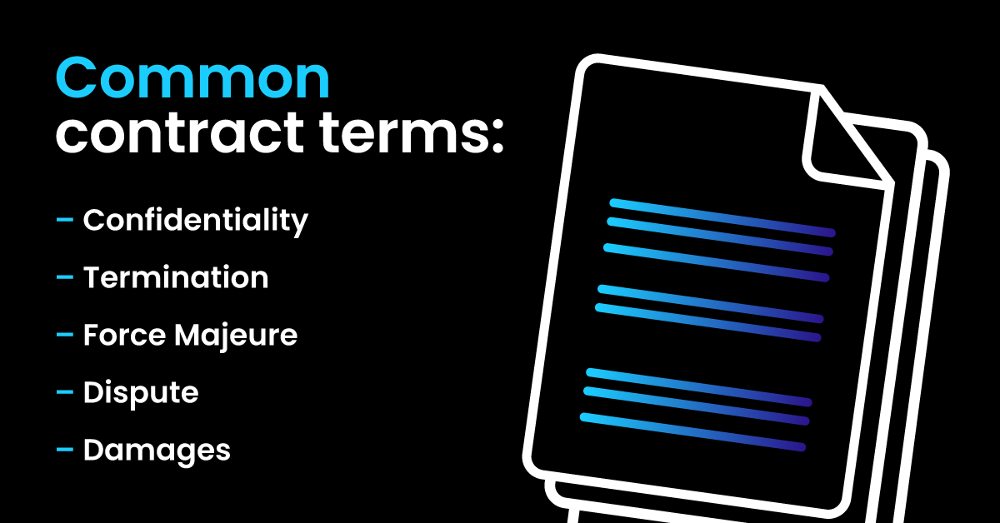
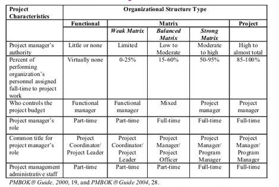
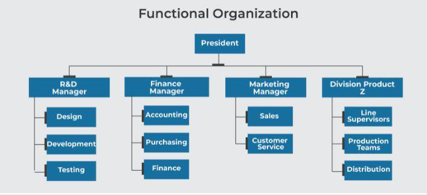
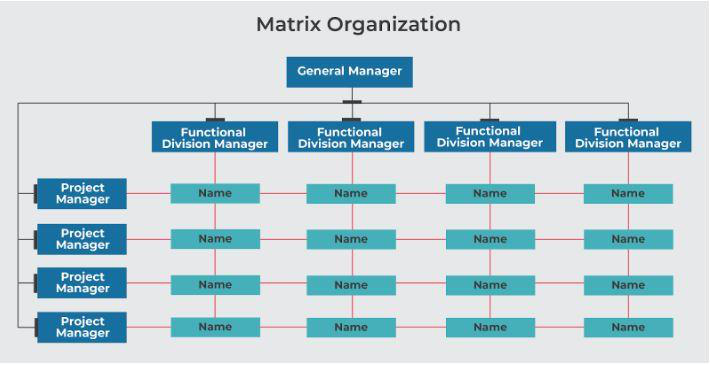

# Unit 07: Managing Contracts and People

> **Hours:** 5 Hrs. | **Source:** `Chapter_7_Managing Contract and People.pdf`

---

## Table of Contents

1. [Introduction to Contracts](#introduction-to-contracts)
2. [Types of Contracts](#types-of-contracts)
   - [Fixed-Price Contract (FP)](#fixed-price-contract-fp)
   - [Cost Reimbursable Contract (CR)](#cost-reimbursable-contract-cr)
   - [Time and Material Contract (T&M)](#time-and-material-contract-tm)
   - [Software Development Subscription Contract (SDS)](#software-development-subscription-contract-sds)
3. [Contract Management Lifecycle](#contract-management-lifecycle)
   - [Pre-Signature Stages](#pre-signature-stages)
   - [Post-Signature Stages](#post-signature-stages)
4. [Typical Terms of a Contract](#typical-terms-of-a-contract)
5. [Key Clauses in a Contract](#key-clauses-in-a-contract)
6. [Terms vs Clauses](#terms-vs-clauses)
7. [Contract Management](#contract-management)
8. [Acceptance](#acceptance)
9. [Contract Placement](#contract-placement)
10. [Managing People](#managing-people)
    - [Understanding Behavior](#understanding-behavior)
    - [Organizational Behavior](#organizational-behavior)
    - [Selecting the Right Person for the Job](#selecting-the-right-person-for-the-job)
    - [Motivation](#motivation)
    - [Working in Groups and Teams](#working-in-groups-and-teams)
    - [Decision Making](#decision-making)
    - [Leadership](#leadership)
    - [Organizational Structures](#organizational-structures)
    - [Instruction in Best Method](#instruction-in-best-method)
11. [Assignment Questions](#assignment-questions)

---

## Introduction to Contracts

> **Definition:** A contract is an agreement between two parties that creates an obligation to perform (or not perform) a particular duty. It is a two-party agreement, either given verbally or in writing, that provides a product or service to an individual or business.

*Outsourcing* is often viewed as involving the contracting out of a business function — commonly one previously performed in-house — to an external provider. In this sense, two organizations may enter into a contractual agreement involving an exchange of services and payments.

**Key Points:**
- *Consideration* between the parties must be exchanged for the contract to be lawful and enforceable.
- The purpose of a contract is to **protect the parties** if either party does not fulfill its promises.
- If the contract is broken, it can be turned over to a court for enforcement.
- > **Remedy at law for breach of contract:** "Damages" or monetary compensation.

**Every great project starts with a contract.**

Contracts can be done through:
- **Letter of Agreement (LOA)**
- **Memorandum of Understanding (MOU)**
- **Letter of Intent (LOI)**
- Any other name — if it contains all the referenced elements, then it's a contract.

---

## Types of Contracts

The available options are the following, and we need to understand their differences to know the outcome of the software development process. Contract types for project management:

| Contract Type | Abbreviation | Description | Risk Allocation | Best Used When |
|---|---|---|---|---|
| **Fixed-Price Contract** | FP | Payment does not depend upon resources or time expended. Seller estimates total cost of labor, resources, and materials | Buyer carries **less risk**; seller takes most of the risk | Requirements are well-defined and stable |
| **Cost Reimbursable Contract** | CR | Seller provides work for a fixed time period, then increases the bill to get profit after finishing | Buyer carries **more risk**; seller has less risk | Requirements are uncertain; research & development with immense innovation |
| **Time and Material Contract** | T&M | Hybrid of FP and CR. One party pays the other for time and materials used within a reasonable limit | Shared risk; vendor selected based on capabilities and experience | Scope may change; simple and convenient for both parties |
| **Software Development Subscription Contract** | SDS | Subscription agreement — customer uses software for agreed-upon time, often with updates/upgrades included | Customer pays recurring fee | Ongoing software usage, maintenance, and support |

---

### Fixed-Price Contract (FP)

> **Definition:** A contract where the payment does not depend upon resources or time expended on completing the project.

- Project managers prefer FP contracts when the scope is clear.
- The seller estimates the total cost of labor, resources, and materials and completes the action regardless of the actual cost.
- **Buyers carry less risk** and the seller typically receives their fixed price for finishing the project.
- The construction industry widely uses fixed-price contracts.
- Buyers know the actual project cost, resulting in **minimal buyer risk**.
- At the start of the project, a buyer makes some payment and the seller takes most of the risk because the buyer pays only for work upon completion.

**Subtypes of Fixed-Price Contracts:**
- *Fixed-Price Incentive Fee Contract*
- *Firm Fixed-Price Contract*
- *Fixed-Price With Economic Price Adjustments Contract*

---

### Cost Reimbursable Contract (CR)

> **Definition:** A contract used when requirements are uncertain from one side and the development process is not clear from the other.

- Used for **new research and development** requiring immense innovation without a guarantee of predicted outcome.
- The seller provides work for a fixed time period and then increases the bill to get profit after finishing the product.
- The amount of the raise is **unknown to the other party** because it is not discussed prior to the agreement.

**Subtypes of Cost Reimbursable Contracts:**
- *Cost Plus Percentage of Cost*
- *Cost Plus Fixed Fee*
- *Cost Plus Incentive Fee*
- *Cost Plus Award Fee*

---

### Time and Material Contract (T&M)

> **Definition:** A hybrid of both Fixed-Price and Cost Reimbursable contracts.

- One of the parties agrees to pay the other the time and materials that are used for the project within a reasonable limit.
- It can be **cost reimbursable** when the customer agrees to pay the cost for all genuine and legitimate expenses.
- It can be more like an **FP type** when the customer sets the limit.
- The vendor is selected based on capabilities and experience, having the required manpower and materials.
- The cost for supplies is negotiated and is paid according to the quantity of resources consumed or purchased.
- The contract is **simple and convenient** for both parties.
- It is possible to establish a *not-to-exceed price* to avoid massive cost overruns.

---

### Software Development Subscription Contract (SDS)

> **Definition:** A contract between a company and its customer that allows the customer to use software for an agreed-upon amount of time, often with updates or upgrades included.

- Consists of the type of licensing rights granted, when the license starts and ends, how many licenses will be issued, and whether any restrictions apply.
- May also include **maintenance agreements** where companies provide bug fixes and security patches.
- Some software providers offer **free trials** so customers can try out products before making their purchase decision.
- Others provide **discounts** on upgrading from one version to another.

---

## Contract Management Lifecycle

> **Definition:** The Contract Management Lifecycle (CML) involves everything from creating your contract to termination and tracking.

This cycle can be broken down into **six distinct stages** of contract management:

| Stage | Step | Phase |
|---|---|---|
| 1 | **Contract Creation** | Pre-Signature |
| 2 | **Negotiation and Collaboration** | Pre-Signature |
| 3 | **Review and Approval** | Pre-Signature |
| 4 | **Administration and Execution** | Post-Signature |
| 5 | **Ongoing Management and Renewal** | Post-Signature |
| 6 | **Reporting and Tracking** | Post-Signature |

- **Pre-signature activities** involve everything from creating the contract to signing on the dotted line.
- **Post-signature activities** occur after the contract is signed and continue until it's either renewed or terminated.

> **Note:** Contract Lifecycle Management (CLM) makes the process more intuitive so you can keep track of your contracts at every stage in the contract lifecycle.

---

### Pre-Signature Stages

#### Stage 1: Contract Creation

After you get a verbal agreement, the next step is to get it in writing. In many cases, you'll be working off a template for the contract, but it still requires careful attention to personalize the contract for each agreement.

**Trigger events for contract creation:**
- Verbal Agreements
- New Contract Requests or Intake Requests
- Contract Amendments
- Contract Renewals
- Contract Cancellations

**Relevant information regarding agreement:**
- Services each party will Receive or Provide
- Start Dates
- Pricing
- Projected Milestones and Expectations
- Contingencies

#### Stage 2: Negotiation and Collaboration

Contract negotiation is one of the **most important steps** in the contract lifecycle.

- After a contract is generated, all parties involved need to negotiate back and forth until final terms are agreed to.
- This stage is the **most time-intensive**.
- Standard steps such as collecting signatures, catching mistakes, and legal approval are the biggest obstacles for faster negotiation.
- Keeping the negotiation and process centralized through online collaboration tools reduces the possibility of human error and ensures all parties have access to the **most recent version** of the contract.

#### Stage 3: Review and Approval

- Once negotiation generates a contract draft, it must go up the approval chain for each internal party to review.
- Approval chains typically include **managers, officers, and other stakeholders**.
- The types of roles and number of people looped in will vary widely depending on the organization.
- This is a stage where many contracts get stuck — delays occur as people lose track of the contract, especially if late-stage edits occur.

---

### Post-Signature Stages

#### Stage 4: Administration and Execution

- Once a contract's been approved, it's time to put pen to paper.
- Although many team members are involved in contract review and approval, there's typically only **one person from each party** who needs to sign.
- Once everyone's signed, the contract gets **securely encrypted and stored** in a contract repository for secured storage.
- Both parties continue to work as per the agreement.

#### Stage 5: Ongoing Management and Renewal

- Contract administration with a contract repository makes documents easy to search and find with just a few keywords.
- By the agreed-upon dates, you'll have to decide if a contract should be **renewed or terminated**.
- Renewing a contract isn't always beneficial to either party.

**Includes tasks like:**
- Keeping track of contract milestones
- Ensuring obligations are met after the contract is signed
- Tracking changes or amendments to the contract
- Executing periodic audits to ensure contracts are compliant

#### Stage 6: Reporting and Tracking

- Especially when owning multiple contracts, it's difficult to continuously ensure things are on track.
- Missed deadlines for expirations, renewals, or goals are major contract management challenges and can lead to **significant financial, legal, and procurement risk**.
- Allowing contracts to **auto-renew** can also cost you compared to the opportunity to renegotiate.
- Knowing **who accessed the records** and made changes to them and when is also important.
- Issues like late payments, non-delivery of products, excessive changes to the contract, and other potential breaches need flagging for prompt attention.
- Contract management facilitates **in-depth reporting** and allows lawyers to set up tailored notification systems.

---

## Typical Terms of a Contract

> **Definition:** A contract term is any provision or term that forms part of a contract where every term provides a contractual obligation, which can lead to litigation if breached.

Every contract a business enters will have critical terms that fall into various categories. The terms of an agreement can bind parties by law to meet a set of minimum obligations.

### Categories of Contract Terms

| Category | Description | Remedy for Breach |
|---|---|---|
| **Condition** | A fundamental term of the contract | Counterparty can **terminate** the contract and **claim damages** |
| **Warranties** | A secondary term, less critical than a condition | Can claim **damages** but **cannot terminate** the agreement |
| **Innominate** | Neither a condition nor a warranty | Remedy depends on **severity of the violation** |

### Expressed vs Implied Terms

| Type | Definition |
|---|---|
| **Expressed Terms** | Terms specifically mentioned and agreed upon by the contracting parties during negotiation. Can be in writing or agreed upon orally. |
| **Implied Terms** | A set of default rules for contracts on points that are essentially "silent". These mandatory rules quietly operate in the background and can **override expressed terms**. |

---

## Key Clauses in a Contract

| Clause | Purpose |
|---|---|
| **Confidentiality** | Ensures both parties keep sensitive information about their agreement confidential. When a business enters a contract, there will be a significant exchange of information. |
| **Termination** | Lays out in which circumstances a party can terminate the agreement. Found in **every contract**. It is sometimes more financially beneficial to terminate. |
| **Force Majeure** | Translates to "greater force". Protects parties from circumstances beyond anyone's control (e.g., hurricanes, pandemics like COVID-19). Prevents a party from being in breach due to unforeseeable disruption. |
| **Dispute** | Clarifies the plans for any dispute resolution that arises. Even well-written agreements can result in disputes. |
| **Damages** | If either party breaches the contract, damages are awarded to the innocent party (monetary compensation). |

---

## Terms vs Clauses

| **Terms** | **Clauses** |
|---|---|
| They form a **basis of a contract** | They are what a **contract is composed of** |
| They are broad agreement between the two parties outlining a contractual relationship | Contract clauses are blocks of text within an agreement that addresses and explains each part of the contract for the parties in more detail |
| They establish the remedies available to either party in case of a breach of contract | They are the conditions that must be met for the deal to go through successfully |
| *Example:* The payment terms of a contract | *Example:* A standard contract clause would be a termination clause — explains how either party can terminate the contract and what repercussions will be involved |

---

## Contract Management

> **Definition:** The process of managing contracts, deliverables, deadlines, contract terms, and conditions while ensuring customer satisfaction.

Activities involved can be **administrative** and **strategic** — depending on who handles which stage.

Effective contract management helps businesses to improve outcomes and realize maximum value from their agreements.

### What Contracts Should Include for Management

Contracts should include agreement about how the customer/supplier relationship is to be managed. Some terms of contract will relate to management of the contract, for example:

- **Progress Reporting** — Regular updates on project status
- **Decision Points** — Could be linked to release of payments to the contractor
- **Variations to the Contract** — How are changes to requirements dealt with?
- **Acceptance Criteria** — Conditions that must be met for acceptance

---

## Acceptance

> **Definition:** When work is completed, the customer needs to carry out acceptance testing.

- The contract may put a **time limit** on acceptance testing — the customer must perform testing before the time expires.
- Part or all payment to the supplier should **depend on acceptance testing**.

---

## Contract Placement

> **Definition:** Placements are the employment opportunities offered by staffing companies which can be **permanent or contract basis**.

| Aspect | Permanent Placement | Contract Placement |
|---|---|---|
| **Duration** | Traditional, long-term positions hired on a full-time, permanent basis | Short-term positions hired on a temporary or project basis |
| **Advantages** | Known and reliable personnel presence; long-term reliability | Cost-effective; less time and training to onboard |
| **Disadvantages** | More time and money to recruit and onboard | Typically not available for long-term positions |
| **Best For** | When you require a long-term, reliable employee | When you need a short-term position filled quickly and cost-effectively |

### Commonly Recognized Types of Contract Placements

- Traditional contract staffing
- Temp-to-direct hire conversions
- Pay-rolling for non-recruited candidates
- Independent contractor to employee conversions
- Retiree re-staffing
- Internships / co-operations

---

## Managing People

Organization. There are three main concerns:

1. **Staff selection**
2. **Staff development**
3. **Staff motivation**

A project leader can encourage effective group working and decision making while giving purposeful leadership where needed.

As part of the concern for the well-being of team members, some attention must be paid to **stress** and other issues of **health and safety**.

> ⚠️ **Important:** This is the most difficult area in managing software development projects. "Most managers are willing to acknowledge the idea that they've got more people worries than technical worries. But they seldom manage that way. One reason: technical experts become managers."

---

### Understanding Behavior

People with practical experience of working on projects invariably identify the **handling of people** as one of the most important aspects of project management.

The field of social science known as **Organizational Behavior (OB)** helps to explain people's behavior and tends to be structured.

#### Approaches to Understanding Behavior

| Approach | Type | Description | Example | Limitation |
|---|---|---|---|---|
| **Positivist Approach** | Quantitative | Based on development of system and discipline of organizational theory. Observes behavior or conducts experiments where variables are measured and a statistical relationship is followed. | "If A is the situation, then B is likely to result" | Unlike physical science, it is rarely the case that B must always follow A |
| **Interpretivist Approach** | Qualitative | Views each and every situation as unique and non-predictive. Considers the wide range of influences on a situation. | Focuses on context and meaning | Difficult to decide which research findings are relevant; danger of hypotheses that are little better than superstitions |

> ⭐ **Key Takeaway:** By examining these questions, people can become more sensitive and thoughtful about the problems involved. The effective and sensitive management of staff comes from **both experience and guidance**.

---

### Organizational Behavior

> **Definition:** Organizational behavior is a subset of management activities concerned with understanding, predicting, and influencing individual behavior in an organizational setting.

The roots of studies in OB can be traced back to work done in the late 19th and early 20th centuries by **Frederick Taylor**. By studying the way that manual workers did tasks, he attempted to work out the most productive way of doing these tasks. The workers were then trained to do the work in this way.

#### Taylor's Three Basic Objectives for Training the Worker

1. **To select the best person for the job.**
2. **To instruct such people in the best methods.**
3. **To give incentives in the form of higher wages to the best workers.**

> **Note:** Organizational behavior research found that the **state of mind** of people helps in better productivity.

---

### Selecting the Right Person for the Job

We need to select such a person for the job who can affect the productivity of the project. Anyone who can communicate well and have good experience and skills can influence the development of the institution.

> **Key Distinction:** We need to distinguish between **eligible** (having the right qualifications) and **suitable** candidates (can do the job).
> - Danger: Employ someone who is **eligible but not suitable**
> - Best situation: Employ someone who is **suitable but not eligible** — these are likely to be cheaper and to stay in the job

#### Selection Process Steps

| Step | Description |
|---|---|
| **1. Create Job Specification** | Advice is needed, as there will be legal implications. Formally or informally, the requirements of the job should be documented and agreed. |
| **2. Create a Job Holder Profile** | Using the job specification, a profile of the person needed is constructed. Qualities, qualifications, education, and experience required are listed. |
| **3. Obtain Applicants** | Advertisement placed within the organization or outside. The job holder profile is examined to identify the medium most likely to reach the largest number of potential applicants at least cost. |
| **4. Examine CVs** | Read carefully and compared to the job holder profile. Avoid calling inapplicable candidates for interview. |
| **5. Interview** | Selection techniques: aptitude tests, personality tests, examination of previous work samples. Best with multiple sessions; no more than two interviewers per session. |
| **6. Other Procedures** | References taken up where necessary; medical examination might be needed. |

---

### Motivation

> **Definition:** Motivation is the process that accounts for an individual's intensity, direction, and persistence of effort toward attaining a goal.

Motivation starts with a physiological or psychological deficiency or need that activates behavior or a drive aimed at a goal or incentive.

An important role of a manager is to motivate the people working on the project.

#### Needs That Drive Motivation

- **Basic needs** (food, sleep, clothing, etc.)
- **Personal needs** (respect, self-esteem)
- **Social needs** (to be accepted as part of a group)

#### Characteristics of Motivation

- Motivation is a **pervasive function** performed by employees at all levels
- It is always **goal oriented** and involves effort to achieve goals
- It is a **psychological process** concerned with individual's needs, motives, drives, and other internal states
- It is **complex and unpredictable** due to individual differences
- It is **situational** — motivation differs person to person and time to time
- It can be **positive or negative** — positive motivation is rewarding, negative motivation is based on punishment

#### Herzberg's Two-Factor Theory

| Factor Type | Description | Examples |
|---|---|---|
| **Hygiene (Maintenance) Factors** | Make you **dissatisfied** if they are not right | Pay, working conditions |
| **Motivators** | Make you feel the job is **worthwhile** | Sense of achievement |

---

### Working in Groups and Teams

Most software project development is a **group activity** as most projects cannot be completed by one person alone.

Having discussed people as individuals, we move on to their place in groups. A key problem with major software projects is that they always involve working in groups, but many people attracted to computer development find this difficult.

> **Formal Groups** can be subdivided into:
> - **Command groups** — departmental groupings seen on organization hierarchy diagrams, reflecting the formal management structure
> - **Task groups** — set up to deal with specific tasks, calling on people from different command groups; typically disbanded once the task is completed

Simply throwing people together does not mean they will immediately be able to work together as a team. Group feelings develop over a period of time.

#### Tuckman's Five Stages of Team Development

| Stage | Description | Key Characteristics |
|---|---|---|
| **1. Forming** | Period of orientation and getting acquainted | Uncertainty is high; people look for leadership and authority. Questions: "What does the team offer me?", "What is expected of me?", "Will I fit in?" Mostly social interactions. |
| **2. Storming** | Most difficult and critical stage. Marked by conflict and competition | Individual personalities emerge. Team performance may decrease. Subgroups form around strong personalities. Must overcome obstacles, accept differences, and work through conflicting ideas. |
| **3. Norming** | Conflict is resolved; unity emerges | Consensus develops around leadership and individual roles. Interpersonal differences resolved. Team performance increases. **Caution:** Harmony is precarious — disagreements can cause sliding back into storming. |
| **4. Performing** | Team is mature, organized, and well-functioning | Clear and stable structure. Members committed to the mission. Problems dealt with constructively. Focused on problem solving and meeting goals. |
| **5. Adjourning** | Most of the team's goals have been accomplished | Emphasis on wrapping up final tasks. Members may be reassigned. Ceremonial acknowledgement of work and success can be helpful. If ongoing, new members may cause the team to go back to forming/storming. |

---

### Decision Making

> **Definition:** A decision-making process is a series of steps one or more individuals take to determine the best option or course of action to address a specific problem or situation.

#### Structured vs Unstructured Decision Making

| Aspect | **Structured Decisions** | **Unstructured Decisions** |
|---|---|---|
| **Goals** | Defined | Uncertain |
| **Information** | Obtainable and manageable | Hard to assess |
| **Context** | Well-defined; known procedures | Unique context |
| **Cost** | Not as high | Quite high |
| **Nature** | Repetitive, routine, programmable | No predefined procedures available |
| **Example** | Payroll for employees | Decision making on personal development |

#### Obstacles to Decision Making

- **Time consuming**
- Can **mixture up conflicts** within the group
- Decisions can be **unduly influenced by dominant personalities**
- Conflict can, in fact, be less than might be expected
- People will modify their personal judgments to **conform to group norms** (common attitudes developed by a group over time)

---

### Leadership

> **Definition:** Leadership is generally taken to mean the ability to influence others in a group to act in a particular way to achieve group goals.

> **Note:** A leader is not necessarily a good manager or vice versa, as managers have other roles such as organizing, planning, and controlling.

Leadership is based on the idea of **authority or power**, although leaders do not necessarily have much formal authority. Power may come from:
- The person's **position** (position power)
- The person's **individual qualities** (personal power)
- A **mixture** of the two

#### Types of Power

| Type | Category | Description |
|---|---|---|
| **Coercive Power** | Position Power | The ability to force someone to do something by threatening punishment |
| **Connection Power** | Position Power | Based on having access to those who have power |
| **Legitimate Power** | Position Power | Based on a person's title conferring a special status |
| **Reward Power** | Position Power | The holder can give rewards to those who carry out tasks to his or her satisfaction |
| **Expert Power** | Personal Power | Comes from being the person who is able to do a specialized task |
| **Information Power** | Personal Power | The holder has exclusive access to information |
| **Referent Power** | Personal Power | Based on the personal attractiveness of the leader |

#### Leadership Styles Grid

Leadership styles can be measured on two axes: **Directive vs. Permissive** and **Autocratic vs. Democratic**.

| Style | Decision Making | Implementation |
|---|---|---|
| **Directive Autocrat** | Makes decisions **alone** | Close supervision of implementation |
| **Permissive Autocrat** | Makes decisions **alone** | Subordinates have **autonomy** in implementation |
| **Directive Democrat** | Makes decisions **participatively** | Close supervision of implementation |
| **Permissive Democrat** | Makes decisions **participatively** | Subordinates have **autonomy** in implementation |

---

### Organizational Structures

Any operating organization should have its own structure in order to operate efficiently. The organizational structure is a hierarchy of people and its functions.

The organizational structure tells you the **character of an organization** and the **values it believes in**.

> ⚠️ **Important:** A company with shared goals, strong leadership, and hard-working employees can still **fail without organizational structure**. The structure can influence the project management process — who makes ultimate project decisions, communication of goals, and how the project manager works with the team.

#### Functional Structure

> **Definition:** The organization is divided into segments based on the functions when managing.

- Workers are classified according to their **functional roles and departments**.
- General departments: Finance, Sales, Customer Service, Supply Chain, etc.
- Suitable for **manufacturing or engineering companies**.
- Supports ongoing operations and practices for producing standard products.
- Appears to be successful in large organizations that produce high volumes at low costs.

| Advantages | Disadvantages |
|---|---|
| Groups employees based on functional skills for higher performance | Employees get bored from routine and lose enthusiasm |
| Employees have experience in the same field, resulting in higher output | Limits the management skills of functional managers — they remain specialists |
| Accountability evident; roles and responsibilities clearly defined | Departments more concerned with departmental goals, less responsive to overall objectives |
| Hierarchy is visible; no need for multiple reporting | Hiring costs are high as high-skilled employees cost more |
| No duplication of work as each department is different | Causes conflicts in making critical decisions due to bureaucratic hierarchy |
| Job description is clear | |

#### Matrix Structure

> **Definition:** The organization places employees based on the **function** and the **product**. The matrix structure gives the best of both worlds of functional and divisional structures.

- The company uses **teams** to complete tasks.
- Teams are formed based on the functions they belong to (e.g., software engineers) and the product they are involved in (e.g., Project A).

| Advantages | Disadvantages |
|---|---|
| Helps in sharing resources efficiently | Dual reporting structure adds confusion and results in conflicts |
| Decision making is balanced and flexible | Creates issues when there is no coordination between functional and project managers |
| Staff members can communicate across boundaries | Resources may be under-utilized if not assigned skill-related tasks |
| Pleasant environment | Costly to maintain as it has many managers |
| Clear career graph and job security; members more loyal | Need to maintain resources throughout the project, no matter how long it takes |

---

### Instruction in Best Method

When a new member of the team is recruited, the team leader will need to plan that person's **induction** into the team very carefully.

Where a project is already well under way, this might not be easy. However, the effort should be made — it should pay off eventually as the new recruit will become a fully effective member of the team more quickly.

#### Training Considerations

- The team leader should **assess continually** the training needs of their team members.
- Some training can be provided by **commercial training companies**.
- Where money is tight, **other sources** of training should be considered.
- Training should **not be abandoned altogether** even if it consists only of a team member learning a new software tool and demonstrating it to colleagues.
- The methods learned need to be **actually applied** after training has been completed.
- **Reviews and inspections** should be done continuously to ensure everyone is on track.

---

## ⭐ Quick Revision Summary

| Topic | Key points |
|---|---|
| **What is a Contract?** | An agreement between two parties creating an obligation to perform a duty. Remedy for breach: damages. |
| **Contract Types** | **FP** (low buyer risk, fixed price), **CR** (uncertain requirements, cost + fee), **T&M** (hybrid, flexible), **SDS** (subscription-based software). |
| **Contract Lifecycle** | 6 stages: Creation → Negotiation → Review & Approval → Administration & Execution → Ongoing Management → Reporting & Tracking. Stages 1-3 are pre-signature; 4-6 are post-signature. |
| **Contract Terms** | **Condition** (breach = terminate + damages), **Warranty** (breach = damages only), **Innominate** (depends on severity). **Expressed** = specifically mentioned; **Implied** = default rules. |
| **Key Clauses** | Confidentiality, Termination, Force Majeure, Dispute, Damages. |
| **Contract Placement** | **Permanent** (long-term, reliable, costlier) vs **Contract** (short-term, cost-effective, less training). |
| **Managing People** | Three concerns: staff selection, development, motivation. |
| **Understanding Behavior** | **Positivist** (quantitative, "if A then B") vs **Interpretivist** (qualitative, unique situations). |
| **Taylor's OB** | Select best person → instruct in best method → give incentives for best workers. |
| **Selecting Right Person** | Job Spec → Job Holder Profile → Obtain Applicants → Examine CVs → Interview → Other Procedures. Distinguish: **eligible** (qualified) vs **suitable** (can do the job). |
| **Motivation (Herzberg)** | **Hygiene factors** (pay, conditions — prevent dissatisfaction) vs **Motivators** (achievement — creates satisfaction). |
| **Tuckman's Team Stages** | **Forming** → **Storming** → **Norming** → **Performing** → **Adjourning**. |
| **Decision Making** | **Structured** (routine, defined, programmable) vs **Unstructured** (unique, uncertain, high cost). |
| **Leadership** | 7 types of power: Coercive, Connection, Legitimate, Reward (position); Expert, Information, Referent (personal). Styles: Directive/Permissive × Autocratic/Democratic. |
| **Organizational Structures** | **Functional** (by department — efficient but siloed) vs **Matrix** (by function + product — flexible but dual reporting). |
| **Instruction** | Plan induction; assess training needs continually; apply learned methods; conduct reviews and inspections. |

---

## Assignment Questions

1. Explain Maslow's hierarchy of needs.
2. How can you select the right person for the job? Explain.
3. What are the roles of a Software Engineer in a project? Explain.
4. What are the popular organizational structures adopted by Nepalese companies? Explain.
5. Explain the process of becoming a mature team within an organization.
6. What are the popular contract types preferred by organizations? Also explain stages of contract lifecycle.
7. Describe the typical terms of a contract.

## Glossary

| Term | Definition |
|------|-----------|
| **Contract** | Agreement between two parties creating an obligation to perform (or not perform) a particular duty |
| **FP (Fixed-Price)** | Payment does not depend on resources or time; seller bears most risk |
| **CR (Cost Reimbursable)** | Buyer pays actual costs plus fee; buyer bears most risk |
| **T&M (Time & Material)** | Hybrid contract — buyer pays for time and materials used within limits |
| **SDS (Subscription)** | Customer pays recurring fee for ongoing software usage and support |
| **Force Majeure** | Clause protecting parties from circumstances beyond anyone's control (e.g., natural disasters) |
| **Condition** | Fundamental term of a contract; breach allows termination + damages |
| **Warranty** | Secondary term; breach allows damages but not termination |
| **CLM** | Contract Lifecycle Management — managing contracts from creation to termination |
| **Herzberg's Two-Factor Theory** | Hygiene factors (prevent dissatisfaction) vs Motivators (create satisfaction) |
| **Tuckman's Stages** | Forming → Storming → Norming → Performing → Adjourning |
| **Functional Structure** | Organization divided by departmental functions (finance, sales, etc.) |
| **Matrix Structure** | Organization combining functional and product-based teams |
| **OB** | Organizational Behavior — study of individual behavior in organizational settings |
| **Legitimate Power** | Authority derived from a person's title or position |
