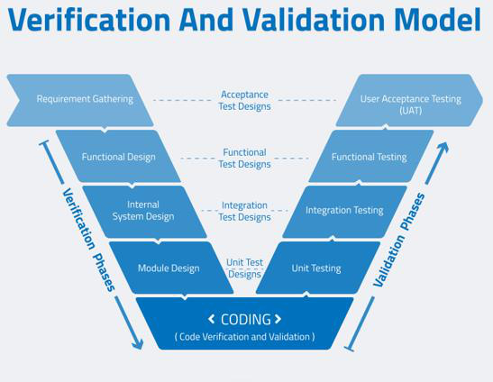
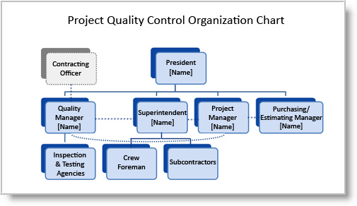

# Unit 08: Software Quality Assurance and Testing

> **Hours:** 5 Hrs. | **Source:** `Chapter_8_ Software Quality Assurance and Testing.pdf`

---

## Table of Contents

- [1. Testing Principles and Objectives](#1-testing-principles-and-objectives)
  - [1.1 Objectives of Testing](#1-1-objectives-of-testing)
  - [1.2 Principles of Testing (Standard Principles)](#1-2-principles-of-testing-standard-principles)
  - [1.3 Mnemonic (Exam Use)](#1-3-mnemonic-exam-use)
- [2. Testing vs Verification vs Validation vs Debugging](#2-testing-vs-verification-vs-validation-vs-debugging)
- [3. Manual Testing vs Automation Testing](#3-manual-testing-vs-automation-testing)
- [4. Levels of Testing](#4-levels-of-testing)
  - [4.1 Unit Testing](#4-1-unit-testing)
  - [4.2 Integration Testing](#4-2-integration-testing)
  - [4.3 System Testing](#4-3-system-testing)
  - [4.4 Acceptance Testing](#4-4-acceptance-testing)
- [5. Test Strategies](#5-test-strategies)
- [6. Test Plan and Test Case](#6-test-plan-and-test-case)
  - [6.1 Test Case](#6-1-test-case)
  - [6.2 Test Plan](#6-2-test-plan)
- [7. Verification and Validation](#7-verification-and-validation)
  - [7.1 Boehm's Definitions](#7-1-boehms-definitions)
  - [7.2 Comparison Table](#7-2-comparison-table)
  - [7.3 V-Model of SDLC](#7-3-v-model-of-sdlc)
- [8. Software Quality](#8-software-quality)
  - [8.1 Software Quality Factors](#8-1-software-quality-factors)
  - [8.2 According to Deming](#8-2-according-to-deming)
  - [8.3 Methods for Ensuring Software Quality](#8-3-methods-for-ensuring-software-quality)
  - [8.4 Key Points](#8-4-key-points)
- [9. Software Quality Assurance (SQA)](#9-software-quality-assurance-sqa)
  - [9.1 Scope of SQA](#9-1-scope-of-sqa)
  - [9.2 Organization of SQA](#9-2-organization-of-sqa)
  - [9.3 Key Principles](#9-3-key-principles)
- [10. SEI-CMM (Capability Maturity Model)](#10-sei-cmm-capability-maturity-model)
  - [10.1 About SEI](#10-1-about-sei)
  - [10.2 About CMM](#10-2-about-cmm)
  - [10.3 Five Aspects of CMM](#10-3-five-aspects-of-cmm)
  - [10.4 SEI-CMM Maturity Levels](#10-4-sei-cmm-maturity-levels)
- [11. SQA Activities and Plan](#11-sqa-activities-and-plan)
  - [11.1 SQA Activities](#11-1-sqa-activities)
  - [11.2 Organizational Structure](#11-2-organizational-structure)
  - [11.3 SQA Plan](#11-3-sqa-plan)
  - [11.4 Components of an SQA Plan](#11-4-components-of-an-sqa-plan)
  - [11.5 Detailed Sections of SQA Plan](#11-5-detailed-sections-of-sqa-plan)
- [12. Mission of SEI](#12-mission-of-sei)
- [13. Quick Revision Summary](#13-quick-revision-summary)
  - [13.1 Definitions at a Glance](#13-1-definitions-at-a-glance)
  - [13.2 Four Levels of Testing](#13-2-four-levels-of-testing)
  - [13.3 Three Test Strategies](#13-3-three-test-strategies)
  - [13.4 SEI-CMM — 5 Levels (Quick Mnemonic: **I** **R**eally **D**o **M**ake **O**ptimizations)](#13-4-sei-cmm-5-levels-quick-mnemonic-i-r-eally-d-o-m-ake-o-optimizations)
  - [13.5 SQA Plan Key Sections](#13-5-sqa-plan-key-sections)
  - [13.6 Mission of SEI](#13-6-mission-of-sei)

---

## 1. Testing Principles and Objectives

> **Definition:** **Testing** is the execution of a program to find faults — an iterative process to verify that software meets its specification and customer requirements.

Testing is a critical element of **Software Quality Assurance** and represents the ultimate review of specification, design, and code generation. An investigation conducted to provide stakeholders with information about the quality of the product or service under test.

### 1.1 Objectives of Testing

- To demonstrate to the developer and the customer that the software meets its requirements
- Finding defects which may get created by the programmer while developing the software
- Gaining confidence in and providing information about the level of quality
- To make sure that the end result meets the business and user requirements
- To ensure that it satisfies **Business Requirement Specification** and **System Requirement Specification (SRS)**
- To gain the confidence of the customers by providing them a quality product

### 1.2 Principles of Testing (Standard Principles)

1. **Testing shows the presence of defects**

  * Testing can reveal bugs but **cannot prove their absence**

2. **Exhaustive testing is impossible**

  * It is not feasible to test all inputs and conditions
  * Example: 10 alphabetic characters → **26¹⁰ (~141 trillion combinations)**
  * 1 test per microsecond → **~4.5 million years**

3. **Early testing (Shift Left)**

  * Testing should begin as early as possible
  * Early detection reduces **cost and effort**

4. **Defect clustering (Pareto Principle)**

  * Around **80% of defects are found in 20% of components**

5. **Pesticide paradox**

  * Repeating the same tests finds fewer new defects
  * Test cases should be **regularly reviewed and updated**

6. **Testing is context-dependent**

  * Different systems require different testing approaches

7. **Absence-of-errors fallacy**

  * Software without defects is useless if it **does not meet user requirements**

---

### 1.3 Mnemonic (Exam Use)

**P-E-E-D-P-T-A**

* **P** → Presence of defects
* **E** → Exhaustive testing impossible
* **E** → Early testing
* **D** → Defect clustering
* **P** → Pesticide paradox
* **T** → Testing is context-dependent
* **A** → Absence-of-errors fallacy

---

> ⚠️ **Important:** Exhaustive testing is impossible. Effective testing depends on selecting a **small, high-impact subset of test cases** and removing as many defects as possible *before* testing begins.

---

## 2. Testing vs Verification vs Validation vs Debugging

| Concept | Definition |
|---------|-----------|
| **Testing** | The execution of a program to find its faults |
| **Verification** | The process of proving the program's correctness |
| **Validation** | The process of finding errors by executing the program in a real environment |
| **Debugging** | Diagnosing the error and correcting it |

Testing is done to improve:
- **Quality**
- **Verify and validate**
- **Reliability estimation**

> ⚠️ **Important:** Testing and debugging are **different activities**. Debugging must be accommodated in *any* testing strategy. Make a clear distinction between **verification** ("are we building the product right?") and **validation** ("are we building the right product?").

---

## 3. Manual Testing vs Automation Testing

| Aspect | Manual Testing | Automation Testing |
|--------|---------------|-------------------|
| **Approach** | Testing the software manually without using any automated tool or script | Testing by writing scripts and using another software to test the software |
| **Role of Tester** | Tester takes over the role of an end-user and tests the software to identify unexpected behavior or bugs | Tester writes scripts that automate the manual process |
| **Reusability** | Must be re-executed manually each time | Can re-run test scenarios quickly and repeatedly |
| **Speed** | Slower | Faster |
| **Best For** | Exploratory, usability, and ad-hoc testing | Regression testing, repeated execution |

---

## 4. Levels of Testing

Testing levels are the procedure for finding missing areas and avoiding overlapping and repetition between the development life cycle stages. In software testing, we have four different levels:

| Level | Description | Performed By | Purpose | Example |
|-------|-------------|-------------|---------|---------|
| **Unit Testing** | Tests for a single component or a single unit | Developer | Validate the performance of unit components | Test the `login()` function in isolation — does it hash the password correctly? |
| **Integration Testing** | Combining different software modules and testing as a group | Testers | Ensure the integrated system is ready for system testing | Test that the `login()` module correctly passes data to the `dashboard()` module |
| **System Testing** | Final test to identify that the system meets specification and criteria | Testers | Evaluate both functional and non-functional needs | Load-test the entire app with 10,000 concurrent users; verify response time < 2 sec |
| **Acceptance Testing** | Evaluate whether the system complies with end-user requirements | QA Team / Users | Determine if the system is ready for deployment | A bank manager tests the ATM workflow: "Can I withdraw cash, check balance, and print a receipt in one session?" |

---

### 4.1 Unit Testing

- Uses tests for a **single component** or a **single unit** in software testing
- Performed by the **developer**
- First level of *functional testing*
- **Primary goal:** Validate the performance of unit components
- **Unit** is the smallest testable portion of the system or application
- **Main aim:** Test that each component/unit is correct, fulfilling requirements and desired functionality

### 4.2 Integration Testing

- Combining different software modules and phases and testing as a **group**
- Ensures the integrated system is ready for system testing
- Tests how different components function at their **interface**
- Performed by **testers**
- Finds the **data flow** from one module to other modules

### 4.3 System Testing

- Most probably the **final test** to identify that the system meets the specification and criteria
- Evaluates both **functional** and **non-functional** needs
- Allows checking the system's compliance as per requirements
- All components are tested as a **whole**
- Involves: **load**, **reliability**, **performance**, and **security testing**
- Very important step — software is almost ready for production
- Tested in an environment very close to the **market/user-friendly environment**

### 4.4 Acceptance Testing

- Aims to evaluate whether the system complies with **end-user requirements** and is ready for **deployment**
- Uses pre-written scenarios and test cases
- QA/testing team can find out how the product will perform when installed on the user's system
- Ranges from easily finding **spelling mistakes** and **cosmetic errors** to **major bugs** that could cause major errors

> ⭐ **Key Takeaways — Levels of Testing:**
> - Testing progresses from **small (unit)** → **grouped (integration)** → **whole system (system)** → **user-ready (acceptance)**
> - Each level has a distinct goal, performer, and scope
> - System testing includes non-functional aspects (load, reliability, performance, security)

---

## 5. Test Strategies

A strategy for software testing must accommodate:
- **Low-level tests** — verify that a small source code segment has been correctly implemented
- **High-level tests** — validate major system functions against customer requirements

A strategy must provide:
- **Guidance** for the practitioner
- **A set of milestones** for the manager

Because testing occurs when deadline pressure rises, progress must be measurable and problems must surface as early as possible.

| Strategy | Description | Focus |
|----------|-------------|-------|
| **Static Test Strategy** | Evaluates quality without actually running the system; looks at portions or system elements to detect problems early | Saves time and money by detecting problems early |
| **Structural Test Strategy** | Needs to be operated on real devices; system must run in its entirety to find all bugs; often run on individual components and interfaces | Identifies localized errors in data flows |
| **Behavioral Test Strategy** | Focuses on **how** a system acts rather than the mechanism behind its functions | Workflows, configurations, performance, user journey |

Key points about test strategies:
- Testing begins at the **component level** and works outward toward integration of the entire computer-based system
- Different testing techniques are appropriate at **different points in time**
- The developer conducts testing and may be assisted by **independent test groups** for large projects
- The role of the **independent tester** is to remove the conflict of interest inherent when the builder tests their own product
- Testing and debugging are **different activities** — debugging must be accommodated in any testing strategy

---

## 6. Test Plan and Test Case

### 6.1 Test Case

> **Definition:** A **test case** is a set of conditions or input variables used to determine whether a software application works correctly — with a test oracle to judge pass/fail.

- A rich variety of test case design methods provide the developer with a **systematic approach** to testing
- These methods can help ensure the **completeness of tests** and provide the highest likelihood for uncovering errors
- The mechanism for determining whether a program has passed or failed such a test is known as a **test oracle**

### 6.2 Test Plan

> **Definition:** A **test plan** is a document that defines the systematic approach to testing — including strategy, resources, schedule, and deliverables for verification and validation.

- Contains a detailed understanding of the eventual workflow
- Documents the strategy used to **verify and ensure** that a product meets its design specifications and other requirements
- Usually prepared by or with significant input from **Test Engineers**

A test plan typically includes:

- Introduction to the Test Plan document
- Assumptions when testing the application
- List of test cases included in testing the application
- List of features to be tested
- What sort of approach to use when testing the software
- List of deliverables that need to be tested
- Resources allocated for testing the application
- Any risks involved during the testing process
- A schedule of tasks and milestones as testing progresses

---

## 7. Verification and Validation

> **Definition:**
> - **Verification** — The set of tasks that ensure that software correctly implements a specific function
> - **Validation** — The set of tasks that ensure that the software that has been built is traceable to customer requirements

> 💡 **Real-World Example — ATM Withdrawal:**
>
> | Step | Verification Question | Validation Question |
> |------|----------------------|---------------------|
> | Requirements review | "Does the spec say PIN must be 4–6 digits?" | "Do users actually want a 4–6 digit PIN?" |
> | Code review | "Does the code properly hash the PIN before storing?" | "Does this hashing meet security compliance?" |
> | System test | "Does the system deduct the correct amount from the balance?" | "Can users complete a withdrawal in under 10 seconds?" |
>
> **Key Insight:** A perfectly verified ATM (all specs met) is useless if users find it too confusing. A perfectly validated ATM (users love it) is dangerous if the code has security bugs. Both are needed.

### 7.1 Boehm's Definitions

| Concept | Boehm's Question |
|---------|-----------------|
| **Verification** | *"Are we building the product right?"* |
| **Validation** | *"Are we building the right product?"* |

### 7.2 Comparison Table

<!-- | Aspect | Verification | Validation |
|--------|-------------|------------|
| **Also Known As** | Static Testing | Dynamic Testing |
| **Key Question** | "Are we building the product right?" | "Are we building the right product?" |
| **Includes** | Business requirements, system requirements, design review, code walkthrough | Functional testing (UT, IT, ST) and non-functional testing (UAT) |
| **Checks** | That the developed application fulfills all requirements given by the client | That the software meets the business needs of the client | -->

| Aspect             | Verification                                                  | Validation                                            |
| ------------------ | -------------------- | ------------------- |
| Key Question       | Are we building the product right?  | Are we building the right product?                    |
| Compared Against   | Requirements, design, specifications | User needs, business goals, intended use              |
| Typical Activities | Requirement reviews, design reviews, code reviews, UT, IT, ST | UAT, beta testing, pilot testing, customer evaluation |
| Nature             | Static **and** dynamic | Mostly dynamic                                        |
| Performed By       | Developers, QA, architects | Customers, users, business stakeholders               |

### 7.3 V-Model of SDLC

The **V-Model** maps verification activities to the left side (planning/review) and validation activities to the right side (execution/testing), demonstrating the parallel relationship between development phases and testing phases.

> ⚠️ **Important:** Verification ensures **process correctness** — "did we build it right?" Validation ensures **product relevance** — "did we build the right thing?" Both are essential for quality.

---

## 8. Software Quality

> **Definition:** **Software Quality** is the degree to which a software product meets specified requirements and user expectations — encompassing functionality, reliability, usability, efficiency, and maintainability.

### 8.1 Software Quality Factors

| Factor | Description |
|--------|-------------|
| **Functionality** | The degree to which the software satisfies stated requirements |
| **Reliability** | The ability of the software to perform without failure under stated conditions |
| **Usability** | The ease with which users can learn and use the software |
| **Efficiency** | The optimal use of system resources by the software |
| **Maintainability** | The ease with which the software can be modified to fix issues or add features |

### 8.2 According to Deming

> *"The problem inherent in attempts to define the quality of a product, almost any product, were stated by the master Walter A. Shewhart. The difficulty in defining quality is to translate future needs of the user into measurable characteristics, so that a product can be designed and turned out to give satisfaction at a price that the user will pay. This is not easy, and as soon as one feels fairly successful in the endeavor, he finds that the needs of the consumer have changed, competitors have moved in, etc."*

### 8.3 Methods for Ensuring Software Quality

- **Testing**
- **Code Reviews**
- **Quality Assurance Process**

The goal of these methods is to identify and fix defects and bugs, improve performance, and enhance user satisfaction.

### 8.4 Key Points

- Quality refers to how well software meets **non-functional requirements** that support the delivery of functional requirements (robustness, maintainability)
- The degree to which the software was produced correctly
- Software must conform to **implicit requirements** (ease of use, maintainability, reliability) as well as its **explicit requirements**

---

## 9. Software Quality Assurance (SQA)

> **Definition:** **Software Quality Assurance (SQA)** is the process of monitoring software engineering processes and methods to ensure quality — a proactive, process-oriented approach to preventing defects.

> 💡 **QA vs QC — What's the Difference?**
>
> | Aspect | Quality Assurance (QA) | Quality Control (QC) |
> |--------|----------------------|----------------------|
> | **Focus** | Process-oriented — prevents defects | Product-oriented — detects defects |
> | **Goal** | Build quality into the process | Verify that the product meets standards |
> | **When** | During development (proactive) | After development (reactive) |
> | **Activity** | Define standards, conduct audits, train teams | Test, inspect, review deliverables |
> | **Example** | Creating a coding standard checklist | Running test cases and reporting bugs |
> | **Slogan** | "Prevent defects before they happen" | "Find and fix defects after they exist" |
>
> **Analogy:** QA is like checking the recipe — QC is like tasting the soup.

### 9.1 Scope of SQA

SQA encompasses the **entire software development process**, including:

- Requirements definition
- Software design
- Coding
- Source code control
- Code reviews
- Change management
- Configuration management
- Testing
- Release management
- Product integration

### 9.2 Organization of SQA

SQA is organized into:
- **Goals**
- **Commitments**
- **Abilities**
- **Activities**
- **Measurements**
- **Verifications**

### 9.3 Key Principles

- **Conformance to software requirements** is the foundation from which software quality is measured
- **Specified standards** define the development criteria used to guide how software is engineered
- Software must conform to **implicit requirements** (ease of use, maintainability, reliability) as well as its **explicit requirements**

---

## 10. SEI-CMM (Capability Maturity Model)

### 10.1 About SEI

> **Definition:** **SEI (Software Engineering Institute)** is a US federally funded research center at Carnegie Mellon University focused on advancing software engineering practices, process improvement, and cybersecurity.

**Principal areas of SEI:** Acquisition, process management, risk, security, software development, and system design.

### 10.2 About CMM

> **Definition:** **CMM (Capability Maturity Model)** is a 5-level model for improving software development processes — developed from studies of organizations contracted with the US Department of Defense.

### 10.3 Five Aspects of CMM

| Aspect | Description |
|--------|-------------|
| **Maturity Levels** | A 5-level process maturity scale where the uppermost (5th) level is a notional ideal state of systematic process optimization and continuous improvement |
| **Key Process Areas** | A cluster of related activities that, when performed together, achieve a set of goals considered important |
| **Goals** | Summarize the states that must exist for a key process area to be implemented effectively; the extent goals are accomplished indicates organizational capability |
| **Common Features** | Practices that implement and institutionalize a key process area (5 types: commitment to perform, ability to perform, activities performed, measurement and analysis, verifying implementation) |
| **Key Practices** | Describe the elements of infrastructure and practice that contribute most effectively to implementation and institutionalization |

### 10.4 SEI-CMM Maturity Levels

| Level | Name | Characteristics | What It Looks Like in Practice |
|-------|------|----------------|-------------------------------|
| **Level 1** | **Initial** | Characterized by periodic efforts required by individuals to successfully complete projects. No formal processes. | Heroic efforts by key individuals; projects routinely over budget; no two projects follow the same approach |
| **Level 2** | **Repeatable** | Software project tracking, requirements management, realistic planning, and configuration management processes are in place; successful practices can be repeated. | Basic project plans exist; past project data helps estimate new projects; managers can track progress reliably |
| **Level 3** | **Defined** | Standard software development and maintenance processes are integrated throughout the organization; a **Software Engineering Process Group** is in place; training programs ensure understanding and compliance. | Every project follows the same tailored process; new hires are trained on standardized procedures; organization-wide process assets exist |
| **Level 4** | **Managed** | **Metrics** are used to track productivity, processes, and products. Project performance is predictable, and quality is consistently high. | Dashboards show real-time quality metrics; defect rates are predictable within statistical bounds; management makes data-driven decisions |
| **Level 5** | **Optimizing** | The focus is on **continuous process improvement**. The impact of new processes and technologies can be predicted and effectively implemented when required. | Teams proactively experiment with new tools; lessons learned are systematically applied; causal analysis prevents recurring defects |

> ⭐ **Key Takeaways — SEI-CMM:**
> - **Level 1 (Initial):** Ad-hoc, individual heroics
> - **Level 2 (Repeatable):** Basic project management, repeatable practices
> - **Level 3 (Defined):** Standardized processes across the organization
> - **Level 4 (Managed):** Quantitative metrics and predictability
> - **Level 5 (Optimizing):** Continuous improvement culture
>
> Each level builds on the previous — an organization must satisfy all goals of a level to advance.

---

## 11. SQA Activities and Plan

### 11.1 SQA Activities

Formulating a Quality Management Plan includes:
- Applying Software Engineering Techniques
- Conducting Formal Technical Reviews
- Applying a Multi-tiered Testing Strategy
- Enforcing Process Adherence
- Controlling Change
- Measuring Impact of Change
- Performing SQA Audits
- Keeping Records and Reporting

### 11.2 Organizational Structure

- The organizational structure must provide the QA manager with direct organizational paths into every department
- **Small businesses:** Assign responsibilities to someone in management, give them authority to manage QA matters throughout the company, and create a QA reporting path to the executive level
- Employees continue to report to their department manager for disciplinary and non-QA matters, but report to the QA person on quality questions

### 11.3 SQA Plan

> **Definition:** An **SQA Plan** is a document outlining the quality assurance strategy — detailing activities, resources, tools, responsibilities, and deliverables to ensure the software meets quality standards.

### 11.4 Components of an SQA Plan

| Section | Description |
|---------|-------------|
| **SQA Process** | The overall quality assurance process to be followed |
| **SQA Responsibilities** | Who is responsible for what quality activities |
| **SQA Tools** | Tools to be used in quality assurance |
| **SQA Deliverables** | What QA artifacts will be produced |

### 11.5 Detailed Sections of SQA Plan

| Section | Contents |
|---------|----------|
| **Management Section** | Describes the place of SQA in the structure of the organization |
| **Documentation Section** | Describes each work product produced as part of the software process |
| **Standards, Practices, and Conventions Section** | Lists all applicable standards/practices applied during the software process and any metrics to be collected |
| **Reviews and Audits Section** | Provides an overview of the approach used in reviews and audits to be conducted during the project |
| **Problem Reporting and Corrective Action Section** | Defines procedures for reporting, tracking, and resolving errors or defects; identifies organizational responsibilities |
| **Test Section** | References the test plan and procedure document; defines test record keeping requirements |
| **Other** | Tools, SQA methods, change control, record keeping, training, and risk management |

---

## 12. Mission of SEI

| Area | Description |
|------|-------------|
| **Research** | Advancing the science and practice of software engineering |
| **Collaboration** | Bringing together and building on work found in industry, academia, and government |
| **Development and Demonstration** | Maturing promising technologies and practices and demonstrating their utility through trial application and prototypes |
| **Transition** | Propagating proven technologies and practices through publication, standards, and other venues |

---

## 13. Quick Revision Summary

### 13.1 Definitions at a Glance

| Term | Definition |
|------|-----------|
| **Testing** | Execution of a program to find faults |
| **Verification** | Proving the program's correctness (*are we building the product right?*) |
| **Validation** | Finding errors by executing in a real environment (*are we building the right product?*) |
| **Debugging** | Diagnosing the error and correcting it |
| **Software Quality** | Degree to which software meets specified requirements and user expectations |
| **SQA** | Monitoring software engineering processes to ensure quality |
| **CMM** | Capability Maturity Model — 5-level model for process improvement |

### 13.2 Four Levels of Testing

1. **Unit Testing** — Single component, by developer
2. **Integration Testing** — Combined modules, by testers
3. **System Testing** — Whole system, includes load/reliability/performance/security
4. **Acceptance Testing** — End-user requirements, readiness for deployment

### 13.3 Three Test Strategies

- **Static** — Without running the system
- **Structural** — Run on real devices
- **Behavioral** — Focus on system behavior and user journey

### 13.4 SEI-CMM — 5 Levels (Quick Mnemonic: **I** **R**eally **D**o **M**ake **O**ptimizations)

| # | Level | Key Focus |
|---|-------|-----------|
| 1 | **I**nitial | Ad-hoc, individual effort |
| 2 | **R**epeatable | Basic project management, repeatable |
| 3 | **D**efined | Standardized processes organization-wide |
| 4 | **M**anaged | Quantitative metrics, predictable quality |
| 5 | **O**ptimizing | Continuous process improvement |

### 13.5 SQA Plan Key Sections

- Management, Documentation, Standards, Reviews & Audits, Problem Reporting & Corrective Action, Testing, Other (Tools, methods, change control, training, risk)

### 13.6 Mission of SEI

Research → Collaboration → Development & Demonstration → Transition

## Past Exam Questions

**2082 Q6.** Explain different levels of testing.

**Answer:** The levels of testing in software development: (1) **Unit Testing** — tests individual components or modules in isolation, usually by developers; (2) **Integration Testing** — tests the interaction between combined components to detect interface and data flow defects; (3) **System Testing** — tests the complete integrated system against specified requirements; (4) **Acceptance Testing** — tests whether the system meets user requirements and is ready for delivery — performed by the client or end-users. Each level builds on the previous one, and defects found earlier cost less to fix.

**2082 Q11.** Define SQA. Explain the SQA organization structure and its responsibilities.

**Answer:** **Software Quality Assurance (SQA)** is a systematic, planned set of activities to ensure that software processes and products conform to requirements and standards. The SQA organization includes: **SQA Group** — independent team that conducts audits, reviews, and process assessments; **Project Manager** — responsible for overall quality of deliverables; **Development Team** — responsible for following SQA processes; **Test Team** — executes verification and validation activities. Responsibilities of SQA include: (1) developing SQA plans; (2) conducting process audits; (3) reviewing deliverables for standards compliance; (4) tracking defects and ensuring corrective action; (5) measuring quality metrics; (6) reporting quality status to management.

**2082 Q12b.** Write short note on Capability Maturity Model.

**Answer:** The **Capability Maturity Model (CMM)** is a process maturity framework developed by SEI to assess and improve software development processes. It has five maturity levels: (1) **Initial** — ad-hoc, chaotic processes; (2) **Repeatable** — basic project management enables repeating past successes; (3) **Defined** — standard processes documented and used across the organization; (4) **Managed** — processes measured and controlled using quantitative data; (5) **Optimizing** — continuous process improvement driven by metrics and innovation. Each level provides a foundation for the next. Higher CMM levels correlate with better quality, predictability, and reduced risk.

**2081 Q3.** Explain the principles of testing and test strategies. Write a short note on SQA plan.

**Answer:** **Testing principles**: (1) Testing shows presence of defects, not their absence; (2) Exhaustive testing is impossible — use risk-based strategies; (3) Early testing saves time and money; (4) Defects cluster in specific modules (Pareto principle); (5) Tests should be independent of the developer; (6) Test cases must be repeatable; (7) Test results must be inspected thoroughly. **Test strategies**: Unit → Integration → System → Acceptance. **SQA Plan**: A document that defines SQA activities, including: standards to be followed, review/audit schedules, roles and responsibilities, metrics to collect, defect tracking procedures, and reporting structure. It ensures quality is built into the process, not just inspected at the end.

**2081 Q9.** What is SEI-CMM? Why is it important for software organizations?

**Answer:** **SEI-CMM** (Software Engineering Institute's Capability Maturity Model) is a framework to assess the maturity of an organization's software processes on a scale of 1 to 5. Importance: (1) Provides a **benchmark** for comparing process maturity across organizations; (2) **Improves predictability** — higher maturity leads to more accurate estimates and schedules; (3) **Improves quality** — defined and measured processes reduce defects; (4) **Competitive advantage** — CMM certification is often required for government/defense contracts; (5) **Continuous improvement** — the model guides step-by-step process evolution rather than trying to fix everything at once.

**2080 Q9.** Explain Capability Process Model.

**Answer:** The **Capability Process Model** refers to the CMM (Capability Maturity Model) framework with five levels: Initial (Level 1) — unpredictable, reactive; Repeatable (Level 2) — disciplined project management; Defined (Level 3) — standardized processes; Managed (Level 4) — quantitative measurement; Optimizing (Level 5) — continuous improvement. Each level builds on the previous, and organizations improve incrementally. The model also includes Key Process Areas (KPAs) for each level — specific practices that the organization must implement to achieve that maturity level. For example, Level 2 KPAs include Requirements Management and Project Planning.

**2079 Q9.** Explain verification vs validation. Describe the principles of testing.

**Answer:** **Verification** answers "Are we building the product right?" — checking that each phase deliverable conforms to its specification (reviews, inspections, walkthroughs). **Validation** answers "Are we building the right product?" — testing the final product against user needs (system testing, acceptance testing). Both are complementary: verification prevents defects, validation detects missed defects. **Testing principles**: (1) Testing shows defect presence, not absence; (2) Exhaustive testing impossible; (3) Early testing saves money; (4) Defect clustering; (5) Pesticide paradox — repeated tests lose effectiveness; (6) Testing is context-dependent; (7) Absence-of-errors fallacy — even a bug-free system may not satisfy users.

**2078 Q9.** Explain quality factors.

**Answer:** **Quality factors** (according to ISO/IEC 25010 and McCall's model) define dimensions of software quality: **Functionality** — does it meet requirements?; **Reliability** — does it perform consistently under specified conditions?; **Usability** — is it easy to use and learn?; **Efficiency** — does it use resources optimally?; **Maintainability** — how easy is it to modify?; **Portability** — can it work in different environments?; **Reusability** — can components be reused? The quality factors help define specific quality goals, create measurable criteria, and guide both development (how to build quality in) and testing (what to verify).

## Glossary

| Term | Definition |
|------|-----------|
| **Testing** | Execution of a program to find its faults |
| **Verification** | "Are we building the product right?" — checking against specifications |
| **Validation** | "Are we building the right product?" — checking against user needs |
| **Debugging** | Process of diagnosing an error and correcting it |
| **Software Quality** | Degree to which a software product meets specified requirements and user expectations |
| **SQA** | Software Quality Assurance — monitoring software engineering processes to ensure quality |
| **CMM** | Capability Maturity Model — 5-level model for process improvement |
| **SEI** | Software Engineering Institute — Carnegie Mellon research center |
| **Unit Testing** | Testing individual components; performed by developers |
| **Integration Testing** | Testing combined modules as a group; performed by testers |
| **System Testing** | Testing the complete system including load, reliability, performance, security |
| **Acceptance Testing** | Testing by users to determine if the system is ready for deployment |
| **Test Plan** | Document detailing the systematic approach to testing a system |
| **Test Case** | Set of conditions under which a tester determines if software works correctly |
| **V-Model** | SDLC model mapping verification (left side) to validation (right side) activities |
